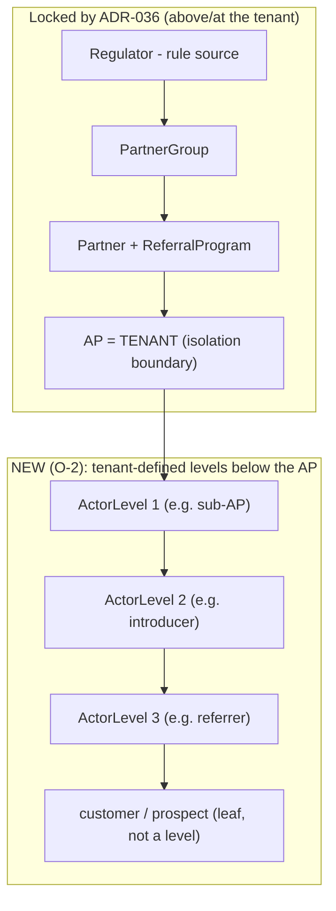
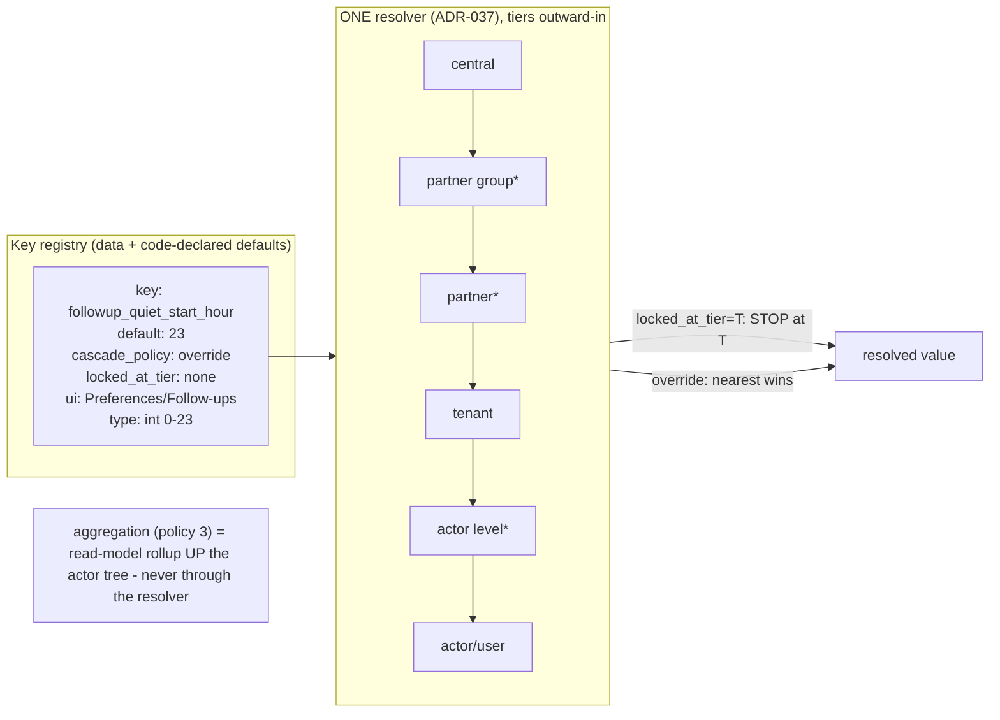

# 16 — Configurable Platform Architecture Review (Actors · Rules · Config · Ports)

> **Status: RATIFIED BY OWNER (Abhay), 2026-07-27.** All five §7 decisions were approved
> in-session the same day (Q-16-1…Q-16-5 = YES, one at a time, recommendation shown per item —
> see COORDINATION 2026-07-27). Formal ADR codification (ADR-042…) is the first act of the
> Phase-0 mission, mirroring the doc-13 → ADR-036…041 precedent. Engineer-authored 2026-07-27
> at the owner's direct instruction, from a code-grounded audit of the live repo (three
> parallel deep-reads: actor model, config coverage, vendor coupling — findings cited as
> `path:line` throughout).
> **Builds ON doc 13 and ADR-036…041; re-decides nothing they lock.** No production code
> changes ride with this document. The owner made four framing decisions on 2026-07-27 (§0);
> everything else here is proposal, structured so each section can be locked or amended
> independently. Companion visual: the published artifact "GoRefer — Configurable Platform
> Architecture" (same diagrams as §3).

---

## 0. Owner decisions this review rests on (2026-07-27, Abhay, in-session)

| # | Decision | Chosen |
|---|---|---|
| O-1 | **Operating model** | **Architect for multi-tenant SaaS; implement toward a generalized PIFS tool.** B-shaped walls, A-sized furniture. Nothing built now may block other businesses becoming tenants later; nothing SaaS-only (self-serve signup, billing) is built while PIFS is the only tenant. |
| O-2 | **Actor hierarchy** | **Tenant-configurable ordered levels below the AP** (e.g. PIFS → sub-AP → introducer → referrer → customer; an insurance tenant: agency → regional manager → agent → policyholder). One parent per actor — a tree, never a graph. Each rule/config key declares its cascade policy: **locked top-down**, **default-with-override** (nearest wins), or **bottom-up aggregation** (child facts roll up). |
| O-3 | **Config operation** | **Everything-as-data immediately; UI staged by churn rate** — high-churn knobs (copy, cadence, claims, URLs, timings) get Preferences UI first; structural knobs stay operator-level until a second tenant is real. **Amendment: tenant admins self-serve their own tenant-tier defaults through the UI** — not only the platform operator. Compliance-locked keys stay visible-but-locked from above. |
| O-4 | **Deliverable** | This proposal + visual artifact + **machine enforcement**: the architecture must be held by guardrail tests, CI gates and import contracts, not by prose. |

## 1. Relationship to what is already locked

Doc 13 (`13-Partner-Hierarchy-and-Vendor-Independence.md`) and **ADR-036…041** already lock,
model-only, the architecture **above and around the tenant**. This review does not reopen any
of it:

| Locked | Where | This review's relationship |
|---|---|---|
| Five-level tree Regulator → Partner Group → Partner → **AP = tenant**; NSE isolation | ADR-036 | **Extends downward**: O-2 adds tenant-defined levels *below* the AP. The two trees join at the tenant node; nothing above it changes. |
| One resolver, per-key `locked_at_tier`; tighten-only = hard stop at the locked tier | ADR-037 | **Adopted as-is** and generalized: the per-key metadata gains `cascade_policy` (§3.2) whose `locked` value IS ADR-037's lock. Aggregation (O-2's third policy) is a read-model, not a resolver change — ADR-037's "one resolver" stands. |
| Advisory enforcement + acknowledged bypass for AP-authored content | ADR-038 | Untouched. §3.2's registry is where the rule rows it needs will live. |
| Platform-standard vendor stack; role-ports; 5 portability invariants; port rename at refactor time | ADR-039 | **This review schedules what ADR-039 deferred**: §2.3 shows the declared port layer is currently dead code; §4 Phase 2 makes it real. |
| Per-AP numbers under platform WABA; opt-out scoping; metering; AP lifecycle | ADR-040 | Untouched; binds the multi-AP mission (§4 Phase 5). |
| Partner code belongs to (AP, partner); `(tenant, mobile)` upsert; holding tenant | ADR-041 | Untouched; §2.4 D-3 confirms the exact defect it predicted already exists in the schema. |

**What is genuinely new here** (not covered by any locked ADR): the below-AP configurable
hierarchy (O-2), config **totality** with a single key registry + generated UI (O-3), the
bottom-up **aggregation** policy, and the **enforcement rails** (O-4).

---

## 2. Current-state audit (code-grounded, 2026-07-27)

### 2.1 Actors — there is no hierarchy, and "role" is five vocabularies

- **No relation between actors exists anywhere.** Exhaustive FK/O2O/M2M dump across all eight
  `apps/*/models.py`: 25 relations, every one actor→tenant, actor→program/partner, or
  record→journey. Zero self-referential FKs, zero team/group tables, zero `parent` columns.
- **`Tenant` is a flat registry** — `name`, `slug`, `is_active` (`apps/tenants/models.py:14`).
  No parent, no level, no type.
- **Authorization is a binary.** The entire staff surface gates on `is_staff`
  (`apps/dashboard/views.py:23`, `apps/followups/api.py:28`); the entire referrer surface gates
  on "has an active `ReferrerAccount`" (`apps/accounts/service.py:87`). No `Group`, no
  `has_perm`, no role field on any persisted actor. A "parent-level admin" (O-2) has **no
  representable identity today**.
- **Actor type is five uncoordinated string vocabularies**, none sharing a source of truth:
  1. `Notification.RECIPIENT_CHOICES` = `office/prospect/referrer` (`apps/integrations/models.py:22`)
  2. `recipient_identity.ROLE_*` = `prospect/referrer/unknown` (`apps/referrals/recipient_identity.py:19`)
  3. `NOTIFY_ROLE_KEYS` = `office/prospect/referrer` again, independently (`apps/config/preferences.py:41`)
  4. `Event.user_type` — free-text, no choices; written as `system/prospect/anonymous` from six call sites (`apps/events/models.py:36`)
  5. `Lead.SUBMITTED_BY_CHOICES` = `friend/referrer` ("friend" = "prospect") (`apps/referrals/models.py:311`)
  Plus template literals branching on `role == "referrer"` (`templates/dashboard/referrer_profile.html:3,6,92`)
  and a `KeyError` on any unregistered role (`apps/config/preferences.py:113`) — adding an actor
  type today is a multi-file code change, the exact opposite of O-2.
- **Tenant scoping is hand-written `tenant=` filters at every call site.** The promised
  "tenant-scoped managers" (`apps/tenants/models.py:5` docstring) **do not exist** — there is no
  custom Manager/QuerySet in `apps/`. Consequence for O-2: "a parent sees its children's data"
  has no single choke point to implement against; it would be a repo-wide edit today.
- **The cascade's user tier is real but unexercised.** `ConfigUser` has zero writers repo-wide;
  the four "per-referrer" keys deliberately persist at the tenant tier as staged defaults
  (`apps/dashboard/preferences_service.py:95-101` — intentional, per its docstring, not a bug),
  awaiting referrer self-serve writes.

### 2.2 Configurability — 57 behaviors are config; 61 sites are hardcoded

Full inventory in the audit (counts are **sites**, not strings; `templates/landing.html` alone
holds ~20 copy strings counted as one site). Highlights:

- **Config-driven (57):** 54 live `cascade.resolve()` keys (landing mode, share settings,
  notify toggles + template names per role×language, OTP policy ×8, followup gates ×10+,
  OG preview ×4, `partner_direct_url_template`, `client_id_pattern` per partner,
  `pii_retention_days`, Zoho reconcile ×3…) + 3 integration flags with DB override
  (`apps/config/integration_flags.py:43-45`).
- **Hardcoded behavior sites (61)** across five classes — the ones an owner would most
  plausibly change (top of the churn list):
  1. Referrer self-view WhatsApp share text — an f-string (`apps/accounts/selfview.py:65-69`)
     while its `/share/` sibling IS config (`share_kit_message_template`). Same behavior, two regimes.
  2. `link_base "gorefer.in/r/"` + `disclosure_url "gorefer.in/d/pifs"` — domain AND tenant slug
     baked into code (`apps/dashboard/profile.py:50,52`; also `share_intent_service.py:90`).
     Breaks on any second tenant or domain change.
  3. **`AP_DISCLOSURE_BLOCK` / `MARKET_RISK_WARNING` — Python constants, not even
     env-overridable** (`gorefer/settings.py:274-282`). Regulator-driven text, editable only by deploy.
  4. The 7 follow-up nudge bodies + link CTA (seed command literals → DB rows; re-seed to change).
  5. The 24h session window (`apps/followups/services.py:27`), sweep intervals
     (`setup_schedules.py:16-53`), rate limits (`settings.py:215-220`, env-only), nonce TTLs,
     defer caps — timing knobs an operator would tune, all literals.
  6. Bot-UA marker list (`apps/events/bots.py:199-220`) — new crawlers appear monthly; a miss
     inflates human counts.
  7. Zoho picklist→stage map (`apps/integrations/zoho/statusmap.py:16-41`) — drifts whenever
     the Zoho layout is edited; a drift silently disables converted-suppression.
- **Four seeded config rows have NO reader** (dead config): `sebi_reg_no`,
  `attribution_window_days`, `referral_incentive_claim`, `nse_ap_no` (`seed_program.py:59-62`);
  `ap_disclosure_block` is locked but **never seeded**. See D-1.
- **Flag layer:** 12 env flags in `gorefer/flags.py`; only the three integration flags have DB
  overrides; `ENABLE_ASSET_GENERATOR` has **zero consumers** (dead flag).

### 2.3 Vendor boundaries — the port layer is declared but dead; OTP is the good pattern

- **`apps/integrations/base.py` is dead code.** Its `WatiAdapter` Protocol (send_template only)
  and duplicate `LogOnlyWatiAdapter` are imported by **nothing**; the de-facto contract is the
  concrete `LiveWatiAdapter`/`LiveZohoAdapter` method sets. There is currently **no interface a
  replacement vendor could implement against** — ADR-039's ports are aspiration, not code.
- **Wati leaks (what would have to change outside `apps/integrations/wati/` to swap BSP):**
  `apps/followups/tasks.py:25-26,185,361-369` imports Wati status constants, branches on
  `STATUS_BLOCKED`, and builds Wati's named-param `[{name,value}]` payload shape;
  `api/wati.py:110-144` is a vendor payload **parser** (owner/fromMe, waId|phone|mobile|senderId,
  epoch timestamps) living in the API layer; `whatsapp_wati` is a vendor-named channel code
  persisted in OTP rows and config choices; `Notification` carries the Meta status lifecycle and
  a `meta_error_code` column.
- **Zoho leaks (same test):** `zoho_*` columns/constraints/models across three apps
  (`apps/integrations/models.py:92-191`, `apps/referrals/models.py:324-355`,
  `apps/events/models.py:182-183`); the `ZohoContact` dataclass is a **UI return type** consumed
  by `apps/dashboard/profile.py:21-24` and rendered in templates; `to_zoho_mobile()` sits in
  shared `apps/common/phone.py:42-62`; four dotted `apps.integrations.zoho.*` schedule strings.
- **`apps/otp/` is the in-repo proof the target is achievable:** a one-method Protocol
  (`apps/otp/ports.py:45-59`), **vendor-neutral status vocabulary** (`delivered/failed/queued/
  suppressed`), a channel registry, and config-driven channel order (`apps/otp/service.py:135`).
  The service imports no vendor module. Its residual flaw — the vendor-named channel code
  `whatsapp_wati` — is the template for what to fix elsewhere, not a reason to reject the pattern.
- **Credentials are process-global env, never per-tenant** — this is **correct** under ADR-039
  (platform-standard stack; per-tenant creds only in the optional AP-owned-WABA path). Recorded
  as posture, not defect.

### 2.4 Defects and drift found (verified by the Engineer, not just the audit agents)

| # | Finding | Severity | Verified how |
|---|---|---|---|
| **D-1** | **The compliance lock guards rows nothing reads.** `COMPLIANCE_LOCKED_KEYS` (`apps/config/models.py:20`) enforce central-only resolution — and the mechanism works (tests `test_config_cascade.py:28-31`, `test_hardening.py:127-130` prove it) — but **no production `resolve()` targets any of the three keys** (full-repo grep). Every rendered compliance surface reads `settings`/`flags` directly (`context_processors.py`, `disclosure_service.py:47`). Today this is *dormant* (the text is code-fixed, so effectively harder-locked than the cascade), but: editing the central row silently does nothing; `ap_disclosure_block` was never even seeded; and multi-AP **requires** per-AP reg numbers/disclosures as data. The lock and the render path must be joined. | **P1 drift** (not a live breach) | Independent grep + read of both render paths |
| **D-2** | `Partner.code` is **globally** unique (`apps/referrals/models.py:57`) and `Lead.zoho_lead_id` likewise (`:324`) — the exact wrong grain ADR-041 predicted; collides the moment a second tenant shares a partner. | P2 now; **P0 the day AP #2 exists** (already ADR-041-bound) | Model source read |
| **D-3** | `apps/integrations/base.py` duplicate/stale port layer — dead code masquerading as the boundary contract; a future adapter author would implement the wrong interface. | P2 | Import grep (zero importers) |
| **D-4** | Docstring claims "tenant-scoped managers" enforce isolation (`apps/tenants/models.py:5`); none exist. Doc-vs-code lie of the kind CLAUDE.md §6b exists to prevent. | P3 | Manager/QuerySet grep |
| **D-5** | Dead config: 4 seeded-but-unread central rows; 1 locked-but-unseeded key; `ENABLE_ASSET_GENERATOR` flag with zero consumers. | P3 | Reader grep per key |
| **D-6** | `VerificationRequest.decided_by` and `ConfigUser.user_id` are bare BigIntegers, not FKs (`apps/accounts/models.py:93`, `apps/config/models.py:54`) — referential integrity gap that matters more once user-tier writes begin. | P3 | Model source read |

---

## 3. Target architecture

### 3.1 One actor model: tenant-defined levels, one tree, one role vocabulary

- **`ActorLevelSchema` (per tenant):** an ordered list of level definitions
  `(tenant, rank, code, label)` — data, not code. PIFS seeds one level (`referrer`); an
  insurance tenant seeds three. Changing the schema is a config operation (O-3).
- **`Actor` (per tenant):** `(tenant, level, parent FK→Actor nullable, person link)` — **one
  parent, same-tenant only** (DB-enforced: parent's tenant must equal child's tenant, parent's
  rank must be exactly one above). The existing `ReferralIdentity` gains an `actor` FK; today's
  flat referrers become depth-1 actors under a migration that is a pure relabeling (no behavior
  change while every tenant has a one-level schema).
- **Attribution is untouched.** Single-winner attribution stays keyed by `client_id` exactly as
  ADR-001/016 lock it. The tree adds *visibility and rule scope*, never a second attribution
  path — an ancestor **sees** descendant journeys, it never **credits** from them.
- **One role vocabulary.** A single `ActorRole` registry (data) replaces the five string
  vocabularies of §2.1; the five existing columns keep their stored values but each declares a
  mapping to the canonical role (migration note per vocabulary; `Event.user_type` history is
  immutable and gets a read-side mapping only). Adding an actor type becomes: add a row, not
  edit five files.
- **Visibility choke point.** Introduce the missing tenant-scoped manager
  (`TenantScopedModel.objects` gains `.for_actor(actor)` = own subtree filter). This is the
  single point where "parent sees children" is implemented and tested — and it fixes D-4 by
  making the docstring true instead of deleting it.
- **AuthZ:** roles become claims on the session (`is_staff` remains the platform-admin
  superclaim); an actor's admin surface is their subtree. No Django groups needed yet; the
  check function is one place (`for_actor`), test-enforced.

### 3.2 One config/rules registry: every behavior is a key; every key declares its policy

\* tiers marked * arrive in later phases; the resolver's tier-walk is data-driven so adding a
tier is a registry change, not a resolver rewrite.

- **`ScopedConfig` replaces the three physical tables.** `(scope_type, scope_id, key, value)`
  with `scope_type ∈ {central, group, partner, tenant, level, actor}` — one table, one unique
  constraint, one resolver. `ConfigCentral/Global/User` migrate in mechanically
  (`central/tenant/actor`); the `resolve()` **signature is preserved** so all 54 call sites are
  untouched by Phase 1.
- **Key metadata registry** (code-declared, like `flags.py`, so it is reviewable and
  greppable): every key declares `default`, `type/validator`, `cascade_policy`
  (`locked@tier | override | aggregate`), `ui_group` (or `operator_only`), and `description`.
  **A key not in the registry does not resolve** (guardrail-tested) — this is what makes
  config-totality enforceable rather than aspirational.
- **The three cascade policies** (O-2) map onto locked decisions:
  - `locked@tier` **is** ADR-037's `locked_at_tier` — unchanged semantics, now spanning the
    below-AP tiers too (a tenant can lock a key against its own sub-levels — the same
    protection PIFS enjoys from central, offered downward).
  - `override` is ADR-022 nearest-wins, unchanged.
  - `aggregate` is **not a resolver feature**: aggregation keys are read-model rollups climbing
    the actor tree (extending the existing dirty-day rollup machinery in
    `apps/events/rollups.py`), so ADR-037's "the resolved value always traces to exactly one
    tier" stays true for every resolved key.
- **Compliance keys close D-1:** the render path (context processor, disclosure service)
  switches to `resolve()`; the keys get seeded (including `ap_disclosure_block`); their
  `locked_at_tier` stays central today and becomes group/partner-tier data when ADR-036 tiers
  arrive — which is exactly what per-AP reg numbers under multi-AP need. The existing
  guardrail-test pattern extends: *a compliance surface rendering text that did not come
  through the locked resolver is a test failure* (§5 E-2).
- **The 61 hardcoded sites become the Phase-1 backlog** (§4), migrated in churn order with the
  audit's top-10 first. Structural literals that are genuinely spec (e.g. the Zerodha client-id
  regex — already a per-partner config key) stay; each survivor must be justified in the
  registry as `operator_only` or dropped from scope explicitly.

### 3.3 Real ports: the OTP pattern, applied to messaging and CRM

- **Make `apps/integrations/base.py` true or delete it — make it true.** Define the two role
  ports from the de-facto surface that already exists:
  - `MessagingPort`: `send_template`, `send_session_text`, `get_message_status`,
    `get_latest_inbound_at` + the two result dataclasses — exactly `LiveWatiAdapter`'s current
    public surface (`apps/integrations/wati/adapter.py:160-364`).
  - `CrmPort` (write): `upsert_lead`, `fetch_referrer_history`, `upsert_referrer_contact`;
    `CrmReadPort`: `fetch_contact_by_client_id`, `fetch_referred_people` — with
    **vendor-neutral result types** replacing `ZohoContact` as the UI-facing shape.
- **Vendor-neutral vocabularies at the seam** (the OTP lesson): message status
  (`queued/sent/delivered/read/failed/suppressed` + a `provider_code` passthrough for the Meta
  error), CRM stage (the `statusmap` output already IS this — keep stage strings, quarantine the
  picklist map), channel codes (`whatsapp` not `whatsapp_wati`; the adapter binding chooses the
  vendor). Persisted vendor-named columns (`zoho_lead_id` etc.) are renamed only when a real
  second vendor forces it — a rename with no second vendor is churn (ADR-039 D-13-7 says
  refactor-time; Phase 2 renames **interfaces and new columns only**).
- **Webhook parsing moves inside the boundary:** `api/wati.py` and `api/zoho.py` become thin
  routers (auth → `adapter.parse_inbound(raw) → neutral dataclass` → domain call); the
  vendor-shape knowledge (owner/fromMe, waId fallbacks, epoch timestamps) joins the adapter it
  belongs to. Contract docs update with it (CI gate §6b already forces this).
- **Port contract tests:** one shared test suite per port that any adapter (live, log-only, or
  future vendor) must pass — the executable version of ADR-039's five invariants (terminal
  status not HTTP 200; never fabricate status; etc.). This is what makes "replaceable" a tested
  property instead of a claim.
- **The followup engine and OTP adapter consume ports only** — `followups/tasks.py` loses its
  `wati.status` import and payload-shape knowledge (the named-params convention moves behind
  `send_template`); the "24h window" stays in followups (it is a WhatsApp-*platform* concept,
  correctly outside the BSP adapter — but its constant becomes the config key
  `messaging_session_window_hours` per O-3).

### 3.4 Self-serve surfaces: Preferences generated from the registry

The Preferences screen (ADR-034) stops being a hand-maintained form and renders **from the key
registry**: every key with a `ui_group` appears automatically in its group, typed by its
validator, with three visual states — *editable here* / *inherited from <tier> (override?)* /
*locked at <tier>* (visible, disabled, labeled with who locked it — the O-3 amendment's
"visible-but-locked"). Tenant admins edit tenant-tier values; actor-level admins (when the
hierarchy lands) edit their level's values for `override` keys. Adding a knob = registering a
key; the screen, the audit trail, and the lock badges come free. This is rule 6d
("message behaviour is configuration, surfaced where an operator would look") generalized to
every behavior.

---

## 4. Phased roadmap (each phase = one dispatchable mission, `main` deployable after each)

| Phase | Mission | Contents | Risk gate |
|---|---|---|---|
| **0** | **Rails + drift fixes** (small, immediate) | Build §5 enforcement rails E-1…E-5 in *observe* mode; fix D-1 (seed + route compliance renders through the locked resolver — byte-identical output, test-locked); delete `base.py` dead duplicate (D-3) or replace with the real Protocols if Phase 2 is imminent; make the D-4 docstring true (add the scoped manager, no call-site changes yet); remove dead flag/rows (D-5). | Compliance bytes identical before/after (existing byte-exact tests must not change) |
| **1** | **Config totality** | `ScopedConfig` + key-metadata registry; migrate 3 tables (resolver API preserved); move the top-10 churn literals (§2.2) into keys; Preferences renders from the registry (3.4). | All 54 existing resolve sites untouched; every migrated literal ships with its old value as default (zero behavior change day one) |
| **2** | **Ports made real** | 3.3 in full: Protocols, neutral vocabularies, webhook parsing relocation, port contract tests, followups/OTP consume ports only. Interface renames per ADR-039 D-13-7; **no persisted-column renames**. | Contract-doc CI gate (§6b) forces doc updates; E-3 import contract flips from observe to enforce |
| **3** | **One actor vocabulary** | `ActorRole` registry; map the five vocabularies; template/branch cleanup; role-aware authz helper (still flat — no tree yet). | Event history immutable — read-side mapping only |
| **4** | **Below-AP hierarchy** | `ActorLevelSchema` + `Actor` + subtree manager; cascade tiers `level/actor` activate; aggregation read-models; hierarchy-scoped dashboards (doc 13 O-6's report page becomes buildable). PIFS migrates as a one-level tree (no visible change until PIFS defines level 2). | The tree is additive; single-winner attribution untouched (guardrail E-5) |
| **5** | **Multi-AP mission** | Already fully ADR-bound (036–041): ADR-041 migration FIRST (partner code → (AP,partner); `(tenant,mobile)`; fixes D-2), per-AP numbers, opt-out scoping, metering, onboarding verification. | Opens only on owner call, per doc 13 §5 |

Phases 0–2 are single-tenant-safe and independently shippable. Phase 3 is preparatory. Phase 4
delivers O-2 visibly. Phase 5 stays owner-gated exactly as doc 13 left it.

---

## 5. Enforcement — the machine rails (O-4)

Extends the proven pattern: three guardrail tests + `check_contract_docs.py` already hold
doc-code sync; these hold the architecture. Each rail lands in Phase 0 in **observe** mode
(report, don't fail) with a baseline allowlist of today's violations; a rail flips to
**enforce** (CI-failing) in the phase that clears its baseline. A shrinking allowlist is the
progress metric; a growing one fails CI immediately even in observe mode.

| # | Rail | Mechanism | Enforces |
|---|---|---|---|
| E-1 | **Key-registry gate** | Guardrail test: `resolve()` rejects unregistered keys; every registered key has default+type+policy+ui/operator declaration; every `COMPLIANCE_LOCKED` key has ≥1 production reader and a seeded row. | §3.2 totality; D-1 never recurs |
| E-2 | **Compliance-surface gate** | Guardrail test: rendered disclosure/risk/claim text on every user-facing route byte-equals the locked-resolver value (extends the existing byte-exact tests from constants to resolver). | ADR-014/037 joined to reality |
| E-3 | **Boundary import contract** | `import-linter` (or an AST script in CI, same style as `check_contract_docs.py`): `apps.integrations.wati/zoho` importable only from within `apps/integrations/` + an explicit shrinking allowlist (§2.3 leak list is the initial baseline); vendor names (`wati`, `zoho`, `meta_error`) banned in **new** identifiers outside the boundary. | §3.3; ADR-039's "domain never learns a vendor's name" |
| E-4 | **Port contract suite** | Shared pytest suite parameterized over every adapter implementing a port; asserts ADR-039's five invariants (terminal-status, no fabrication, no auto-submit, lead-first, contract-doc presence). | Replaceability as a tested property |
| E-5 | **Hierarchy invariants** | Guardrail tests (Phase 4): actor parent same-tenant + rank-adjacent (also DB constraints); subtree visibility never crosses tenants; attribution result identical with and without the tree (single-winner unchanged); aggregate keys never resolve through the resolver. | O-2 without ADR-016 regression |
| E-6 | **Session rails** | Repo `CLAUDE.md` §6e addition (one paragraph): new behavior literal → must register a key or mark `operator_only` in the same PR; plus a lightweight pre-commit grep hook flagging string literals added to the known behavior surfaces (copy/URLs/timings) as a *warning*. Advisory, because humans/AI write code — E-1/E-3 are the hard stops. | O-3 discipline at authoring time |

**Enforcement of enforcement:** each rail is itself a file named in `check_fleet_script_health`
-style dead-gate detection — a rail with no CI call site fails the build (the lesson of
`contract-lint.py`, T-020).

---

## 6. Explicitly NOT proposed (guard against overbuild)

- **No rules-DSL or generic rules engine.** Rules are keys with policies + (later, ADR-038) rule
  rows with citations. A DSL is complexity no current requirement pays for.
- **No free-form actor graphs, no multi-parent, no cross-tenant relations** (would break
  single-winner attribution and NSE isolation).
- **No per-AP vendor choice** (ADR-039 locked platform-standard; unchanged).
- **No SaaS surface** — no self-serve tenant signup, billing, or plans (O-1: B-shaped walls only).
- **No speculative second adapters** — the port + contract suite proves swappability; a second
  vendor adapter is written when a real vendor need exists.
- **No persisted vendor-column renames in Phase 2** (churn without benefit; renamed at the
  first real second-vendor migration).

## 7. Decisions requested from the DA/owner to lock this proposal — ALL APPROVED

> **Owner disposition (Abhay, 2026-07-27, in-session):** each question was asked individually
> with the recommendation shown; every answer was YES. This section is retained verbatim as the
> record of what was asked.

| # | Question | Engineer recommendation | Owner |
|---|---|---|---|
| Q-16-1 | Lock §3.1's actor model (levels-as-data, one parent, leaf prospects outside the level schema)? | Yes as written — it is the minimal shape satisfying O-2 under ADR-016/036. | **APPROVED** |
| Q-16-2 | Lock §3.2's single `ScopedConfig` + registry (replacing the 3 tables) as the ADR-037 implementation vehicle? | Yes — it is the only shape where "adding a tier is data" holds, which ADR-037's 5-tier future needs anyway. | **APPROVED** |
| Q-16-3 | Phase-0 scope: approve D-1 fix (compliance renders via resolver) now, ahead of the registry? | Yes — smallest possible diff, byte-identical output, closes the worst drift first. | **APPROVED** |
| Q-16-4 | Approve the E-1…E-6 rails and the observe→enforce ladder? | Yes — rails without a ladder either break CI on day one or stay advisory forever. | **APPROVED** |
| Q-16-5 | Ratify §6's not-building list? | Yes — it is where this proposal would otherwise grow silently. | **APPROVED** |

---

*Grounding: three parallel code audits 2026-07-27 (actor model · config coverage · vendor
coupling), findings cited inline; doc 13 + ADR-022/023/034/036…041; CLAUDE.md §4/§6/§6b/§6d;
owner decisions O-1…O-4 (2026-07-27, in-session). The spec remains authoritative; this document
is a proposal until the DA locks it.*
