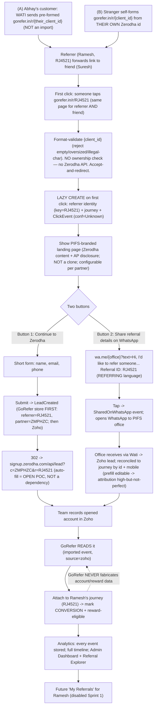

# GoRefer — 11. Referral Workflow & Edge-Case Analysis

> **What this is.** The definitive, end-to-end **Zerodha referral workflow** for GoRefer — the *final, locked model* — shown as both an ASCII flow and a Mermaid `flowchart`, followed by a concrete worked example (Ramesh refers Suresh), an edge-cases / loopholes / gaps table, and a short multi-partner readiness note.
>
> **Read alongside:** [`01-GoRefer-Foundation-Specification.md`](./01-GoRefer-Foundation-Specification.md) (REQ/BR/NFR/AC), [`02-Architecture-Decisions-ADR.md`](./02-Architecture-Decisions-ADR.md) (ADR-001 **raw Zerodha `client_id` in the path — no token, no mapping DB**; ADR-005 single-domain `client_id` routing; ADR-008 lazy creation on first click), [`04-System-Architecture.md`](./04-System-Architecture.md) (orchestrator model, sequence flows), [`05-Database-Design.md`](./05-Database-Design.md) (referral-identity table keyed by partner + client_id + source, lazy journey, click-confidence), [`06-API-Specification.md`](./06-API-Specification.md) (`GET /r/{client_id}`, `POST /api/leads`, `POST /api/share`), [`07-UI-UX-Specification.md`](./07-UI-UX-Specification.md) (two-button landing page).
>
> **Grounded in:** `GoRefer-Master-SourceOfTruth-from-ChatGPT.md` and the 2026-07-04 live-test decisions (`GoRefer-Build-Spec-Cowork-Decisions.md`).
>
> **Date:** 2026-07-04. **Identifier scheme:** **raw Zerodha `client_id` in the path** (ADR-001, locked). **Partner code:** `ZMPHZC` (injected server-side, never in the shared link). **NSE AP:** `AP2516003693`.

---

## 1. The Final Model in One Paragraph

A referrer's link is simply **`gorefer.in/r/{client_id}`** — their **raw Zerodha `client_id`** in the path (e.g. `gorefer.in/r/RJ4521`). **There is no opaque token and no token→id mapping table.** Referrers are **open-ended**: anyone with a Zerodha client ID can refer, not only Abhay's customers — a stranger self-forms the link from **their own** client ID, and for Abhay's own customers a WATI campaign simply sends them their pre-formed `gorefer.in/r/{their_client_id}` link built from data Abhay already has (this is **not** an "import"). **Nothing is pre-loaded.** On the **first click** of the link, GoRefer **format-validates** the `client_id` (no ownership check — there is no Zerodha API), then **lazily creates** the referrer record (keyed by that raw id), the referral journey, and the click event, all in that moment, and proceeds to a **PIFS-branded landing page** — never a Zerodha clone. The landing page is **configured per partner**; for Zerodha it shows Zerodha-specific content, the SEBI/NSE **AP disclosure block**, and **two buttons**: (1) **"Continue to Zerodha"**, which shows a short form (name, email, phone), saves the lead to GoRefer **and** Zoho (referrer = the `client_id` from the URL, partner = `ZMPHZC`), then redirects to `signup.zerodha.com/api/lead?c=ZMPHZC&r={client_id}`; and (2) **"Share referral details on WhatsApp"**, a client-side `wa.me` deep link to the PIFS office with a **referring-language** pre-fill + the referral id, which logs a `SharedOnWhatsApp` event. The partner code `c=ZMPHZC` is **injected server-side** and never appears in the shared URL, so it **always** credits PIFS; a wrong/mistyped `client_id` only fails to credit that one referrer. **Account-opening and reward status come ONLY from Zoho** (a recorded, imported event with `source=zoho`); GoRefer **never fabricates** them. The **same page serves both** a referrer clicking their own link and a friend clicking a shared link. Every event is stored; analytics are derived from events, not counters.

---

## 2. Workflow Diagram — ASCII Flow

```
  DELIVERY / SELF-FORM
  ┌───────────────────────────────────────────────────────────────┐
  │ (A) Abhay's customer: WATI sends their pre-formed link         │
  │     gorefer.in/r/{their_client_id}   (built from known data —  │
  │                                       NOT an import)           │
  │ (B) Non-customer / stranger: self-forms the link with THEIR    │
  │     OWN Zerodha client id  →  gorefer.in/r/{client_id}         │
  └───────────────────────────────┬───────────────────────────────┘
                                   ▼
  SHARE                Referrer (Ramesh, RJ4521) forwards the link
                       to a friend (Suresh) on WhatsApp
                                   │
                                   ▼
  FIRST CLICK          Someone taps gorefer.in/r/RJ4521
  (Suresh or Ramesh —                │
   SAME page for both)               ▼
                       Format-validate {client_id}
                       (reject empty / oversized / illegal-char)
                       NO ownership verification (no Zerodha API)
                                   │  accept-and-redirect
                                   ▼
                       LAZY CREATE on this first click:
                         • referrer identity (key = RJ4521)
                         • referral journey
                         • ClickEvent (device/city/time, conf=Unknown)
                                   │
                                   ▼
                       Show PIFS-BRANDED landing page
                       (Zerodha content + AP disclosure; NOT a clone)
                       (configurable PER PARTNER)
                                   │
                 ┌─────────────────┴──────────────────────────┐
                 ▼                                             ▼
  ┌────────────────────────────────┐        ┌──────────────────────────────────────┐
  │ BUTTON 1 "Continue to Zerodha" │        │ BUTTON 2 "Share referral details on  │
  │  │ short form (name,email,phone)│        │           WhatsApp"                  │
  │  ▼                             │        │  │ wa.me/{office}?text=Hi, I'd like  │
  │ Submit -> LeadCreated          │        │  │  to refer someone... Referral ID: │
  │  (GoRefer store FIRST,         │        │  │  RJ4521   (REFERRING language)    │
  │   referrer=RJ4521, c=ZMPHZC,   │        │  ▼                                   │
  │   then Zoho)                   │        │ tap -> SharedOnWhatsApp event        │
  │  │                             │        │ opens WhatsApp to PIFS OFFICE        │
  │  ▼                             │        │  │                                   │
  │ 302 -> signup.zerodha.com/api/ │        │  ▼                                   │
  │  lead?c=ZMPHZC&r=RJ4521        │        │ Office receives via Wati -> Zoho lead │
  │ (auto-fill = OPEN POC, NOT a   │        │ reconciled to journey by id + mobile │
  │  dependency)                   │        │ (prefill is EDITABLE — attribution   │
  └───────────────┬────────────────┘        │  high-but-not-perfect)               │
                  │                          └──────────────────┬───────────────────┘
                  └───────────────────────┬─────────────────────┘
                                          ▼
  ACCOUNT STATUS       Team records opened account in Zoho
  (external truth)                        │
                                          ▼
                       GoRefer READS it (imported event, source=zoho)
                                          │
                                          ▼
                       Attach to Ramesh's journey (RJ4521)
                       -> mark CONVERSION + reward-eligible
                       (GoRefer NEVER fabricates account/reward data)
                                          │
                                          ▼
  ANALYTICS            Every event stored -> full timeline per link
                       Admin Dashboard + Referral Explorer
                       (filter by partner / date / referrer / status)
                       Future "My Referrals" for Ramesh (disabled Sprint 1)
```

---

## 3. Workflow Diagram — Mermaid



---

## 4. Worked Example — Ramesh Refers Suresh

**Concrete values used throughout:** referrer = **Ramesh** (Zerodha `client_id = RJ4521`); friend = **Suresh** (mobile `+91-98XXXXXX21`); partner code = `ZMPHZC` (injected server-side); program = Zerodha; **the link is `gorefer.in/r/RJ4521`** — the raw client id itself, no token.

1. **How the link exists.** There is **no setup, no import, no mint step.** Ramesh's link *is* `gorefer.in/r/RJ4521`. If Ramesh is one of Abhay's customers, a WATI campaign sends him this pre-formed link (built from data Abhay already has). If Ramesh is a stranger to Abhay, he simply writes his own Zerodha client id into the link himself. Either way, **nothing is stored in GoRefer yet** — creation is lazy.

2. **Share.** Ramesh forwards `gorefer.in/r/RJ4521` to Suresh on WhatsApp.

3. **First click.** Suresh taps the link. GoRefer **format-validates** `RJ4521` (non-empty, right length, legal chars — it does **not** and **cannot** verify the id belongs to a real Zerodha client, as there is no Zerodha API). It then **lazily creates on this first click**: the referrer identity `(partner=Zerodha, client_id=RJ4521, id_source=native)`, the journey, and `ClickEvent { journey=RJ4521, device=Android, city=Delhi, time=2026-07-04T10:12+05:30, confidence=Unknown }`.

4. **Landing.** Suresh sees the **PIFS-branded** landing page — configured for the Zerodha partner: "Ramesh invited you to open a Zerodha account", benefits, the mandatory AP disclosure block (`SEBI INZ000031633 | PIFS | NSE AP AP2516003693`), and **two buttons**. It looks like PIFS, **not** like Zerodha. (The very same page would render if **Ramesh himself** clicked his own link — one page serves both audiences.)

5. **Button 1 — "Continue to Zerodha".** Suresh taps it and a **short form** appears (name, email, phone). He enters `Suresh, suresh@example.com, +91-98XXXXXX21` and submits. GoRefer saves the lead to PostgreSQL **first** (`LeadCreated`, referrer = `RJ4521`, partner = `ZMPHZC`), then creates it in Zoho, then fires the WATI messages (alert Ashok; warm utility notice to Suresh naming Ramesh; thank-you to Ramesh only if his phone resolves from Zoho). GoRefer then **redirects** Suresh to `https://signup.zerodha.com/api/lead?c=ZMPHZC&r=RJ4521`. *Auto-filling Zerodha's own form with the collected name/email/phone is an OPEN, build-time POC (currently believed not possible); the lead is captured regardless — it is **not** a dependency. The form-first choice is Abhay's decision and may be removed later.*

   **Button 2 — "Share referral details on WhatsApp".** Alternatively, Suresh (or Ramesh) taps this. It opens WhatsApp to the **PIFS office** number via a `wa.me` deep link, pre-filled with **referring** language + the referral id: *"Hi, I'd like to refer someone for a Zerodha account. Referral ID: RJ4521."* (Note the actor is **referring**, not "I want to open an account.") GoRefer logs a `SharedOnWhatsApp` event at the tap. The office receives the WhatsApp via Wati → a Zoho lead, reconciled back to the journey by the referral id + mobile. **Accepted downside:** the person can edit the pre-filled text before sending, so this path's attribution is high-but-not-perfect.

6. **Account status (external truth).** Days later Suresh's account opens. The team records it in **Zoho**. GoRefer's Zoho sync **reads** it as an imported event `{ source=zoho }`, attaches it to Ramesh's journey (`RJ4521`), and marks **conversion + reward-eligible**. GoRefer never wrote this from a click — only from Zoho.

7. **Analytics.** Ramesh's link now carries a full ordered timeline: `ReferralClicked(Unknown) → LandingViewed → LeadCreated (or SharedOnWhatsApp) → RedirectInitiated → (Zoho) AccountOpened → Conversion`. The Admin sees it in the dashboard and can filter to it in the **Referral Explorer** by partner=Zerodha, date=2026-07-04, referrer=RJ4521, status=Converted. A future "My Referrals" view would let Ramesh see this himself — **disabled in Sprint 1**.

---

## 5. Edge Cases / Loopholes / Gaps

| # | Scenario | Risk | How GoRefer handles it |
|---|----------|------|------------------------|
| 1 | **Owner self-click** — Ramesh clicks his own link. | Inflated/false referral clicks; identity of clicker unprovable. | Click is **logged, not excluded**, with `confidence=Unknown`. GoRefer cannot prove who clicked, so it never asserts it as a genuine referral; analytics separate `Unknown` from higher-confidence classes. No fabrication. |
| 2 | **Re-click after a long gap** — Suresh (or Ramesh) clicks again weeks later. | Journey duplication / attribution confusion. | The `client_id` is stable, so it resolves to the **same referral identity**; a later click **continues the SAME journey** (a new `ClickEvent` appended), never spawns a second one. Re-clicks never re-create the referrer. |
| 3 | **WhatsApp / social link-preview crawler** — the messaging app or a social scraper prefetches the URL to render a preview. | Phantom clicks inflate click counts. | **Bot/prefetch user-agents are filtered** (and/or classified out of the human-click confidence band) so crawler hits do not inflate real clicks. The event may still be stored for audit but is not counted as a human open. |
| 4 | **Invalid / mistyped / format-only `client_id`** — a stranger fat-fingers their own id, or someone puts junk in the path. | Wrong or no referrer credited; junk records. | The redirect **format-validates** the `client_id` (reject empty, oversized, illegal chars → branded error page, no DB work). There is **no ownership verification** (no Zerodha API), so a well-formed-but-wrong id is accepted: it simply **fails to credit that referrer**, while **`c=ZMPHZC` (injected server-side) always credits PIFS**. GoRefer asserts nothing about an id's real owner. |
| 5 | **Friend edits the URL / deletes `ZMPHZC`** on Zerodha's editable form (after redirect). | Revenue leakage — PIFS AP credit (and/or `r=`) stripped (R7). | `c=ZMPHZC` is **injected server-side** into the redirect and is **never in the shared GoRefer link**, so it cannot be stripped *before* Zerodha. On **Zerodha's own page** the codes are editable text boxes we cannot control (residual risk). The **capture-first path mitigates it** because the lead is saved to GoRefer/Zoho with `c=ZMPHZC` **before** any redirect. Steer users to Button 1. |
| 6 | **WhatsApp-share pre-fill is editable** — the person changes the pre-filled `wa.me` text before sending. | Referral id altered/removed → attribution imperfect on the share path. | **Accepted downside.** The office still receives the WhatsApp → a Zoho lead, reconciled to the journey by referral id **+ mobile**; where the id was edited out, mobile-based reconciliation is the fallback. This path is **high-but-not-perfect** by design; Button 1 (capture-first) is the higher-fidelity path. |
| 7 | **Zerodha form auto-fill not available** — GoRefer cannot pre-fill Zerodha's own signup form with the captured name/email/phone. | Expectation that the friend won't re-type details on Zerodha's page. | Auto-fill is an **OPEN, build-time POC and NOT a dependency**. Button 1 **already captured the lead** into GoRefer + Zoho before the redirect, so the referral is safe regardless; the friend re-entering details on Zerodha's own reCAPTCHA-gated page (or Ashok completing KYC on a call) does not affect attribution. |
| 8 | **Friend already had a Zerodha account** before clicking. | Mapping void; a reward would be falsely claimed. | Zerodha's **prior-registration rule voids the credit**; GoRefer **cannot know** the prospect's prior status, so it asserts nothing. Zoho will simply show **no conversion**, and GoRefer reflects that (never fabricates a reward). |
| 9 | **60-day open window** — account opens long after the click. | Attribution claimed outside Zerodha's window. | GoRefer records timestamps but **does not enforce** Zerodha's 60-day window; it never claims attribution it cannot prove. Conversion is only ever marked from a Zoho sync, which reflects Zerodha's own eligibility decision. |
| 10 | **WATI delivery failure (~33%) + duplicate sends** across Zoho modules. | Funnel leaks at step 0; the same person messaged twice; opt-in violations. | Needs **dedup** (one message per person per campaign) and an **opt-in-aware audience** built from Zoho; delivery is verified from WATI terminal status, not HTTP 200. Without this the funnel silently loses ~1 in 3 at the very first step. |
| 11 | **Messaging a non-opted-in friend** (referrer submitted their details). | Meta throttling / number-quality damage. | The **first message must be a warm, utility-style notice naming the referrer** (BR-008) — never a marketing blast. Marketing templates are reserved for opted-in audiences. |
| 12 | **`client_id` is public / scraped and click-flooded.** | Analytics pollution; unwanted traffic on one referrer. | The `client_id` is a **raw, already-public identifier** (it appears in Zerodha's own `r=` links, ADR-001), so there is **nothing to "revoke"** and no secrecy to protect — the defense is **rate-limiting at the edge** (per-IP and per-`client_id`), **not** obscurity. Abusive spikes are absorbed and still logged with low click-confidence, never trusted. |
| 13 | **Referrer privacy** — what Ramesh may see about who clicked. | Exposing the friend's PII to the referrer. | Ramesh (future "My Referrals") sees only **anonymized events** — e.g. "someone clicked from Delhi" — **never** Suresh's name, mobile, or exact identity. PII stays with Ashok/Zoho. |
| 14 | **Compliance** — public landing/asset content. | NSE/SEBI AP violations; misrepresentation. | The PIFS landing carries the **SEBI/NSE AP disclosure block**, is **not a Zerodha clone** (BR-009), and the **10% brokerage claim is live-but-revocable** and confined to one swappable place (BR-011). Every public asset passes the `zerodha-ap-social-media-compliance` gate before publishing. |
| 15 | **Zoho temporarily down** during a status change. | Lost conversion updates; temptation to guess status. | Status sync **queues and retries** (idempotent); **clicks are still recorded** independently at the edge. GoRefer **never fabricates** a conversion to fill the gap — it waits for the real Zoho sync. |
| 16 | **Analytics integrity** — can counts be corrupted or double-counted? | Numbers drift from reality; irreproducible metrics. | **Events are immutable and append-only**; analytics are **built from events, not counters**, so any figure can be rebuilt by replaying events. No `clicks++` counter exists to corrupt. |
| 17 | **Stale lead / abandoned-after-form** — a GoRefer-captured lead never converts and ages toward Zerodha's 60-day window (prospect abandoned after the capture form, no account opened). | Warm lead goes cold; follow-up missed. | **Sprint 1 (locked):** stale-lead follow-up is **owned by Zoho** (source of truth); GoRefer only surfaces a **read-only aging flag** derived from its own timeline (GoRefer-derived, **not** a Zoho override — GoRefer never writes back to or overrides Zoho). **Future (DEFERRED, Sprint 2+):** an **automated Wati stale-lead nudge** — a warm, utility-style WhatsApp reminder to the prospect (Foundation Spec REQ-F01). Deferred until the WATI delivery-dedup + opt-in fix (row 10) lands; must respect Meta opt-in rules. |

---

## 5A. Locked Gap Decisions (16) — Attribution, Truth-Source & Privacy

> These are the **16 locked gap decisions** (2026-07-04) that harden the model above. They are additive to §5 and binding on `05-Database-Design`, `06-API-Specification`, and `07-UI-UX-Specification`. **None of the "future" items expand Sprint-1 scope** — they are marked DEFERRED where applicable.

| Gap | Decision (locked) | How GoRefer handles it |
|---|---|---|
| **1 — Partner-direct (no referrer)** | A visitor can arrive with **no referrer** (the PIFS-direct link). | `GET /open` carries **`c=ZMPHZC` only, no `r=`** and creates a **partner-direct journey** (`source=partner_direct`, `referrer = null`). Credits PIFS as AP but no referrer. Same landing page, referral-id echo omitted. |
| **2 — Attribution join key** | How a Zoho conversion is matched back to a journey. | Join on **mobile + the GoRefer referral reference**. When **no mobile** is available, fall back to **referrer-level-only** attribution (credit the referrer, not a specific journey row). |
| **3 — Single-winner attribution** | One conversion must credit exactly one referrer. | **Single-winner**: **Zoho is authoritative** for who is credited. GoRefer does **not** guess from the last redirect or last click. If Zoho names no referrer, none is credited. |
| **3b — Off-platform / no-click conversions** | Accounts opened without any GoRefer click (walk-in, phone, Zerodha-direct that PIFS later logs). | **Ingested from Zoho**: an inbound conversion can **create a journey with no click rows**, tagged `source=zoho`, still attributed per Gap 2/3. |
| **4 / 7 — Reward truth** | Where reward/points status lives. | Reward truth lives **only in the Zerodha Console** (external). GoRefer **displays** status when synced and **never fabricates** it. **No PIFS top-up / no GoRefer-computed reward.** |
| **4b — True account-opening date** | Analytics dates must reflect reality, not sync time. | Store the **true `account_opened_at`** (from Zoho) distinct from `synced_at`; **all conversion analytics run off the real open date**, not when GoRefer heard about it. |
| **8 — Unconverted reason** | Why a lead didn't convert. | Captured via the **Zoho disposition/reason**, mirrored onto the journey/lead (`lead_disposition`). GoRefer never invents a reason. |
| **9 — Stale-lead handling** | Warm lead ages without opening. | **Now (Sprint 1):** a **read-only aging flag** derived from GoRefer's own timeline (never overrides Zoho). **DEFERRED (Sprint 2+):** an automated **WATI stale-lead nudge**, gated on the WATI delivery/opt-in fix (Gap 12). |
| **10 — 60-day window** | Zerodha's attribution window. | GoRefer shows a **60-day-window hint** on the journey (a soft indicator), but **does not enforce** the window — conversion eligibility remains Zerodha/Zoho's decision. |
| **11 — Visitor identity & counts** | Who clicked, and how uniques are counted. | Identity is a **first-party cookie visitor id** (`gr_vid`); on lead submit the **mobile becomes authoritative** for the person. **Unique counts are approximate** (cookie-based), never asserted as exact humans. |
| **12 — WATI delivery** | Messaging is a funnel prerequisite. | WATI **delivery is a prerequisite**, verified from **terminal delivery status** (never HTTP 200); GoRefer **consumes the delivery status** and records it on the journey. |
| **13 — Share on WhatsApp** | The share button's destination. | "Share on WhatsApp" opens a `wa.me` deep link to the **WATI business number** with a referring-language prefill (incl. referral id), so the resulting inbound is **auto-attributed** to the journey. |
| **14 — Compliance** | Disclosures on public assets. | The **AP disclosure + risk warning are auto-injected** on every page and are a **hard publish gate** (a page without them does not ship). |
| **15 — DPDP** | Personal-data hygiene. | Explicit **consent** captured at the form; **retention limits** (anonymize unconverted personal data after 12 months); **raw IP + city stored as erasable PII — no hashing** (supersedes the earlier hashed/derived form; treated as PII, admin-only, purged/erasable). |
| **16 — Bot / preview filter** | Crawler & link-preview hits inflate clicks. | Two-stage filter: a **bot user-agent list** at the edge, then a **JS-confirmation beacon** — a click counts as human **only after** the beacon fires (`is_confirmed_human`). Preview/crawler hits are stored for audit but excluded from human counts. |

**Notes.** Gaps 2/3/3b together define the attribution contract: **Zoho decides the winner; GoRefer credits the referrer by Zerodha client id (conversion data has no mobile) and never last-redirect-guesses; conversions can exist with zero clicks.** Gaps 11 & 16 define the **click-truth** contract: cookie visitor identity + bot-UA + JS beacon give *approximate-but-honest* human counts. Gaps 14 & 15 are **hard gates** (compliance auto-inject; DPDP consent/retention; raw IP + city stored as erasable PII, no hashing).

---

## 6. Multi-Partner Readiness (short note)

The referral identity resolves to **exactly one program + partner** (here: Zerodha / `ZMPHZC`, from **config**), so a journey can never straddle two programs and **journeys never mix**. The **Referral Explorer filters by partner**, keeping each partner's funnel cleanly separable. Adding **Groww, loans, mutual funds, or properties** later is **configuration, not new core code**: create a new **Partner** record, a **landing config** (content + buttons per partner), and a destination-URL template — and the same Redirect / Landing / Kit / Campaign / Analytics engines serve it unchanged. **Identifier note:** Zerodha uses its **native `client_id`** directly in the path (no token, no mapping). **Future non-Zerodha partners** may expose no reusable native id; for those, GoRefer will use a **generated referral id created when the referrer LOGS IN** (a future capability) — so the "generated id" concept returns for future partners, while Zerodha keeps its native id. **Sprint 1 = Zerodha only**; all other partners stay **disabled behind a feature flag** until switched on. The platform stays the same; only the partner changes.

---

*GoRefer — 11. Referral Workflow & Edge-Case Analysis. Compiled 2026-07-04. Owner: Abhay Kumar Maurya (PIFS, Zerodha Authorised Person, NSE AP AP2516003693).*
