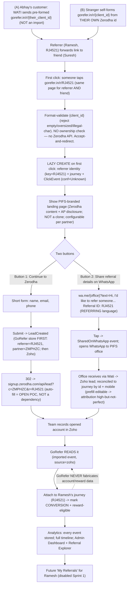

ROLE: You are a startup founder and product strategist reviewing the GoRefer specification (below). Challenge the business assumptions, referral psychology, growth loops, user engagement, viral mechanics, and business risks. What is missing? What would make this succeed or fail? Be blunt and specific. Note: technical decisions like the identifier scheme are locked — focus on product, growth, and business risk, not re-opening architecture.

--- FULL GOREFER SPECIFICATION BELOW — read all of it before responding ---

# GoRefer — Review Bundle

GoRefer — Zerodha Referral Platform. Sprint 1 (Zerodha only), architecture extensible to future partners.
Owner: Abhay Kumar Maurya / Passive Income Financial Solutions (PIFS), drafted with AI assistance.
This bundle is the full design spec for independent architecture/UX/product review.
Read all sections before commenting; note that Zoho is the authoritative source of truth for
referral credit and account status, and there is no Zerodha API.

## Table of Contents

1. 00-README.md
2. 01-GoRefer-Foundation-Specification.md
3. 02-Architecture-Decisions-ADR.md
4. 03-GoRefer-Constitution.md
5. 04-System-Architecture.md
6. 05-Database-Design.md
7. 06-API-Specification.md
8. 07-UI-UX-Specification.md
9. 08-Zoho-WATI-Integration.md
10. 11-Referral-Workflow-and-Edge-Cases.md
11. 12-Resolved-Gaps-and-Edge-Case-Decisions.md


================================================================================
FILE: 00-README.md
================================================================================

# GoRefer — Documentation Repository

**Owner:** Abhay Kumar Maurya / Passive Income Financial Solutions Private Limited (PIFS) — AI-assisted.
**Status:** Working draft.
**Last updated:** 2026-07-04.

---

## What GoRefer is

GoRefer is a referral-management and referral-intelligence platform for PIFS, a Zerodha Authorised Person (NSE AP `AP2516003693`, partner code `c=ZMPHZC`). It sits between WhatsApp/WATI and Zerodha's public signup flow: it mints a short, opaque, trackable referral link for every customer, captures each lead in PIFS's own systems *before* handing a real human off to Zerodha's reCAPTCHA-gated form, records every observable event (share, click, landing-page view, redirect) as immutable data, and enriches the referral journey with lead and account status pulled from Zoho CRM. Zerodha remains the underlying broker; GoRefer is the orchestration and intelligence layer. It is built as a scalable product from day one — Sprint 1 exposes only the Zerodha flow, but the architecture is provider-agnostic so future partners (Groww, insurance, mutual funds, property) plug into the same design without a redesign.

---

## Document list

| # | Document | Purpose |
|---|----------|---------|
| 00 | **README** (this file) | Repository index and how to use it |
| 01 | **GoRefer Foundation Specification** | Product/business vision, principles, functional & non-functional requirements, user journeys, scope |
| 02 | **Architecture Decision Records (ADRs)** | Every significant decision (ADR-001..ADR-014) with context, alternatives, decision, reasoning, consequences |
| 03 | **GoRefer Constitution** | The non-negotiable engineering principles every future feature must follow |
| 04 | **System Architecture** | Components, orchestration model, request/redirect flow, deployment topology |
| 05 | **Database Design** | PostgreSQL schema — referrals, tokens, journeys, events, configuration |
| 06 | **API Specification** | Endpoint contracts, request/response shapes, stable REQ/endpoint IDs |
| 07 | **UI/UX Specification** | Wizard-style screens, mobile-first flows, one-action-per-screen wireframes |
| 08 | **Zoho–WATI Integration** | Lead sync, phone resolution, template dispatch, opt-out handling |
| 09 | **LLM Review Pack** | Machine-readable context for AI design review (Claude/Grok/Gemini) |
| 10 | **Claude Code Implementation Guide** | How Claude Code should build against these specs (CLAUDE.md, DoD, standards) |

Documents 00–03 exist in this working draft. Documents 04–10 are planned skeletons from the original starter pack and are assembled incrementally as design freezes.

---

## Source of truth

The raw decision log this repository is **derived from** is [`GoRefer-Master-SourceOfTruth-from-ChatGPT.md`](./GoRefer-Master-SourceOfTruth-from-ChatGPT.md) — the origin vision captured across 37 "Additions" including ADR-001..ADR-012. Two companion capture docs refine and ground it against live testing:

- [`GoRefer-Build-Spec-Cowork-Decisions.md`](./GoRefer-Build-Spec-Cowork-Decisions.md) — the 2026-07-04 Cowork session: locked decisions, the verified Zerodha link behaviour, and the mandatory compliance layer the origin doc omitted.
- [`GoRefer-Context-Brief.md`](./GoRefer-Context-Brief.md) — the consolidated, sourced brief of everything already decided vs genuinely open.

Where this repository and the master capture doc disagree, the ADRs in Document 02 record the reconciliation explicitly (see especially ADR-001 and ADR-013).

---

## How to use this repo

1. **Start with 01 (Foundation Specification)** for vision, scope, and requirements — the "what and why."
2. **Read 03 (Constitution)** before proposing or building any feature — these principles are non-negotiable and every design is checked against them.
3. **Consult 02 (ADRs)** before revisiting any settled decision. Each ADR records the reasoning and consequences, so a future change can be weighed against the original intent rather than relitigated from scratch.
4. **Use 04–08** for implementation detail once a design area is frozen.
5. **Run the compliance gate** (Abhay's `zerodha-ap-social-media-compliance` skill) on every public asset before it ships — this is a hard requirement, not advisory (see ADR-014).
6. **Never fabricate data.** GoRefer reports only events it can verify; account-opening and reward status come solely from Zoho (see ADR-013).

Requirements carry stable IDs (REQ-001…) and decisions carry ADR IDs (ADR-001…) so that Claude Code and future AI tools can navigate and implement consistently.


================================================================================
FILE: 01-GoRefer-Foundation-Specification.md
================================================================================

# GoRefer Foundation Specification
**Version 1.0 (Draft) — Document 1 of the GoRefer Architecture Repository**
_Being assembled incrementally; this is Part 1 (~first 10%)._

## Revision History
| Version | Date | Author | Remarks |
|---|---|---|---|
| 0.1 | Initial Draft | Abhay Kumar Maurya / Passive Income Financial Solutions (PIFS) — drafted with AI assistance | Foundation specification created |
| 1.0 | Pending | After Architecture Review | Frozen for implementation |

## Status
Working Draft. This document is the single source of truth for the GoRefer platform. Every future design decision, implementation, enhancement, integration, and architecture review shall reference this document.

## Purpose
Defines: Product Vision, Business Vision, Architecture Principles, Functional Requirements, Non-Functional Requirements, Business Rules, User Journeys, System Behaviour, Future Expansion Strategy. It intentionally avoids implementation details (those belong in later documents).

## Intended Audience
Product Owners, Architects, Software Engineers, Claude Code, Gemini, Grok, Future Contributors.

## What is GoRefer?
GoRefer is a Referral Management & Referral Intelligence Platform. It enables users to manage, share, and track referral links from multiple businesses using one unified platform. Unlike traditional referral systems that only generate links, GoRefer focuses on the complete referral lifecycle: referral creation, sharing, tracking, analytics, intelligence, conversion tracking, and future reward tracking.
GoRefer does NOT own referral programs — it integrates with existing referral programs offered by partner businesses. Examples: Zerodha, insurance companies, mutual fund platforms, property brokers, loan providers, credit card companies, affiliate programs, any future referral-enabled business.

## Vision Statement
To become the most trusted platform for managing, sharing, and analysing referral programs across multiple industries through one intelligent ecosystem.

## Mission Statement
Help every individual maximize the value of their referral relationships while providing businesses with a scalable and extensible referral management platform.

## Product Philosophy (5 core principles)
1. **Build once, scale forever** — every architectural decision today must support future referral programs without redesign.
2. **Expose only today's capabilities** — never show unfinished functionality; no "Coming Soon," placeholder menus, or disabled buttons; users only see features they can actually use.
3. **Measure everything possible** — capture every observable business event (link created, link shared, link clicked, landing page viewed, redirect initiated, lead created, contact converted). If GoRefer can observe it, record it.
4. **Never fabricate data** — GoRefer only reports facts it can verify. It CAN verify click timestamp and redirect timestamp. It CANNOT independently verify whether Zerodha completed KYC or account approval — those must originate from external systems (e.g. Zoho updates).
5. **Configuration over code** — adding a future referral program should require configuration wherever possible, not application code changes.

## Product Scope
**Sprint 1 scope:** only ONE referral program enabled — Partner: Zerodha. Although only Zerodha is active, the architecture shall support multiple future referral programs.
**Sprint 1 includes:** Public Website, Admin Dashboard, Referral Tracking, Referral Analytics, WATI Integration, Zoho CRM Integration, Referral Landing Pages, Redirect Tracking, Referral Journey Timeline.
**Sprint 1 explicitly excludes:** Customer Login, Public Registration, Self-Service Dashboard, Reward Calculations, Payment Integrations, Mobile Application, Multi-language Support.

## Business Goals
1. Increase Zerodha referrals.
2. Increase referral conversion rate.
3. Reduce manual follow-up.
4. Provide visibility into referral performance.
5. Create reusable architecture for future referral businesses.

## Success Metrics (Sprint 1 succeeds if)
Personalized referral links are generated correctly; WATI campaigns successfully distribute referral links; click tracking functions reliably; referral journeys are recorded; Zoho CRM synchronization works; admin dashboard displays meaningful analytics; architecture requires minimal changes to onboard a second referral partner.

## User Types (actors)
1. **Platform Administrator** — current: one bootstrap administrator (Abhay). Responsibilities: configure referral programs, monitor analytics, review referral journeys, manage integrations, review campaign performance.
2. **Existing Customer (Future)** — a customer who has joined one or more referral programs. NOT enabled in Sprint 1 (architecture only).
3. **Referral Visitor** — a person who clicks a referral link; no authentication required.
4. **External Systems** — WATI, Zoho CRM, Zerodha, future partners; interact with GoRefer via APIs, redirects, or synchronization.

## High-Level Product Flow
1. A referral program (e.g. Zerodha) is configured in GoRefer.
2. A unique referral link is associated with a participant for that program.
3. The participant shares the link (WhatsApp, social media, email, QR code).
4. A visitor clicks the referral link.
5. GoRefer records the click and starts a referral journey.
6. The visitor is shown an optional landing page (or redirected immediately, depending on configuration).
7. The visitor is redirected to the partner's official referral URL.
8. Subsequent business events (lead creation, account opening) are synchronized from Zoho CRM.
9. The admin dashboard displays the complete referral lifecycle.

---
_End of Part 1 (~10% of the Foundation Specification). Subsequent parts will cover the complete referral lifecycle, business rules, user journeys, and all functional requirements._

---

# Part 2 — Referral Lifecycle, Journeys, Requirements, Rules & Compliance

> _Part 1 above (Vision, Philosophy, Scope, Actors, High-Level Flow) is frozen. Part 2 completes the Foundation Specification. Requirement IDs (REQ-xxx), business-rule IDs (BR-xxx), non-functional IDs (NFR-xxx), and acceptance-criteria IDs (AC-xxx) are **stable**: once assigned they are never renumbered. New items get the next free number; retired items are marked `DEPRECATED`, never reused._

## 10. The Referral Lifecycle (Canonical State Model)

The referral lifecycle is the spine of GoRefer. Every downstream document (database, API, UI, analytics) derives from it. The lifecycle records **only what GoRefer can observe or receive from a trusted source**. It never infers or fabricates a state (Product Philosophy #4).

### 10.1 The states

| # | State | Meaning | Who/what sets it | GoRefer-verifiable? |
|---|-------|---------|------------------|---------------------|
| S0 | **Created** | A permanent referral link exists for a (user, program) pair. No visitor activity yet. | GoRefer, lazily on first need | Yes |
| S1 | **Shared** | The referrer distributed the link through a channel (WhatsApp, Status, social, email, QR). Recorded when a share action is observable. | GoRefer / channel event | Partially (only observable shares) |
| S2 | **Clicked** | A visitor opened the referral link. Every click is stored as a **separate event** with a confidence classification. | GoRefer redirect layer | Yes |
| S3 | **Landing Viewed** | The visitor was shown the GoRefer landing experience (if landing is enabled for the program). | GoRefer | Yes |
| S4 | **Redirected** | GoRefer handed the visitor off to Zerodha's official public lead URL. **This is the last state GoRefer can independently verify.** | GoRefer | Yes |
| S5 | **Lead Created** | A lead was captured (name + mobile) via GoRefer's own PIFS-branded capture form, or a lead record was created in Zoho. | GoRefer capture form / Zoho | Yes (for GoRefer-captured leads) |
| S6 | **Contact / Account** | The prospect became a Zoho Contact and/or a Zerodha account was opened. | **Zoho only** (synced) | **No — external truth** |
| S7 | **[Reward — FUTURE]** | Reward points / brokerage share credited to the referrer. Out of Sprint 1 scope; architecture-only. | **Zoho / Zerodha only** (synced) | **No — external truth** |

### 10.2 The critical verification boundary

```
   GoRefer verifies up to here ──────────────┐
                                             ▼
Created → Shared → Clicked → Landing Viewed → Redirected  │  Lead Created → Contact/Account → [Reward]
                                                          │
                          external truth (Zoho / Zerodha) ┴────────────────────────────────────►
```

**Account opening and reward come ONLY from Zoho and are NEVER fabricated by GoRefer.** GoRefer can prove a visitor was *redirected* to Zerodha; it cannot prove — and must never claim — that KYC completed, an account opened, or a reward was paid. Those states appear in GoRefer only after a trusted Zoho sync writes them (see REQ-021). This is a direct consequence of the live-tested fact that Zerodha's link is lead-capture-only, reCAPTCHA-gated, ends at "thanks," and is completed by a human (Ashok) off-platform.

### 10.3 State transitions and events

Every state change emits an immutable event (event-sourced; store events, not counters). Ordering is not strictly linear: a visitor may click without a landing page (S2→S4 when landing is disabled), may click many times (multiple S2 events on one journey), or may never proceed past S4. A lead (S5) can also originate from the GoRefer capture form *before* any redirect. The lifecycle is therefore a **directed graph with S4 as the verification frontier**, not a rigid pipeline.

| From | To | Trigger event |
|------|----|---------------|
| — | S0 Created | `ReferralLinkCreated` (lazy) |
| S0 | S1 Shared | `ReferralShared` (observable share only) |
| S0/S1 | S2 Clicked | `ReferralClicked` (one per click, with confidence) |
| S2 | S3 Landing Viewed | `LandingViewed` (only if landing enabled) |
| S2/S3 | S4 Redirected | `RedirectInitiated` |
| any | S5 Lead Created | `LeadCreated` (GoRefer form submit: name + mobile) |
| S5 | S6 Contact/Account | `ZohoContactSynced` / `ZohoAccountStatusSynced` (from Zoho only) |
| S6 | S7 Reward | `RewardSynced` (FUTURE, from Zoho/Zerodha only) |

---

## 11. Detailed User Journeys

### 11.1 Journey A — Managed customer (existing PIFS/Zerodha client), reached via WATI

1. PIFS sends a Meta-approved WATI WhatsApp template to an existing, opted-in client. The template carries the client's **personal referral link** and the **PIFS partner link** (both always present).
2. The client taps their personal referral link → GoRefer records a **click event** (confidence classified) and, if enabled, shows the landing experience.
3. The client shares the link with a friend (WhatsApp forward, Status, social) — recorded as a **Shared** event where observable.
4. Alternatively (and the **recommended primary path**), the client uses "Share Friend Name + Mobile": GoRefer captures the friend's name + mobile in a PIFS-branded form, saves the lead first, and alerts Ashok. The link path stays available as the **secondary** path.
5. GoRefer never depends on the client understanding referral-link mechanics; the assisted path always leads.

### 11.2 Journey B — Referral visitor (the friend / prospect)

1. Visitor opens a GoRefer referral link (`gorefer.in/r/{client_id}`). **No authentication is required.**
2. GoRefer creates the journey **lazily on this first click** (no tracking record existed before), stores the click as a separate event with a confidence classification (default `Unknown`), and captures available signals (timestamp, referer, user-agent, and IP handled per the DPDP rules in NFR-006).
3. If the program has a landing experience enabled, the visitor sees a PIFS-branded page ("Your friend invited you… Open your Zerodha account", benefits, "Open Account", "Need Help?"). The page is **not** a Zerodha look-alike.
4. On "Open Account", GoRefer records a **RedirectInitiated** event and redirects the real human browser to Zerodha's official public lead URL (`https://signup.zerodha.com/api/lead/?c=ZMPHZC&r={client_id}`).
5. On "Need Help?" (or via the assisted flow), the visitor submits name + mobile → **LeadCreated** in GoRefer/Zoho → the three WATI messages fire (to Ashok, to the new person, and to the referrer only if the referrer's phone is resolvable from Zoho).
6. Ashok calls and helps complete Zerodha account opening (the human satisfies reCAPTCHA legitimately). GoRefer's view of this journey **stops at Redirected/Lead Created**; account status appears later only via Zoho sync.

### 11.3 Journey C — Administrator

1. Admin authenticates via the **admin-only login** (bootstrap admin credentials from environment variables; no public registration).
2. Admin lands on the dashboard: aggregate metrics (links, clicks by confidence, landing views, redirects, leads, and Zoho-sourced account status).
3. Admin opens the **Referral Explorer** to filter journeys by partner, date range, customer/referrer, and status; drills into a single journey's full event timeline.
4. Admin reviews campaign performance, configures the (single, Sprint-1) Zerodha program, and manages integrations (WATI, Zoho) — all behind **feature flags** so nothing half-built is exposed. There is **no "Coming Soon."**

---

## 12. Functional Requirements (REQ-xxx)

### 12.1 Referral links & identifiers

- **REQ-001** Each referrer has **exactly one permanent referral link per program**, carrying their **raw Zerodha `client_id`** in the path. The canonical public form is **`gorefer.in/r/{client_id}`** (e.g. `gorefer.in/r/RJ4521`). The link is stable for the life of the (referrer, program) relationship. There is **no opaque token and no token→id mapping table** (ADR-001).
- **REQ-002** The path segment **is** the referrer's Zerodha `client_id`. At redirect time GoRefer injects the partner code **server-side** and builds the official destination `https://signup.zerodha.com/api/lead/?c=ZMPHZC&r={client_id}`. The `client_id` is already public (it appears in Zerodha's own `r=` links); the **partner code `c=ZMPHZC` is never exposed** in the shared link and is added server-side (supports R6). _Note: for future non-Zerodha partners that expose no reusable native ID, GoRefer will generate a referral ID at referrer login — a forward-looking capability, not Sprint 1 (ADR-001)._
- **REQ-003** Link creation is **lazy**: GoRefer does **not** create a tracking/journey record until the **first click** on that link (or the first lead capture). No pre-provisioned empty journeys.

### 12.2 Click & event capture

- **REQ-004** Every click is stored as a **separate event** (never an incremented counter), with timestamp, the referrer `client_id` from the link, channel/UTM signals where present, user-agent, and IP (stored per NFR-006).
- **REQ-005** Every click event carries a **confidence classification** describing how reliably it maps to a real human referral click. Default classification is **`Unknown`**. Other classifications (e.g. `Likely-Human`, `Likely-Bot`, `Duplicate`) may be assigned by later logic; the schema must allow reclassification without data loss.
- **REQ-006** All observable business events are recorded (`ReferralLinkCreated`, `ReferralShared`, `ReferralClicked`, `LandingViewed`, `RedirectInitiated`, `LeadCreated`, and the Zoho-sourced `ZohoContactSynced` / `ZohoAccountStatusSynced`). Events are **append-only and immutable**.

### 12.3 Landing & redirect

- **REQ-007** For programs with landing enabled, GoRefer shows a **PIFS-branded landing experience** before redirect, recording a `LandingViewed` event. For programs with landing disabled, GoRefer redirects immediately after the click event.
- **REQ-008** On the visitor's explicit action ("Open Account"), GoRefer records `RedirectInitiated` and redirects the **real human browser** to Zerodha's **official public** `api/lead` URL with `c=ZMPHZC` and `r={client_id}`. GoRefer **never** auto-submits or programmatically completes Zerodha's form (see BR-005).

### 12.4 Lead capture & CRM

- **REQ-009** GoRefer provides its **own PIFS-branded capture form** ("Passive Income Financial Solutions — open your Zerodha account"). On submit of **name + mobile**, GoRefer creates a lead (`LeadCreated`) and saves it **first** in GoRefer's own store so the lead is never lost, even if the person abandons Zerodha. _Canonical lead schema (whether "City" is required) is an OPEN decision inherited from the source docs; the mandatory minimum is name + mobile._
- **REQ-010** On lead creation, GoRefer triggers the **three WATI messages** via Meta-approved templates: (a) alert to Ashok, (b) warm utility-style notice to the new person naming the referrer + a `r=`-bearing continue link, (c) thank-you to the referrer **only if** the referrer's phone is resolvable from Zoho. Message (b) must be utility-style, not a marketing blast (see BR-008).
- **REQ-011** GoRefer writes/reconciles the lead to **Zoho CRM** (lead destination — Zoho, WATI, or both — is an OPEN decision; the requirement is that a durable CRM record exists and Ashok is alerted instantly).

### 12.5 Admin, dashboard & explorer

- **REQ-012** GoRefer provides an **admin dashboard** showing aggregate lifecycle metrics: links created, clicks (broken down by confidence classification), landing views, redirects, leads, and Zoho-sourced account status.
- **REQ-013** GoRefer provides a **Referral Explorer** to list and filter referral journeys by **partner, date range, customer/referrer, and status**, with drill-down into a single journey's complete, ordered event timeline.
- **REQ-014** The dashboard **distinguishes GoRefer-verified states (≤ Redirected) from externally-sourced states (Contact/Account/Reward)** visually, so no one mistakes a redirect for an opened account.

### 12.6 Platform, access & configuration

- **REQ-015** GoRefer serves a **public marketing website** (no auth) and an **admin-only authenticated area**. There is **no public registration** and **no customer login** in Sprint 1.
- **REQ-016** The **bootstrap administrator** is provisioned from **environment variables** (no seed user in code, no public sign-up path to admin).
- **REQ-017** All not-yet-shippable capability sits behind **feature flags**; the UI exposes **only features that actually work**. **No "Coming Soon", no placeholder menus, no disabled buttons** (Product Philosophy #2).
- **REQ-018** Adding a **new referral partner** must be achievable through **configuration** (program record: name, display name, logo, theme, brand color, landing template, redirect strategy, reward description, T&C, active flag) — **no partner-specific application code** (Product Philosophy #5, "Engines not pages").

### 12.7 Zoho synchronization (external truth)

- **REQ-019** GoRefer **reads** account/contact status from Zoho and reflects it on the corresponding journey. GoRefer must **never** synthesize `Contact/Account` or `Reward` states from its own click/redirect data.
- **REQ-020** Zoho sync is **idempotent and auditable**: each sync records its source, timestamp, and the field(s) it changed; re-running a sync produces no duplicate state.
- **REQ-021** Externally-sourced states (S6, S7) are written **only** by the Zoho sync path and are clearly labelled in storage and UI as **externally sourced** (traceable to the sync that set them).

---

### 12.8 Future / Out-of-Sprint-1 requirements (DEFERRED — not in Sprint 1)

> _These requirements are **explicitly out of Sprint 1 scope**. They are recorded here so the architecture stays forward-compatible, but Claude Code / any implementer **must not** build them in Sprint 1. IDs in the `REQ-Fxx` range denote deferred/future requirements._

- **REQ-F01 Stale-lead auto-nudge (DEFERRED — Sprint 2+).** When a GoRefer-sourced lead ages without converting (e.g. approaching Zerodha's 60-day attribution window, see BR-003), GoRefer **automatically** sends a WhatsApp reminder to the prospect via **Wati** nudging them to complete account opening.
  - **Sprint 1 behaviour (locked):** stale-lead follow-up is **owned by Zoho** (Zoho is the source of truth for lead status and follow-up). GoRefer only shows a **read-only aging flag** derived from GoRefer's own timeline data. This aging flag is **GoRefer-derived, not a Zoho override** — GoRefer never writes lead status back to Zoho and never overrides Zoho (BR-006, REQ-019).
  - **Future behaviour (REQ-F01):** GoRefer moves from passive aging flag to an **active stale-lead WhatsApp nudge via Wati**.
  - **Dependencies / guardrails:** deferred until the **WATI opt-in / delivery-dedup fix** (the ~33% delivery-failure item) lands first. Any nudge **must respect Meta opt-in rules** — a warm, **utility-style** message, never a marketing blast (see BR-008). Zoho remains the source of truth; the nudge is additive and must never override or contradict Zoho lead status.

---

## 13. Non-Functional Requirements (NFR-xxx)

- **NFR-001 Mobile-first.** All visitor-facing surfaces (referral link redirect, landing experience, capture form) are designed mobile-first; the dominant channel is WhatsApp on phones. Landing/redirect must feel instant on a mid-range Indian Android device on 4G.
- **NFR-002 Performance.** The redirect path (click → event stored → redirect) must add negligible latency to the visitor's hop to Zerodha; event persistence must not block the redirect (write-through/async acceptable as long as no event is silently dropped).
- **NFR-003 Security.** Admin area protected by authentication; bootstrap admin from env vars (REQ-016). Secrets (WATI bearer token, Zoho credentials) live in a secret store / environment — **never hardcoded** (the current hardcoded WATI JWT in Zoho Deluge is a known debt to avoid repeating). No auto-submission of third-party forms.
- **NFR-004 Privacy / DPDP.** GoRefer processes personal data (name, mobile, click IP). Comply with India's DPDP Act: collect the minimum needed, state purpose, and **store IP carefully** — treat it as personal data (restrict access, define retention, avoid unnecessary exposure in logs/UI). Honour opt-out signals from Zoho where available.
- **NFR-005 Scalability.** Event-sourced, append-only design; multi-partner architecture from day one even though only Zerodha is active. Adding partners is configuration, not re-architecture.
- **NFR-006 IP handling (specific).** The click IP is captured for confidence classification and abuse detection only. It must be access-controlled, retained no longer than needed, and never displayed to non-admin users. Consider storing a truncated/hashed form where full IP is not required.
- **NFR-007 Auditability.** Every state change and every external sync is traceable to its source and timestamp (immutable event log + sync audit). The admin can reconstruct any journey exactly.
- **NFR-008 Configuration-over-code.** New partners, landing templates, and redirect strategies are data/config; engines (Redirect, Landing, Campaign, Notification, Poster) contain no partner-specific branches.

---

## 14. Business Rules (BR-xxx)

- **BR-001 Dual-code attribution.** Every referral destination URL must carry **both** `c=ZMPHZC` (credits PIFS as AP for ongoing brokerage) **and** `r={client_id}` (credits the referring client under Zerodha Refer & Earn). A plain link with only `c=ZMPHZC` credits the partner alone.
- **BR-002 Referrer credit source.** The `r=` value is the **referrer's Zerodha client_id**, taken directly from the `gorefer.in/r/{client_id}` path (no lookup). `c=ZMPHZC` is constant for PIFS and injected server-side. The `client_id` is visible in the link (already public); `c=ZMPHZC` is never exposed in the shared GoRefer link.
- **BR-003 Attribution window.** A referred account must open **within 60 days** of the referral. GoRefer records timestamps but does not enforce Zerodha's window; it must not claim attribution it cannot prove.
- **BR-004 Prior-registration voids mapping.** If the prospect had already registered with Zerodha before using the link, the referral mapping does not apply. GoRefer must not assert a reward for such cases.
- **BR-005 reCAPTCHA reality — never auto-submit.** Zerodha's `api/lead` form is a **lead-capture form that ends at "thanks," is reCAPTCHA-gated, and has editable code fields.** GoRefer **must not** auto-submit or script it. The only compliant path is redirecting a **real human**, who is then assisted by Ashok to complete account opening. Code-swap on Zerodha's editable form is a residual, un-preventable risk (mitigated by a hidden default in our link).
- **BR-006 Verification boundary.** GoRefer independently verifies **only up to Redirected**. `Contact/Account` and `Reward` come **only** from Zoho sync and are never fabricated (see REQ-019/021).
- **BR-007 Lead-first.** On any capture, save the lead in GoRefer/Zoho **before** handing off to Zerodha, and alert Ashok instantly. The lead must survive Zerodha abandonment.
- **BR-008 Warm first contact.** The first WATI message to a lead who did **not** personally opt in (referrer submitted their details) must be a **warm, utility-style notice naming the referrer** — never a marketing blast — to protect the WhatsApp business number from Meta throttling.
- **BR-009 No clone.** GoRefer's forms and landing pages must be clearly **PIFS-branded** and must **not** clone or impersonate Zerodha's signup page (misrepresentation risk under NSE/COMP/55482).
- **BR-010 Referrer notification is best-effort.** The thank-you to the referrer fires **only** when the referrer's phone is resolvable from Zoho; for open-ended referrers known only by `client_id`, no message is sent.
- **BR-011 Single swappable incentive claim.** The "10% brokerage + 300 points" wording is kept in **one** configurable place so it can be pulled instantly if the regulatory position changes (see §15).

---

## 15. Compliance (MANDATORY)

> This section is a **hard gate**. Nothing publishes until it passes. (The origin ChatGPT doc omitted compliance entirely; it is mandatory here.)

### 15.1 Mandatory AP disclosure block

Must appear, verbatim, on **every owned channel and public asset** (website, landing pages, posters, WATI templates, emails, bios):

```
Zerodha Broking Ltd.: SEBI Registration no.: INZ000031633 | Passive Income Financial Solutions Private Limited | NSE AP reg. no.: AP2516003693
```

A market-risk warning (min font size 10) must accompany investment-related assets: "Investments in securities market are subject to market risks, read all the related documents carefully before investing." If brokerage rates are mentioned: "Brokerage will not exceed the SEBI prescribed limit."

### 15.2 Incentive claim — LIVE but REVOCABLE

The "**10% of brokerage + 300 reward points**" claim is **currently permitted but revocable**:

- **NSE/INSP/63425 (14-Aug-2024)** banned non-AP referrer brokerage-sharing.
- **NSE/INSP/66284 (24-Jan-2025)** put that ban **IN ABEYANCE** (paused, not repealed); interim regime reverts to **NSE/INSP/43824 (11-Mar-2020)**, which permits brokerage-sharing referral. Zerodha relaunched Refer & Earn on these terms.
- **Implication:** if NSE reinstates the ban, all content claiming 10% becomes non-compliant. Per **BR-011**, this wording lives in a single, swappable place.

### 15.3 Advertising gates

- All public assets must pass the **NSE Code of Advertisement (NSE/COMP/55482)** and the **SEBI Feb-2026 social-media disclosure circular** (HO/(79)2026-MIRSD-PODMMC, 26-Feb-2026, effective 1-May-2026).
- **Every public asset must pass Abhay's `zerodha-ap-social-media-compliance` skill review before publishing — this is a non-negotiable pre-publish gate.**
- **GoRefer's own forms and pages must NOT clone or impersonate Zerodha's signup page** (BR-009).
- Prohibited: superlatives (best/No.1/lowest/leading), income projections / assured returns, NSE logo, any MCX claim, PIFS-funded incentives on top of Zerodha's program, paid ads pointing at affiliate links, public-forum spam of affiliate links.

---

## 16. Acceptance Criteria (AC-xxx)

Sprint 1 is accepted when all of the following hold (mapped to the Success Metrics in Part 1 §Success Metrics):

- **AC-001** A permanent, correct personalized referral link (`gorefer.in/r/{client_id}`) is generated for a user and resolves to `signup.zerodha.com/api/lead/?c=ZMPHZC&r={client_id}` with both codes intact. _(REQ-001, REQ-002; Metric: links generated correctly.)_
- **AC-002** A WATI campaign successfully distributes referral links to opted-in recipients, with delivery verified from WATI's terminal status (not just HTTP 200). _(Metric: WATI campaigns distribute links.)_
- **AC-003** Every click is recorded as a separate event with a confidence classification (default `Unknown`), reliably, before redirect. _(REQ-004, REQ-005; Metric: click tracking reliable.)_
- **AC-004** A complete referral journey (Created → … → Redirected, plus any Lead Created) is recorded and viewable as an ordered event timeline. _(REQ-006, REQ-013; Metric: journeys recorded.)_
- **AC-005** Zoho synchronization writes `Contact/Account` status onto the correct journey, clearly labelled as externally sourced; no such state is ever fabricated by GoRefer. _(REQ-019/021, BR-006; Metric: Zoho sync works.)_
- **AC-006** The admin dashboard and Referral Explorer display meaningful analytics and support filtering by partner, date, customer/referrer, and status. _(REQ-012/013; Metric: meaningful analytics.)_
- **AC-007** A second referral partner can be onboarded via configuration only, with no partner-specific application code. _(REQ-018, NFR-008; Metric: minimal change for partner #2.)_
- **AC-008** No unfinished capability is visible: no "Coming Soon", placeholder menus, or disabled buttons; admin is reachable only via env-bootstrapped login. _(REQ-015/016/017.)_
- **AC-009** Every public asset carries the AP disc

================================================================================
FILE: 02-Architecture-Decisions-ADR.md
================================================================================

# GoRefer — Architecture Decision Records (ADRs)

**Document 02 of the GoRefer Architecture Repository.**
**Owner:** Abhay Kumar Maurya / PIFS (AI-assisted). **Status:** Working draft. **Last updated:** 2026-07-04.

> Each record captures one significant, hard-to-reverse decision. Format for every ADR: **ID · Title · Status · Context/Problem · Alternatives Considered · Decision · Reasoning · Consequences.** ADR-001..ADR-012 originate in the master capture doc (`GoRefer-Master-SourceOfTruth-from-ChatGPT.md`); ADR-013 and ADR-014 encode the ground truth added in the 2026-07-04 Cowork session (`GoRefer-Build-Spec-Cowork-Decisions.md`).

---

## ADR-001 — Raw Zerodha `client_id` in the path `gorefer.in/r/{client_id}` (no token, no mapping DB)

- **Status:** Accepted (locked, 2026-07-04). **Reverses** the earlier opaque-token decision. The partner code `ZMPHZC` is injected **server-side** into the redirect and never appears in the shared link.
- **Context / Problem:** A referral link must credit both the partner (`c=ZMPHZC`) and the referring client (`r=<client_id>`). The earlier design used an opaque token resolved through a `token → client_id` mapping table. But GoRefer's referrers are **open-ended** — anyone with a Zerodha client ID can refer, not just Abhay's existing customers — so **no token→id mapping can pre-exist** for a stranger. A person who is not in Abhay's data must be able to refer simply by putting **their own** Zerodha client ID in the link. A mint-a-token-per-customer scheme cannot serve a referrer GoRefer has never seen.
- **Alternatives Considered:**
  1. **Opaque token** (`gorefer.in/r/{token}`) — requires a pre-created `token → client_id` mapping row per referrer. Fails the open-ended-referrer test: a stranger has no pre-existing token, so they cannot self-form a link. Rejected.
  2. **Raw Zerodha `client_id` in the path** (`gorefer.in/r/RJ4521`) — no mapping table, no mint step; any referrer self-forms their own link from their own known client ID.
- **Decision:** Put the **raw Zerodha `client_id` directly in the path**: `gorefer.in/r/{client_id}` (e.g. `gorefer.in/r/RJ4521`). There is **no opaque token and no token→id mapping table**. The partner code `ZMPHZC` is added **server-side** at redirect time and is never in the shared URL. For Abhay's own customers, a WATI campaign simply sends each of them their pre-formed `gorefer.in/r/{their_client_id}` link (built from data Abhay already has — this is *not* an import step). Non-customers self-form the link with their own Zerodha client ID.
- **Reasoning:** Referrers are open-ended, so there is no pre-existing data from which to mint or map a token. The raw `client_id` is the only identifier that both Abhay's customers **and** strangers can produce without an onboarding step. The `client_id` is not a secret — it is **already public in Zerodha's own `r=` referral links**. A wrong or mistyped id only fails to credit that one referrer; `c=ZMPHZC` is injected server-side and **always** credits PIFS regardless.
- **Consequences:** The `client_id` is **visible in the link** (accepted — it is already exposed in Zerodha's own referral URLs). There is **no per-link revocation/rotation** (accepted — a raw public identifier has none). No `token → client_id` mapping table is built or maintained for Zerodha; the redirect handler format-validates the `client_id` and uses it directly. See ADR-008 for lazy creation on first click.
- **Note for future partners:** Partners **other than Zerodha** (properties, mutual funds, loans, etc.) may not expose a reusable native ID like Zerodha's `client_id`. For those, GoRefer will **generate a referral ID when the referrer logs in** (a future capability). So the *generated-ID* concept returns for future partners — but **Zerodha uses its native `client_id`**. This is a forward-looking note, **not** a Sprint-1 feature.

---

## ADR-002 — Landing experience before redirect

- **Status:** Accepted.
- **Context / Problem:** When a friend clicks a referral link, GoRefer can either bounce them straight to Zerodha or first show its own page. An immediate redirect is a pure URL-shortener; it forfeits trust-building, value explanation, analytics, and any chance to offer human help.
- **Alternatives Considered:** (1) Immediate redirect to Zerodha. (2) A branded GoRefer landing page ("Your friend Rahul invited you — open your free Zerodha account, benefits, need help?") shown first, redirecting only when the visitor chooses to continue.
- **Decision:** Every referral link resolves to a **landing experience first**; redirect to Zerodha happens only after the visitor chooses to continue.
- **Reasoning:** The landing page builds trust, explains the value proposition, captures analytics (landing-page view as a distinct event), enables an offer of assistance, and allows A/B testing. This is the shift from "URL shortener" to "conversion platform."
- **Consequences:** GoRefer owns a real page per referral (configurable per program). One extra step before Zerodha, justified by higher conversion and richer data. Requires the landing-page-view event in the event model.

---

## ADR-003 — Mobile-first UI

- **Status:** Accepted.
- **Context / Problem:** The overwhelming majority of referral traffic originates from WhatsApp on a phone. A desktop-first design that is merely "responsive" degrades the primary experience.
- **Alternatives Considered:** (1) Desktop-first, responsive down to mobile. (2) Mobile-first, designed for the phone as the primary surface.
- **Decision:** Design **mobile-first** — for the phone as the primary device, not merely responsive.
- **Reasoning:** Most referrals start on WhatsApp; the majority of clicks and shares happen on mobile. Optimising for the real device raises conversion.
- **Consequences:** All screens, wireframes, and share affordances are designed for mobile first; desktop is the adaptation. One-tap Share/Open is preferred over copy-paste or same-phone QR scans.

---

## ADR-004 — Event-driven analytics (store events, not counters)

- **Status:** Accepted.
- **Context / Problem:** Analytics can be stored as running counters (e.g. a `clicks` integer) or as an append-only log of individual events. Counters are cheap but lossy — they cannot answer questions not anticipated when the counter was created.
- **Alternatives Considered:** (1) Counter-based analytics (increment aggregates). (2) Event-driven model (store each observable event as an immutable row; derive all aggregates from events).
- **Decision:** Use an **event-driven analytics model**. Every observable event (link created, shared, clicked, landing-page viewed, redirect initiated, lead created, …) is stored as its own record; all reporting is computed from the event stream.
- **Reasoning:** Unlimited reporting flexibility, easier debugging, a complete audit trail, and support for future AI-driven insights. "Collect everything now, visualise it later." Counters throw away exactly the data future questions need.
- **Consequences:** More storage and a query/aggregation layer are required. Events are immutable (see ADR-007 and the Constitution). Any new metric is a query over existing data, not a schema migration or a backfill.

---

## ADR-005 — Single-domain routing (`gorefer.in/r/{client_id}` + `gorefer.in/{partner}`)

- **Status:** Approved & locked (2026-07-04). Supersedes the earlier `z.gorefer.in` subdomain scheme. Updated to carry the **raw `client_id`** in the path (ADR-001), not an opaque token.
- **Context / Problem:** The origin doc initially assumed a per-context subdomain (`z.gorefer.in`). Subdomains multiply DNS records, SSL certificates, and operational surface — heavy for a one-person operation and awkward to extend per partner.
- **Alternatives Considered:** (1) Per-partner/subdomain scheme (`z.gorefer.in`, `groww.gorefer.in`, …). (2) Single bare domain with path-based routing: referral journeys at `gorefer.in/r/{client_id}`, marketing pages at `gorefer.in/{partner}`.
- **Decision:** Use a **single-domain, path-routed** architecture. Canonical URLs: referral journey `gorefer.in/r/{client_id}` (the raw Zerodha `client_id`, per ADR-001); public/marketing page `gorefer.in/{partner}` (e.g. `gorefer.in/zerodha`, future `gorefer.in/groww`, `gorefer.in/insurance`, `gorefer.in/properties`). The partner/program for a referral path is resolved from **config** (Sprint 1 = Zerodha); the path segment carries the referrer's `client_id`.
- **Reasoning:** Simpler infrastructure, easier SSL/DNS management, cleaner analytics, shorter links (better UX), and painless future expansion — a new partner is a new path, not a new subdomain and certificate. Migrating URL structures later is expensive, so this is locked before code is written.
- **Consequences:** One domain and one certificate to manage. Partner pages and referral journeys share a routing layer that dispatches by path. No subdomain dependency. The `{client_id}` segment is the raw referrer id (ADR-001), not a token.

---

## ADR-006 — PostgreSQL + Zoho CRM + WATI, with GoRefer as orchestrator

- **Status:** Accepted (locked recommendation).
- **Context / Problem:** GoRefer needs a home for its own entities (referrals, referral identities, journeys, analytics, configuration) while a mature CRM (Zoho) already owns leads and sales, and WATI already owns WhatsApp messaging. Duplicating any of these invites drift and conflict.
- **Alternatives Considered:** (1) Store everything inside Zoho custom modules. (2) Use a document store (e.g. MongoDB) for GoRefer data. (3) A dedicated relational database for GoRefer entities, integrating with Zoho and WATI as systems of record for their domains.
- **Decision:** **PostgreSQL** is the primary store for all GoRefer-specific entities; **Zoho CRM** owns lead management, executive workflow, and the sales pipeline; **WATI** owns WhatsApp messaging, templates, and campaigns; **GoRefer** is the orchestration layer integrating all three.
- **Reasoning:** GoRefer's data is highly relational (links → journeys → events) and analytics-heavy — PostgreSQL fits far better than a document store or CRM modules. Keeping each system as the authority for its own domain avoids duplication and keeps GoRefer's logic separate from CRM and messaging logic.
- **Consequences:** Clear ownership boundaries: business/referral logic in GoRefer, CRM logic in Zoho, messaging in WATI. GoRefer must maintain integration adapters and reconcile state pulled from Zoho. No partner or messaging logic leaks into the core schema.

---

## ADR-007 — Every referral link is a first-class entity with a full lifecycle

- **Status:** Accepted (core feature, not an enhancement).
- **Context / Problem:** A referral link can be treated as a throwaway string, or as an entity with identity, ownership, and history. Treating it as a string makes per-link intelligence impossible and loses data forever.
- **Alternatives Considered:** (1) Links as opaque strings; track only aggregate program-level stats. (2) Links as first-class entities, each with its own lifecycle and analytics.
- **Decision:** Every referral link is a **first-class entity** with a unique identifier, an owner (the referring customer), a creation timestamp, and a complete chronological timeline: share events, click events, visitor details (where available and privacy-compliant), landing-page visits, redirects, lead-creation status, account-opening status, and reward status.
- **Reasoning:** Per-link intelligence (who shares, on what channel, converting how well) is a core differentiator, not an add-on. Even in Sprint 1 the events must be captured so historical data is never lost — "collect everything now, visualise it later."
- **Consequences:** The schema models links, journeys, and events explicitly. Analytics and the future "My Referrals" dashboard are derived from this per-link history. Storage and event volume grow with usage, accepted as the cost of intelligence.

---

## ADR-008 — Lazy journey creation (no record until the first click)

- **Status:** Locked.
- **Context / Problem:** Every referrer can form a referral link, but most links are never clicked. Eagerly creating a tracking record for every possible referrer wastes storage and clutters analytics with empty journeys. Because referrers are open-ended (ADR-001), there is no fixed customer list to pre-load anyway.
- **Alternatives Considered:** (1) Eagerly create a journey per known customer up front. (2) Create the referrer record **and** the journey only when the link is first clicked (lazy creation).
- **Decision:** **Lazy creation on first click.** Nothing is pre-loaded. On the **first click** of `gorefer.in/r/{client_id}`, GoRefer creates the **referrer record** (keyed by that raw `client_id`), the **Referral Journey**, and the first **click event** — all in that moment, after format-validating the `client_id`. Every subsequent event is appended to the same journey. Zoho CRM enriches the journey with lead/contact information; WATI is used only for communication.
- **Reasoning:** Keeps the system lightweight and scalable and mirrors how the business actually operates — a referral only "exists" operationally once someone acts on it. Avoids millions of empty rows.
- **Consequences:** Journey count reflects real activity, not headcount. A link with no journey simply means "shared but not yet clicked." The event pipeline must create-or-append on the first inbound event.

---

## ADR-009 — Role-based dashboards (admin now, "My Referrals" architected)

- **Status:** Locked.
- **Context / Problem:** GoRefer serves two very different audiences — the operator (Abhay/team) who needs cross-partner operational intelligence, and the individual referrer who wants to see their own performance. One dashboard cannot serve both well.
- **Alternatives Considered:** (1) A single dashboard for everyone. (2) Distinct, role-based dashboards from the beginning.
- **Decision:** **Role-based dashboards from the start.** (a) **Admin Dashboard** (Abhay + team): cross-partner analytics, customer performance, campaign analytics, referral intelligence, lead and account status via Zoho. (b) **Referrer Dashboard ("My Referrals")**: personal referral link, share tools, click history, unique visitors, landing-page and account-page visits, accounts opened (synced from Zoho where applicable), progress toward milestones, recent-activity timeline. In Sprint 1 only the admin dashboard is exposed; the "My Referrals" role is architected but disabled (see ADR-011).
- **Reasoning:** "My Referrals" gives customers a reason to return, share more, and stay engaged; the admin view gives the operator the intelligence to grow referrals across Zerodha now and other partners later. Designing both roles up front avoids a rebuild when self-service switches on.
- **Consequences:** Authorization and data-scoping are role-aware from day one. Sprint 1 ships only the admin surface; enabling the referrer view later requires no redesign.

---

## ADR-010 — One permanent link per user per program; channel analytics via share events

- **Status:** Proposed (recommended to lock).
- **Context / Problem:** To measure which channel (WhatsApp, Facebook, Status, email) drives referrals, one option is to mint a separate link per channel. That multiplies links per user and fragments a single person's referral identity.
- **Alternatives Considered:** (1) Multiple links per user, one per channel (channel encoded in the link). (2) One permanent link per user per program, with the channel captured on the **share event** instead.
- **Decision:** A GoRefer user may participate in **multiple referral programs**; each program has **one permanent referral link** for that user; each program has its own dashboard, analytics, and landing experience. **Channel-level analytics are achieved through share events**, not by creating multiple permanent links for the same program. A future public profile (`gorefer.in/u/{username}`) may showcase all programs but is not used for campaign referrals.
- **Reasoning:** One stable link per program is simpler for the user to remember and share, and keeps their referral identity singular. Recording the channel on the share event preserves channel analytics without link proliferation.
- **Consequences:** The share event must carry a channel attribute. Channel breakdowns are derived from share events joined to subsequent clicks. No per-channel link management burden.

---

## ADR-011 — Admin-only login, bootstrap admin, feature flags (Sprint 1)

- **Status:** Proposed (recommended to lock).
- **Context / Problem:** Sprint 1 needs authentication for exactly one operator without building a full customer identity system, and it must avoid exposing half-built capabilities.
- **Alternatives Considered:** (1) Build full customer auth (OTP/magic-link/passwordless) now. (2) Admin-only login for Sprint 1, with the customer-auth architecture present but disabled and unfinished capabilities hidden behind feature flags.
- **Decision:** **Sprint 1 = admin login only.** The bootstrap admin is created from environment variables. The customer-authentication architecture exists but is **disabled**. **Feature flags** control unfinished capabilities. There are **no "Coming Soon" screens or inaccessible menu items.**
- **Reasoning:** Minimises Sprint-1 complexity and security surface while keeping a clean upgrade path — the same login flow later supports customers without a redesign. Feature flags let architecture exist without exposing it.
- **Consequences:** Only Abhay can authenticate in Sprint 1; anyone else is turned away by design. Enabling customer auth later flips flags and configuration, not a rebuild. No dead UI is ever shown.

---

## ADR-012 — Public marketing site + login at `gorefer.in`

- **Status:** Locked.
- **Context / Problem:** `gorefer.in` could be the app itself or a public marketing site. Making the root the dashboard hides the product story and forces auth on every visitor.
- **Alternatives Considered:** (1) Root domain is the dashboard (auth wall at `/`). (2) Root domain is a public marketing site explaining GoRefer, with login gated separately.
- **Decision:** **`gorefer.in` is a public marketing website, not the dashboard.** It explains GoRefer, its purpose, benefits, and supported programs. A **Login** button appears top-right. In Sprint 1 only the bootstrap admin (Abhay) can authenticate; anyone else sees "Access is currently by invitation only." The dashboard stays behind authentication. The same login flow later supports customer authentication without redesigning the application.
- **Reasoning:** A public site positions the product and supports future self-service signups, while keeping the operational dashboard private. Reusing one login flow avoids a later rebuild.
- **Consequences:** Two surfaces on one domain: public marketing (open) and dashboard (authenticated). Non-admins can read about GoRefer but cannot enter. Customer login is a later configuration change, not a new system.

---

## ADR-013 — No Zerodha API/integration ever; Zoho is the only source of downstream truth

- **Status:** Locked (2026-07-04 Cowork session, grounded in live testing).
- **Context / Problem:** GoRefer needs to report whether a referred account was actually opened and whether a reward is due. It is tempting to integrate with Zerodha to fetch this — and tempting to auto-submit Zerodha's signup form to reduce friction. Live testing (July 2026) showed why neither is possible: `signup.zerodha.com/api/lead?c=ZMPHZC&r=DA1707` lands on a **lead-capture-only** form that ends at a "thanks / we'll contact you" screen (it does **not** proceed into PAN/KYC), the partner and referrer codes are **editable text boxes**, and the form is **Google reCAPTCHA-gated**.
- **Alternatives Considered:** (1) Integrate with a Zerodha referral/account API. (2) Automate/background-submit Zerodha's form to complete signups. (3) Treat Zerodha as an external, human-driven endpoint and source all downstream status from Zoho.
- **Decision:** **No Zerodha API or integration, ever.** Account-opening and reward status come **only from Zoho** (updated operationally by the team). GoRefer **never fabricates unverifiable events**. Because the Zerodha `api/lead` endpoint is a reCAPTCHA-gated lead-capture form ending at "thanks," GoRefer performs **no automated submission** — the only compliant path is redirecting a real human browser, after which a human (Ashok) completes KYC on a call.
- **Reasoning:** There is no Zerodha API to integrate; the public endpoint is bot-gated and lead-capture-only, so automation is both impossible and non-compliant (account + compliance risk). GoRefer can verify what it observes (clicks, redirects) but cannot verify KYC/approval — those must originate externally. Fabricating them would violate the "never fabricate data" principle.
- **Consequences:** GoRefer's verified events stop at "redirect initiated." Account-opening and reward status are enrichments synced from Zoho, clearly attributed to Zoho, never asserted by GoRefer independently. The flow is capture-first and human-assisted by design (see the Build Spec flow). This reconciles the origin doc's "lazy journey / no Zerodha integration" stance (ADR-008) with the verified reality of Zerodha's form.

---

## ADR-014 — Compliance is a hard, non-negotiable gate

- **Status:** Locked (2026-07-04 Cowork session).
- **Context / Problem:** The origin vision doc omitted compliance entirely. As a Zerodha Authorised Person, PIFS is bound by NSE/SEBI advertising and disclosure norms; a single non-compliant public asset is a regulatory and relationship risk. The headline "10% of brokerage" incentive also sits on shifting regulatory ground.
- **Alternatives Considered:** (1) Treat compliance as a manual afterthought before each pos
---

## ADR-015 — Partner-direct link + partner-direct journey (referrer=none, source=partner-direct)

- **Status:** Locked (2026-07-04 Cowork session). Encodes Gap 1 in [`12-Resolved-Gaps-and-Edge-Case-Decisions.md`](./12-Resolved-Gaps-and-Edge-Case-Decisions.md).
- **Context / Problem:** Not every prospect arrives through a referrer, but PIFS still earns **partner brokerage** on those accounts and needs them tracked. The referral path `gorefer.in/r/{client_id}` (ADR-001/ADR-005) always assumes a referrer id. There is no clean, honest way to record a referrer-less prospect on that path.
- **Alternatives Considered:** (1) Route referrer-less traffic through the referral path with a synthetic/house referrer id. (2) Add a distinct **partner-direct** link type and a distinct journey source. (3) Don't track referrer-less traffic at all.
- **Decision:** Add a **second link type `gorefer.in/open`** that redirects to `signup.zerodha.com/?c=ZMPHZC` **with no `r=` parameter**. The journey is stored with **`referrer = NONE`** and **`source = partner-direct`**, and is explicitly **not modelled as a fake referrer**. The **Referral Explorer filters referral journeys vs partner-direct journeys** as separate populations.
- **Reasoning:** A synthetic referrer would pollute referrer leaderboards, conversion rates, and per-referrer analytics with traffic no human referred. A dedicated source keeps partner-direct volume countable for brokerage purposes while keeping the referrer population pure. Not tracking it at all would lose visibility into a real revenue stream.
- **Consequences:** Two link types exist (`/r/{client_id}` and `/open`). The journey model carries a `source` that includes `partner-direct`. Analytics and the Referral Explorer must treat `referrer=NONE / source=partner-direct` as a first-class, filterable class rather than an error or a referral.

---

## ADR-016 — Zoho is the single authoritative source for conversion + referrer credit; single-winner attribution; off-platform conversions ingested from Zoho

- **Status:** Locked (2026-07-04 Cowork session). Encodes Gaps 2, 3, 3b, 7, 10 in [`12-Resolved-Gaps-and-Edge-Case-Decisions.md`](./12-Resolved-Gaps-and-Edge-Case-Decisions.md). Extends ADR-008 and ADR-013.
- **Context / Problem:** A prospect may click two different referrers' links, or be referred entirely off-platform (no GoRefer click at all). GoRefer needs one deterministic answer to "who is credited?" that never contradicts the money, and it must be able to represent conversions it never observed a click for. GoRefer has no Zerodha API (ADR-013) and cannot independently verify credit.
- **Alternatives Considered:** (1) Last-redirect (last-click) attribution decided by GoRefer. (2) First-click attribution decided by GoRefer. (3) **Zoho (synced from Zerodha) as the sole authority**, with GoRefer mirroring exactly one winner and never inferring or overriding.
- **Decision:** **Zoho is the single authoritative source** for both **conversion** and **referrer credit**. GoRefer credits **exactly one journey** — the **Zerodha-credited referrer**, matched by **mobile + credited referrer id** (the reconciliation join key = **mobile + a GoRefer journey-reference** stamped on the Zoho lead). There is **NO last-redirect fallback**; if Zoho shows **no referrer**, GoRefer credits **no one**. A unique mobile flips **at most one** journey to `converted`. **Off-platform (no-click) conversions are ingested from Zoho**: a referrer identity is created lazily on **first click OR first Zoho-imported conversion**, and **a conversion can exist with zero GoRefer clicks**. GoRefer **never assumes or overrides** Zoho.
- **Reasoning:** The reward flows through Zerodha to whoever Zerodha credited; any GoRefer-invented heuristic (last/first click) would routinely disagree with the actual payout and mis-state the winner. Making Zoho authoritative guarantees GoRefer's narrative matches the money, keeps attribution deterministic, and lets real off-platform referrals be counted without fabricating click events.
- **Consequences:** Conversion and credit are enrichments synced from Zoho, never asserted by GoRefer. Referrer numbers = everything Zoho credits + click detail for the link-sourced subset only. The data model must support a converted journey with zero clicks. When Zoho is silent on referrer, GoRefer shows no credit rather than guessing.

---

## ADR-017 — Store the true Zoho account-opening date; analytics run off it, not the import date

- **Status:** Locked (2026-07-04 Cowork session). Encodes Gap 4b in [`12-Resolved-Gaps-and-Edge-Case-Decisions.md`](./12-Resolved-Gaps-and-Edge-Case-Decisions.md).
- **Context / Problem:** Off-platform conversions (ADR-016) are imported from Zoho in bulk, often long after the accounts were actually opened. If analytics keyed off the import/sync date, every historical account would stack onto the import day and produce a false spike, corrupting every trend and cohort.
- **Alternatives Considered:** (1) Use the sync/import timestamp as the conversion date (simplest). (2) Store the **true account-opening date** from Zoho as a distinct field and drive all analytics from it.
- **Decision:** Store the **TRUE account-opening date from Zoho** as a first-class field, **distinct from the sync/import date**. Also retain **click date(s)**, **lead date**, and **sync date**. **All conversion analytics and timelines run off the true opening date**, so historical and off-platform imports sit in their **real period** with **no fake day-1 spike**.
- **Reasoning:** The economically and analytically meaningful moment is when the account actually opened, not when GoRefer learned about it. Separating the two dates keeps history honest and makes cohort/period analysis trustworthy, while retaining the sync date for operational/audit purposes.
- **Consequences:** The journey/conversion schema carries multiple dated fields (click, lead, true opening, sync). Reporting layers must default to the true opening date. Imports must map Zoho's opening-date field, not fall back to `now()`.

---

## ADR-018 — Best-effort visitor identity (first-party cookie), mobile-authoritative on submit; unique counts labelled approximate

- **Status:** Locked (2026-07-04 Cowork session). Encodes Gap 11 in [`12-Resolved-Gaps-and-Edge-Case-Decisions.md`](./12-Resolved-Gaps-and-Edge-Case-Decisions.md).
- **Context / Problem:** GoRefer needs to distinguish returning visitors and count uniques, but has no reliable cross-session identifier before a prospect submits their details. Cookies are frequently cleared or blocked; IP/device/UA are noisy. Over-claiming precise unique counts would be dishonest.
- **Alternatives Considered:** (1) Claim exact unique counts from IP/device fingerprinting. (2) **First-party cookie as the primary signal**, secondary signals as hints, uniques labelled approximate, and mobile promoted to authoritative identity on form submit.
- **Decision:** Set a **first-party cookie `visitor_id` on the first click**; **same cookie = same journey**, **new/absent = new journey**; **IP/device/UA are secondary**. **Unique-vs-total counts are BEST-EFFORT / approximate and labelled as such.** On **form submit**, promote to a **mobile-keyed identity** and **merge cookie-journeys that share that mobile**. **Conversions are keyed by mobile.**
- **Reasoning:** Cookies are the best available client-side signal but are lossy, so honest labelling beats false precision. Mobile is a strong, real identifier the moment it appears, which is why conversions (which always carry a mobile) are deterministic even when raw click-uniques are only approximate.
- **Consequences:** Unique metrics are surfaced with an "approximate" label. The identity layer supports promotion and merge on mobile. Conversion counting is mobile-keyed and reliable; pre-submit click-uniques are explicitly best-effort.

---

## ADR-019 — Bot/preview click filtering (UA list + JS-confirmation beacon)

- **Status:** Locked (2026-07-04 Cowork session). Encodes Gap 16 in [`12-Resolved-Gaps-and-Edge-Case-Decisions.md`](./12-Resolved-Gaps-and-Edge-Case-Decisions.md).
- **Context / Problem:** The instant a link is shared, messaging/preview bots (WhatsApp, Facebook, Telegram, Slack, Twitter, LinkedIn) fetch the URL to render a preview. Counted naively, every share would generate phantom clicks, fake uniques, and spurious journeys.
- **Alternatives Considered:** (1) Count every hit as a click. (2) Filter known bot user-agents and require a JS-executed confirmation beacon to count a "human" click. (3) Rely on server heuristics alone.
- **Decision:** Maintain a **UA bot-list** (WhatsApp, `facebookexternalhit`, Telegrambot, Slackbot, Twitterbot, LinkedInBot, Googlebot, prefetchers). Bot hits are **logged but EXCLUDED** from click / unique / journey counts. A **JS-confirmation beacon** marks a **"confirmed human click"** (preview bots don't run JS). A **bot preview never creates a journey and never counts as a redirect.**
- **Reasoning:** UA filtering catches the known offenders cheaply; the JS beacon is a robust positive signal for a real human because preview bots don't execute JavaScript. Logging-but-excluding preserves auditability and tunability without polluting headline counts.
- **Consequences:** Two-tier click record: raw (incl. bots, for audit) and confirmed-human (for analytics). A small client-side beacon is required on the landing/redirect path. The bot list is a maintained artifact that will need occasional updates. Underpins the best-effort counts in ADR-018.

---

## ADR-020 — DPDP baseline (consent, purpose limitation, 12-month retention on unconverted PII, IP minimization, manual erasure)

- **Status:** Locked (2026-07-04 Cowork session). Encodes Gap 15 in [`12-Resolved-Gaps-and-Edge-Case-Decisions.md`](./12-Resolved-Gaps-and-Edge-Case-Decisions.md).
- **Context / Problem:** GoRefer collects real prospect PII (name, mobile, email) and tracking data. India's DPDP regime requires consent, notice, purpose limitation, and data minimization. Retaining prospect PII indefinitely — especially for prospects who never converted — is unnecessary risk and liability.
- **Alternatives Considered:** (1) Collect and retain PII indefinitely with a generic privacy note. (2) Adopt a **DPDP-aligned baseline** from Sprint 1: explicit consent/notice, purpose limitation, bounded retention, IP minimization, and an erasure path.
- **Decision:** **Consent + notice + Privacy Policy link on the form**; a **cookie/privacy notice** for tracking; **purpose limitation** (data used for **referral / account-opening only**); **retention = anonymize/purge UNCONVERTED prospect PII after 12 months**; **derive city then hash/drop the raw IP** (IP minimization); **manual erasure-on-request** in Sprint 1.
- **Reasoning:** A DPDP-aligned baseline is mandatory given real PII, not optional. Purpose limitation and a 12-month purge of unconverted PII minimise both regulatory risk and stored liability; deriving city and dropping the raw IP keeps tracking useful without retaining a raw personal identifier. Manual erasure is acceptable at Sprint-1 volumes and avoids over-building.
- **Consequences:** The form must render consent/notice and link a Privacy Policy. A retention job anonymizes/purges unconverted PII at 12 months. IP is transformed to city + hash at ingestion, never stored raw. An erasure-on-request process exists (manual in Sprint 1; a candidate for automation later).


================================================================================
FILE: 03-GoRefer-Constitution.md
================================================================================

# GoRefer Constitution

**Document 03 of the GoRefer Architecture Repository.**
**Owner:** Abhay Kumar Maurya / PIFS (AI-assisted). **Status:** Working draft (Constitution v1). **Last updated:** 2026-07-04.

> These are the non-negotiable engineering principles for GoRefer. **Every future feature, design decision, and pull request is checked against this document.** If a proposal violates a principle, either the proposal changes or the principle is amended by an explicit ADR — never silently. The principles are drawn from the captured Constitution v1 and the GoRefer product principles in the master source-of-truth doc, and from the decisions recorded in Document 02 (ADRs).

---

## 1. Build once, scale forever
Every architectural decision today must support future referral programs without a redesign. Sprint 1 enables only Zerodha, but nothing is built in a way that would have to be torn up to add Groww, insurance, mutual funds, or property. When in doubt, choose the option that generalises.

## 2. Platform, not project — provider-agnostic by default
No component is named or designed as Zerodha-only. `ReferralProgram` is acceptable; `ZerodhaReferral` is not, unless it is an explicit plugin/adapter. The platform stays provider-agnostic even while Sprint 1 supports a single partner. Adding a partner should be configuration (see Principle 3), not core-code surgery.

## 3. Configuration over code
Onboarding a future referral program should require configuration wherever possible, not application-code changes. Partner-specific values (codes, URLs, landing copy, reward wording) live in configuration and data, not hardcoded in logic. No hardcoded partner logic in the core.

## 4. Expose only today's capabilities — no "Coming Soon"
Never show a feature the user cannot use today. No "Coming Soon," placeholder menus, disabled buttons, or dead links. The UI reflects only what actually works now; unfinished capabilities sit behind feature flags until they are real. Architecture may be built for tomorrow, but the interface exposes only today.

## 5. Measure everything observable
Capture every observable business event — link created, link shared, link clicked, landing-page viewed, redirect initiated, lead created, and every future equivalent. If GoRefer can observe it, GoRefer records it. What is not measured cannot be improved.

## 6. Analytics are built from events, not summaries
All reporting is derived from the immutable event stream, never from pre-computed counters. A new metric is a new query over existing events, not a schema change or a backfill (ADR-004). "Collect everything now, visualise it later."

## 7. Events are immutable
Recorded events are append-only and never edited or deleted in place. Corrections are new events. This preserves the audit trail, keeps analytics trustworthy, and makes every referral journey a faithful history (ADR-007).

## 8. Never fabricate data
GoRefer reports only facts it can verify. It CAN verify click and redirect timestamps. It CANNOT independently verify whether Zerodha completed KYC or approved an account — those originate only from external systems (Zoho). Downstream status is always attributed to its source and never asserted by GoRefer on its own (ADR-013).

## 9. Clear system ownership — GoRefer owns referral intelligence, Zoho owns sales, WATI owns messaging
Business/referral logic lives in GoRefer; lead management and the sales pipeline live in Zoho CRM; WhatsApp messaging, templates, and campaigns live in WATI. GoRefer orchestrates the three. No system duplicates another's authority (ADR-006).

## 10. Never expose internal logic
Users never see Zerodha URLs, partner codes, or database IDs. Public referral links carry the customer's raw Zerodha `client_id` in the path (`gorefer.in/r/{client_id}`) — there is no opaque token and no token→id mapping DB; the partner code `ZMPHZC` is injected server-side and never appears in the shared link (ADR-001). People interact with GoRefer surfaces only; the plumbing stays hidden.

## 11. Mobile-first
Designed for the phone as the primary device, not merely responsive. Most referrals begin on WhatsApp on mobile, so every screen, share affordance, and flow is optimised for mobile first and adapted to desktop second (ADR-003).

## 12. Zero friction — one primary action per screen
Remove every possible click. Each screen answers exactly one question and makes the next step obvious. Prefer one-tap Share/Open over copy-pasting long links or scanning a QR on the same phone. GoRefer should feel like a wizard, not software. Always offer the user a choice of paths (share link / share friend's contact / contact an advisor), but keep one action primary.

## 13. Automation first; human assistance only where it adds value
Before any manual step, ask "can software do this?" — if yes, automate it. Humans are reserved for what genuinely needs them: trust, guidance, and edge cases (KYC doubts, first-time investors, complex queries). In the referral flow, automation captures and routes the lead; a human completes the Zerodha account opening on a call.

## 14. Every referral program plugs into the same architecture
One permanent referral link per user per program; every program uses the same journey model, event model, landing-experience pattern, and dashboard structure. Channel analytics come from share events, not from proliferating links (ADR-010). A new program reuses the machinery rather than adding a parallel one.

## 15. Security by default
Opaque/signed links where appropriate, no exposed client IDs, rate limiting, audit logs, encryption for sensitive data, and least privilege — built in from the start, not bolted on later. Authentication and data scoping are role-aware from day one (ADR-009, ADR-011).

## 16. Compliance is non-negotiable
Every public asset carries the SEBI/NSE AP disclosure block and the market-risk warning, and passes the `zerodha-ap-social-media-compliance` review before it ships. GoRefer forms must never clone or resemble Zerodha's page (misrepresentation risk under NSE/COMP/55482); they are clearly PIFS-branded. The revocable "10% of brokerage" claim lives in a single, swappable place. Compliance is enforced in the pipeline, not left to memory (ADR-014).

---

*Constitution v1. Amendments to any principle require an explicit ADR in Document 02 recording the reason. Referenced by Documents 01 (Foundation), 02 (ADRs), and every implementation guide.*


================================================================================
FILE: 04-System-Architecture.md
================================================================================

# GoRefer — 04. System Architecture

> **What this is.** The system architecture for **GoRefer**, the referral-management platform PIFS (Passive Income Financial Solutions Pvt Ltd) is building on top of its Zerodha Authorised-Person relationship. This document defines the components, how they talk, the runtime flows, the background jobs, the event model, the security posture, scalability, deployment, and the multi-partner future.
>
> **Read alongside:** [`05-Database-Design.md`](./05-Database-Design.md) (the PostgreSQL schema this architecture assumes) and [`06-API-Specification.md`](./06-API-Specification.md) (the API layer described here). This document is the "shape of the system"; 05 is "where the data lives"; 06 is "how the pieces talk."
>
> **Grounded in:** `GoRefer-Master-SourceOfTruth-from-ChatGPT.md` (esp. Additions 10, 15, 16, 18), `GoRefer-Build-Spec-Cowork-Decisions.md`, and `GoRefer-Context-Brief.md`. Where those docs leave a decision open, this document marks it **OPEN** rather than silently resolving it.
>
> **Date:** 2026-07-04.

---

## 1. Architectural North Star

GoRefer is an **orchestrator**, not a monolith and not a bag of scripts.

- **GoRefer owns the referral intelligence.** The referral *relationship* — who referred whom, through which campaign, which landing page, how many clicks, what state the journey is in — is data that **no other system owns**. WATI knows only messages. Zoho knows only "this is a lead." Neither understands that Abhay referred Rahul. That relationship is GoRefer's core value, and it lives in **GoRefer's own PostgreSQL database**. (`Master` Addition 18.)
- **Zoho CRM is the sales pipeline.** Lead created → assigned to executive → called → documents pending → KYC → account opened. GoRefer *creates* the lead in Zoho; Zoho *runs* the sales process. (`Master` Addition 18.)
- **WATI is messaging only.** Campaigns, templates, WhatsApp conversations, delivery status, read receipts, inbound messages. Nothing else. (`Master` Addition 18.)
- **GoRefer has its own API layer, and everything flows through it. WATI and Zoho never talk to each other directly.** All coordination is centralized in GoRefer's business logic — which means one place to debug, one place for analytics, and the freedom to add Groww / insurance / properties later without touching the WATI or Zoho integrations. (`Master` Addition 18; ADR-006.)

This is the load-bearing decision of the whole system. If you remember one thing: **GoRefer sits in the middle; the two SaaS tools hang off it; they never wire to each other.**

---

## 2. Component Diagram (ASCII)

```
                        ┌──────────────────────────────────────────┐
                        │             END USERS / CHANNELS          │
                        │  Existing Zerodha customer · Friend/       │
                        │  prospect · Executive (Ashok) · Admin     │
                        │  via WhatsApp · web browser · social       │
                        └───────────────┬──────────────────────────┘
                                        │  (HTTPS / short links / WA)
                                        ▼
   ┌───────────────────────────────────────────────────────────────────────────┐
   │                          E D G E   L A Y E R                                │
   │  ┌───────────────────────────┐   ┌────────────────────────────────────┐    │
   │  │  Redirect / Link Service  │   │  Web App (landing experiences,     │    │
   │  │  gorefer.in/r/{client_id}     │   │  customer referral wizard,         │    │
   │  │  FAST · edge-friendly ·   │   │  PIFS-branded capture form,        │    │
   │  │  rate-limited · logs a    │   │  admin portal)                     │    │
   │  │  click event, then 302    │   │                                    │    │
   │  └────────────┬──────────────┘   └───────────────┬────────────────────┘    │
   └───────────────┼──────────────────────────────────┼─────────────────────────┘
                   │                                  │
                   ▼                                  ▼
   ┌───────────────────────────────────────────────────────────────────────────┐
   │                    G o R e f e r   A P I   L A Y E R                        │
   │          (the orchestrator — ALL business logic lives here)                │
   │                                                                            │
   │  Referral Engine │ Landing Engine │ Redirect Engine │ Kit/Poster Engine    │
   │  Campaign Engine │ CRM Sync Engine │ Analytics Engine │ Notification Engine │
   │  Identity/Auth   │ Admin Engine    │ (AI Engine — later)                    │
   └───────┬───────────────────┬───────────────────────┬───────────────────────┘
           │                   │                       │
           │ writes/reads      │ emits/consumes        │ integrations (outbound only,
           ▼                   ▼                       │ GoRefer initiates every call)
   ┌────────────────┐  ┌────────────────────┐          │
   │  PostgreSQL    │  │   Event Bus /      │          │
   │  (system of    │  │   Event Store      │          │
   │  record for    │  │  (immutable        │          │
   │  referral      │  │   domain events)   │          │
   │  intelligence) │  │        │           │          │
   │  see doc 05    │  │        ▼           │          │
   └────────────────┘  │  Background Jobs:  │          │
                       │  · Event ingestion │          │
                       │  · Zoho sync worker│          │
                       │  · Share-event cap │          │
                       │  · Analytics rollup│          │
                       └────────────────────┘          │
                                                        ▼
        ┌───────────────────────────────┬───────────────────────────────┐
        │            WATI               │             Zoho CRM          │
        │  (messaging only:             │  (sales pipeline only:        │
        │   templates, sends,           │   leads, executives,          │
        │   delivery/read, inbound)     │   follow-ups, KYC status)     │
        └───────────────────────────────┴───────────────────────────────┘
                       ▲                                 │
                       │  webhook (inbound WA replies,   │  account-status
                       │  delivery status) → GoRefer     │  sync → GoRefer
                       └─────────────────────────────────┘

        ┌───────────────────────────────────────────────────────────────┐
        │  DESTINATION (external, not owned): Zerodha public lead URL     │
        │  https://signup.zerodha.com/api/lead?c=ZMPHZC&r={client_id}     │
        │  reCAPTCHA-gated · lead-capture-only · ends at "thanks"         │
        └───────────────────────────────────────────────────────────────┘
```

**Key reading of the diagram:** WATI and Zoho both sit on the *bottom* row and there is **no line between them** — every arrow to/from either passes through the GoRefer API layer. The Zerodha URL is a *destination*, reached only by handing a real human browser to it; GoRefer never posts to it.

---

## 3. The Orchestrator Model (responsibilities)

| System | Owns | Does NOT own | Notes |
|--------|------|--------------|-------|
| **GoRefer + PostgreSQL** | Referral identities (raw `client_id`), referrer↔prospect relationship, campaign attribution, landing experiences, click/share/redirect history, referral state machine, analytics, reward *eligibility* display | KYC, PAN/Aadhaar, brokerage math, trading data, reward *calculation* | The brain. System of record for everything no one else owns. (Addition 18; ADR-006.) |
| **Zoho CRM** | Lead lifecycle, executive assignment, follow-ups, call logs, KYC/account-opening status | The referral relationship; analytics on kits/posters/QR; leaderboards | GoRefer creates the lead; Zoho runs the sale. (Addition 18.) |
| **WATI** | WhatsApp template sends, campaigns, delivery/read receipts, inbound messages | Any business logic, any referral state | Messaging pipe only. (Addition 18.) |
| **Zerodha (external)** | Account opening, KYC, reward crediting, brokerage | Anything GoRefer models | Reached only via the public lead URL, by a human. (`Build-Spec` §3–4.) |

**Why all three, not one:** forcing this into WATI or Zoho alone breaks the moment you need leaderboards, kit-download analytics, per-poster A/B tests, or a second partner. Forcing it into PostgreSQL alone means re-building lead assignment, reminders, call logs, and pipelines that Zoho already does well. GoRefer coordinates; it does not replace. (`Master` Addition 18.)

**GoRefer's own API layer is the only integration hub.** Concretely: when a friend clicks a link, GoRefer — not WATI — decides to create a Zoho lead; when Zoho marks an account opened, Zoho calls GoRefer, and GoRefer — not Zoho — decides to fire the "congrats" WhatsApp via WATI. Centralized logic, single audit trail, swappable partners.

---

## 4. Sequence Flows

### 4.1 Referral click → log event → optional landing → redirect

This is the hot path and the reason the redirect service must be fast (§8, §9).

```
Friend taps  gorefer.in/r/{client_id}
        │
        ▼
Redirect/Link Service (edge)
  1. Format-validate {client_id} from the path; lazily create-or-find the referral_identity
        │  (partner=Zerodha + ZMPHZC from config; no ownership check — no Zerodha API)
        │  (empty/oversized/illegal-char id → friendly error page, still logs an event)
        ▼
  2. Emit immutable event: ReferralLinkOpened
        │  (event carries session_id, device_id, geo, ip*, user_agent, confidence=Unknown)
        ▼
  3. Decide next hop by program/landing rule:
        ├── Landing experience configured  → 302 to gorefer.in landing page
        │        │  (ADR-002: landing before redirect — trust, benefits, "Need help?")
        │        │  user taps "Open Account"
        │        ▼
        │      Emit event: LandingViewed → then RedirectInitiated
        │        ▼
        └── No landing (direct)            → straight to step 4
        ▼
  4. Build destination URL from the Program plugin:
        https://signup.zerodha.com/api/lead?c=ZMPHZC&r={referrer_client_id}
        │  (r= preserved — Decision Option A, referrer stays credited)
        ▼
  5. 302 the REAL HUMAN BROWSER to Zerodha. GoRefer never submits the form.
        │
        ▼
  Zerodha lead-capture form (reCAPTCHA) → "thanks" → Zerodha follow-up / Ashok completes KYC
```

\* IP/PII handling per DPDP — see §7.5.

### 4.2 PIFS capture-first flow (branded form → lead saved → WhatsApp fan-out)

The team-assisted path locked in the build session (`Build-Spec` §4).

```
Friend/referrer submits PIFS-branded GoRefer form (mobile, name, email; c= & r= hidden)
        │
        ▼
GoRefer API: SAVE LEAD FIRST (PostgreSQL prospect + referral rows)   ← never lost
        │
        ├── create Lead in Zoho CRM (CRM Sync Engine)
        │
        └── enqueue 3 WhatsApp sends via WATI (each a Meta-approved template):
              a) → Ashok:    "new lead [name, mobile, referred-by], call now"
              b) → new person:"[Referrer] referred you to PIFS… continue: [link with r=]"
              c) → referrer:  "Your referral for [name] is registered — thank you"
                              (ONLY if referrer phone resolvable from Zoho)
        │
        ▼
Ashok calls, helps complete Zerodha account opening (human satisfies reCAPTCHA legitimately)
```

Opt-in caution (§7) applies to message (b): the first message to a lead who did **not** opt in themselves must be a warm, utility-style notice naming the referrer — not a marketing blast.

### 4.3 Zoho → GoRefer account-status sync

Zoho owns the pipeline, so account-opening truth originates there and is imported back.

```
Executive in Zoho advances lead:  Contacted → KYC Started → Account Opened
        │
        ▼
Zoho notifies GoRefer (webhook or polled by the Zoho sync worker — see §5.2)
        │
        ▼
GoRefer maps Zoho lead → referral row, updates referral status / conversion_status
        │  records SOURCE = "zoho" on the imported status field (05 §audit)
        ▼
Emits event: SignupCompleted / ReferralConfirmed
        │
        └── Notification Engine → WATI "congratulations" to the referrer (if phone known)
```

**Fabrication rule (hard):** account-opening and reward events come **only** from Zoho (or a future partner's system of record). GoRefer **never fabricates unverifiable events**. The Zerodha lead URL ends at "thanks" and tells us nothing about whether an account actually opened — so `ReferralLinkOpened` / `RedirectInitiated` are the *most* we can assert from a click; `SignupCompleted` must be imported. (`Build-Spec` §3; `Context-Brief` §3.)

---

## 5. Services & Background Jobs

GoRefer is a set of **engines** (each could become its own API/service) plus a small set of **background workers**. Engines are named for behaviour, never for Zerodha. (`Master` Additions 6, 7, 10.)

### 5.1 Engines (request-path services)

- **Referral Engine** — a referrer's link **is** `gorefer.in/r/{client_id}` (their raw Zerodha `client_id`; no mint step). On the **first click** it lazily creates the `referral_identities` row (05 §9), the journey, and the click event; subsequent clicks continue the same journey.
- **Redirect Engine** — format-validate the `client_id` → identify program from config (Sprint 1 = Zerodha) → log analytics → emit event → build destination URL with `c=ZMPHZC` injected server-side → 302. Knows nothing about Zerodha internals; the Program plugin supplies the destination. (`Master` Addition 8 §7.)
- **Landing Engine** — serve per-referral landing experiences (headline, benefits, FAQ, CTA) before redirect.
- **Kit / Poster Engine** — one click → personalized referral kit (poster, WhatsApp Status image, QR, ready-made messages). Receives Title/Subtitle/Link/QR/Logo/Theme/CTA and generates output; program-agnostic. (`Master` Addition 6.)
- **Campaign Engine** — model Channel/Message/Variables/CTA/Media; WhatsApp/Facebook/Email are connectors, not hard-coded.
- **CRM Sync Engine** — create/update leads in Zoho, resolve referrer phone from Zoho `client_id`.
- **Notification Engine** — dispatch via WATI (WhatsApp primary), email fallback later.
- **Analytics Engine** — answer questions from events (not counters): which poster/campaign/executive/city converts.
- **Identity/Auth + Admin Engine** — admins & executives only in Sprint 1; customers do NOT log in. (`Master` Addition 10, context 1.)

### 5.2 Background jobs (off the request path)

- **Event ingestion worker** — durably persists emitted domain events into the event store; the hot redirect path emits fast and returns, ingestion happens asynchronously so a slow write never delays a redirect.
- **Zoho sync worker** — reconciles lead/account status from Zoho into referral rows (webhook-driven where available, polled as a fallback), recording the `source` on imported fields.
- **Share-event capture worker** — captures share signals (kit downloaded, WhatsApp/Status/social share) into events; some arrive from the client and are validated/normalized here.
- **Analytics rollup worker** — periodically folds raw events into `campaign_stats` / `daily_metrics` aggregate tables (05 §12) so dashboards read cheap pre-computed rows instead of scanning the events table.

---

## 6. Event-Driven Architecture

**Store business events, not counters.** Instead of `referral.clicks++`, GoRefer records an immutable `ReferralLinkOpened` event; instead of a poster-download counter, a `PosterDownloaded` event. (`Master` Additions 8, 10; **ADR-004 approved**.)

- **Events are immutable and append-only.** They are never updated in place; they are the ground truth.
- **Analytics are *derived* from events, never stored as authoritative counters.** Counts and rates in `campaign_stats` / `daily_metrics` are rollups (§5.2) that can always be rebuilt by replaying events. If we ever want to answer a question we never anticipated — "which landing page converts best for referrals that arrived after a 15-day gap?" — the raw events already hold the answer, no schema change needed. (`Master` Addition 8 §4.)
- **Modules communicate through the event bus, not by calling each other.** `Referral Created → Event Bus → Analytics / CRM / Notifications / Reports`. Loose coupling means adding a consumer (e.g. a future AI insights engine) never touches the producer. (`Master` Addition 8 §5.)
- **The referral state machine emits an event on every transition:** `Created → Shared → Opened → Landing Viewed → Signup Started → Signup Completed → Confirmed → Rewarded`. Every state change is stored forever. (`Master` Addition 7 §9.)

The canonical event vocabulary (from `Master` Addition 7 §5): `CustomerRegistered, ReferralLinkCreated, ReferralLinkOpened, LandingViewed, WhatsAppClicked, PosterDownloaded, ReferralShared, LeadCreated, ExecutiveAssigned, ExecutiveCalled, SignupStarted, SignupCompleted, ReferralConfirmed, RewardReceived`. The physical `events` table that stores them (columns, indexes, the click-`confidence` field) is specified in [`05-Database-Design.md`](./05-Database-Design.md) §12.

---

## 7. Security Model

### 7.1 Bootstrap admin & identity
Sprint 1 has no customer login; only **Admins and Executives** authenticate. (`Master` Addition 10.) The system ships with a single **bootstrap admin** created at deploy time (seeded, then forced to rotate its credential on first login); all other users are created by that admin. This avoids an open registration surface on a system that touches lead PII.

### 7.2 Feature flags
Every non-core capability (kit generator, social share, AI copy, multi-program) sits behind a **feature flag** so it can be dark-launched and killed without a deploy. The **10%-brokerage claim wording is itself flag-/single-source-controlled** (§7.6) so it can be pulled instantly if NSE reinstates the ban.

### 7.3 Least privilege
Executives see only their assigned leads and the operational surface they need; admins get configuration and analytics; the redirect/edge service holds only the credentials it needs to validate a `client_id`, lazily create-or-append the journey, and log an event — it cannot mutate referral business state. Service credentials (WATI bearer token, Zoho tokens) live in a secrets store / connection manager, **never inline in code** — a direct lesson from the existing hardcoded-JWT finding in the Zoho Deluge functions. (`Context-Brief` §4.3.)

### 7.4 Rate limiting on the redirect endpoint
`gorefer.in/r/{client_id}` is public and unauthenticated, so it is the prime abuse target (click-flooding to pollute analytics). The `client_id` is a raw, already-public identifier (ADR-001), so there is nothing to "enumerate" that Zerodha's own links do not already expose; the defense is **rate-limiting at the edge** (per-IP and per-`client_id`), not obscurity. Abusive spikes are absorbed at the edge and still logged (with low click-confidence) rather than trusted.

### 7.5 Careful IP / PII storage per DPDP
The `events` table can capture `ip`, `user_agent`, and coarse geo. Under India's DPDP Act this is personal data, so: collect the minimum needed for fraud/analytics, treat raw IP as sensitive (truncate/anonymize where full precision isn't required, apply retention limits), and keep PII out of the referral *intelligence* tables that don't need it. GoRefer deliberately does **not** store PAN / Aadhaar / KYC / brokerage — it stores *workflow* data, not *ownership* data, which structurally shrinks the compliance blast radius. (`Master` Addition 10; §1.)

### 7.6 Click confidence (anti-fabrication)
Every click event carries a **confidence** field — default **`Unknown`**, or **`Authenticated Owner`** / **`Internal Test`** when we can prove the origin. This lets analytics separate "a real, attributable open" from "a bot/preview/warm-up hit" and from "our own test traffic," so we never over-report referrals. It is the storage-level expression of the *never fabricate unverifiable events* rule (§4.3). Column defined in [`05-Database-Design.md`](./05-Database-Design.md) §12.

### 7.7 No spoofing, compliance gate
The PIFS capture form must **not resemble Zerodha's** (misrepresentation risk under NSE/COMP/55482), and every public asset passes the `zerodha-ap-social-media-compliance` gate before publishing. Security here is also *regulatory* security. (`Build-Spec` §7; `Context-Brief` §6.)

---

## 8. Scalability

- **The `events` table is the largest object in the system, by a wide margin.** Every click, landing view, share, redirect, and status change is a row. It is append-only, time-ordered, and read mostly in aggregate — so it is a natural fit for time-based partitioning and for being rolled up (§5.2) rather than scanned live.
- **Lazy journey creation keeps volume proportional to real activity, not customer count.** A referral journey / analytics rows are created **only on the first click** of a link — not for every customer, and not when a link is merely generated. So load scales with *actual clicks*, not with the size of the customer base. A campaign blasted to 20,000 contacts that gets 400 clicks creates ~400 journeys, not 20,000. (This is the architectural payoff of the lazy-journey rule specified in 05.)
- **Read/write split by nature:** the redirect hot path is write-light (one lazy upsert + one append event) and read-light (one indexed `client_id` lookup); dashboards read pre-aggregated rollups. Neither competes with the other.
- **Stateless edge:** the redirect/link service holds no session state, so it scales horizontally and can run at the edge (§9).

---

## 9. Deployment

**Status: TBD / not locked.** The build spec *recommends* a simple managed stack for a one-person operation and flags the redirect layer as latency-critical. (`Build-Spec` §9; `Context-Brief` §7.)

Recommended shape (not yet a locked ADR):

- **Redirect / link service must be fast and edge-friendly.** The original recommendation was a **Cloudflare Worker** that logs the click and forwards to the correct pre-filled Zerodha URL — precisely because a redirect must feel instant and because the edge gives global low latency and built-in rate limiting. (`Build-Spec` §9.) Keep this tier thin: validate the `client_id`, lazily create-or-append the journey, emit event, 302.
- **Simple managed stack for the rest:** a managed PostgreSQL, a managed container/app host for the API engines, and a managed queue for the background workers. For a solo founder, prefer managed services over self-hosted infra (simpler DNS/SSL/ops) — the same reasoning that favours a bare domain over per-partner subdomains (§10).
- **Build order (from the spec):** ship the **form + CRM capture first** (works immediately, no template approval needed), and submit the three WATI templates for Meta approval **in parallel** (hours to ~2 days). (`Build-Spec` §9.)
- **Deployment-adjacent decisions** (see 05 and the build spec): domain scheme is locked to `gorefer.in/r/{client_id}` (raw `client_id`, ADR-005); lead destination (Zoho / WATI / both).

---

## 10. Future Multi-Partner Expansion

GoRefer is "a platform, not a project": Sprint 1 supports only Zerodha, but **no component is named or designed as Zerodha-only**. (`Master` constitution §8; Additions 14–16.)

- **Partner as configuration.** Adding Groww, Upstox, insurance, mutual funds, properties, or loans is a **data/config change, not a code change**. The Referral, Redirect, Landing, Kit, Campaign, and Analytics engines already operate on `program_id` / `partner_id`, never on a hard-coded "Zerodha." (`Master` Additions 6, 8, 15.)
- **Partner Credentials abstraction.** The partner-specific secrets — **Client ID / Agent ID / Advisor Code** (for Zerodha: partner code `ZMPHZC`, the referrer's Zerodha `client_id`, NSE AP `AP2516003693`) — are modelled as a *Partner Credentials* structure attached to the partner/program, so a new partner is "fill in its credentials + destination URL template + landing theme," and the Redirect Engine's Program plugin supplies the destination. (`Master` Additions 8, 15; `Build-Spec` §3.)
- **Single-domain routing (ADR-005, approved & locked 2026-07-04).** Referral URLs are `gorefer.in/r/{client_id}` — the raw referrer id in the path, with the program resolved from config — plus `gorefer.in/{partner}` as the marketing page. This avoids accumulating `zerodha./groww./upstox.…` subdomains (DNS/SSL sprawl at ~100 partners) and means the *same* engine serves every partner with no routing changes. **Future non-Zerodha partners** that expose no reusable native ID will use a GoRefer-**generated** referral id created at referrer login (ADR-001 note); Zerodha uses its native `client_id`. (`Master` Additions 15, 16.)

The platform stays the same; only the partner changes.

---

## 11. The Cowork Reality (guard-rails that constrain every design above)

These are verified, non-negotiable facts from the 2026-07-04 live test (`Build-Spec` §3–5; `Context-Brief` §3). They are why this architecture is "capture-first, human-assisted" rather than "automated funnel":

1. **Zerodha's `api/lead?c=ZMPHZC&r={client_id}` is a reCAPTCHA-gated, lead-capture-only page that ends at a "thanks / we'll contact you" screen.** It does **not** proceed into PAN/KYC/account opening. The `/?c=…&r=…` variant behaves identically.
2. **Account opening and reward crediting come ONLY from Zoho** (the pipeline system of record), imported back into GoRefer with a recorded `source`. They are never inferred from a click or a redirect.
3. **GoRefer never fabricates unverifiable events.** A click proves `ReferralLinkOpened`, at a stated confidence level — nothing more. `SignupCompleted` / `ReferralConfirmed` are only ever set from a verified partner source.
4. **Never auto-submit Zerodha's form** (reCAPTCHA + compliance + account risk). The only compliant path is redirecting a real human browser. A human (Ashok) satisfies reCAPTCHA and completes KYC on a call, preserving both the `c=` (partner) and `r=` (referrer) mappings.
5. **The partner/referrer codes are pre-filled but editable on Zerodha's own page**, so code-swap (R7 revenue leakage) is mitigated by a hidden default in our link but **cannot be fully prevented** — it is Zerodha's page, not ours. Residual risk accepted.

---

## 12. Cross-References

- **Data model / every table, column, inde

================================================================================
FILE: 05-Database-Design.md
================================================================================

# GoRefer — 05. Database Design

> **What this is.** The production PostgreSQL schema for **GoRefer**, organized into the **12 bounded contexts** from the master source-of-truth. This is the system of record for GoRefer's referral intelligence — and deliberately *not* a customer master: no PAN, Aadhaar, KYC, or brokerage data lives here.
>
> **Read alongside:** [`04-System-Architecture.md`](./04-System-Architecture.md) (which components read/write these tables and the event/orchestrator model) and [`06-API-Specification.md`](./06-API-Specification.md) (the API contracts over this schema).
>
> **Grounded in:** `GoRefer-Master-SourceOfTruth-from-ChatGPT.md` (esp. Addition 10 "Production Database Design v1", Additions 8 & 18) and `GoRefer-Build-Spec-Cowork-Decisions.md`. **Date:** 2026-07-04.
>
> **Golden rule:** every table has exactly **one** responsibility. The `customers` table never stores analytics; the `events` table never stores business ownership. (`Master` Addition 10.)

---

## 1. Database Philosophy

GoRefer stores **workflow** data, not business **ownership** data. It tracks referral identities (raw `client_id`), campaigns, landing experiences, marketing assets, analytics, and lead assignments. It does **not** become the system of record for customer KYC, trading activity, reward calculation, brokerage, or holdings — those stay with Zerodha (or a future partner). This structurally minimizes security and compliance (DPDP) risk. (`Master` Addition 10; `04` §1, §7.5.)

Two principles drive the shape of everything below:

- **Event-driven, not counter-driven (ADR-004, approved).** Store business events (`ReferralLinkOpened`), never mutable counters (`clicks++`). Analytics are *derived* from the immutable `events` table; the aggregate tables in Context 12 are rebuildable rollups, not authoritative truth. (`Master` Additions 8, 10.)
- **Lazy journey creation.** Journey/analytics rows are created **only on the first click** of a referral link — never when a link is merely generated, and never per customer. Data volume tracks *actual activity*, not headcount. (`04` §8.)

---

## 2. Conventions (apply to every table)

**Naming.** (`Master` Addition 10.)
- Tables are **plural**: `customers`, `campaigns`, `referrals`, `referral_identities`, `events`.
- Columns are **snake_case**: `created_at`, `partner_id`, `client_id`.
- Primary key is always **`id`**.
- Foreign keys are **`<entity>_id`**: `customer_id`, `campaign_id`, `program_id`, `partner_id`.

**Soft-delete columns** — on every important table (nullable):
- `deleted_at TIMESTAMPTZ` · `deleted_by BIGINT` (→ `users.id`) · `delete_reason TEXT`.
- A row is "live" when `deleted_at IS NULL`. Nothing is hard-deleted from business tables.

**Audit columns** — on every important table:
- `created_by BIGINT` · `updated_by BIGINT` (→ `users.id`; null for system/edge writes) · `version INTEGER NOT NULL DEFAULT 1` (optimistic locking — bumped on every update).
- `created_at TIMESTAMPTZ NOT NULL DEFAULT now()` · `updated_at TIMESTAMPTZ NOT NULL DEFAULT now()`.

**Imported-status → recorded source.** Any field whose truth originates in another system (chiefly **account-opening / conversion status imported from Zoho**) carries a companion **`*_source`** column (e.g. `source = 'zoho'`) and a **`*_synced_at`** timestamp, so every imported value is traceable to where it came from and when. GoRefer never fabricates these — they are set only from a verified partner source. (`04` §4.3, §11.)

**Lazy-creation rule (enforced in application logic, reflected here).** Nothing is pre-provisioned. On the **first click** of `gorefer.in/r/{client_id}`, GoRefer creates the `referral_identity` (keyed by the raw `client_id`), the `referral`, and the click `event` together — after format-validating the `client_id`. There is no link-generation step and no pre-loaded customer list. (`04` §8; ADR-001, ADR-008.)

**DPDP consent & retention (Gap 15).** Personal data is captured only with explicit **consent** (recorded on the lead). **Retention limit:** personal data on **unconverted** journeys is **anonymized after 12 months** (name/mobile/email stripped; aggregate event rows retained). **IP is stored HASHED or reduced to a city-derived location — never raw.** These rules apply across `prospects`, `leads`, and `events`.

**Types.** `id` = `BIGINT GENERATED ALWAYS AS IDENTITY`. Timestamps = `TIMESTAMPTZ`. Free-form/extensible payloads = `JSONB`. Short codes/tokens = `TEXT` (or `VARCHAR` with a length) + unique index.

---

## 3. The 12 Bounded Contexts (map)

```
 1  Identity            users, roles, permissions, user_sessions, audit_logs
 2  Referral Programs   programs, program_settings, program_redirect_rules
 3  Partners            partners, partner_contacts, partner_branding, partner_domains
 4  Customers           customers  (minimal only — NO PAN/KYC/brokerage)
 5  Referral Identities referral_identities  (the heart)
 6  Referrals           referrals  (distinct from identities)
 7  Prospects           prospects
 8  Campaigns           campaigns
 9  Marketing Assets    marketing_assets  (one table, all asset types)
10  Landing Experiences landing_experiences
11  CRM linkage         leads, lead_notes, lead_assignments, lead_status_history, executive_calls
12  Analytics           events, sessions, devices, campaign_stats, daily_metrics
```
(`Master` Addition 10.)

---

## 4. ASCII ER Overview

```
 IDENTITY (1)                 PROGRAMS (2)                 PARTNERS (3)
 ┌─────────┐                  ┌──────────┐                 ┌──────────┐
 │ users   │                  │ programs │◄───────────────│ partners │
 │ roles   │                  └────┬─────┘   partner_id    └────┬─────┘
 │ perms   │                       │                            │
 └────┬────┘        program_settings·program_redirect_rules  partner_contacts
      │ created_by/updated_by (audit) on ALL tables          partner_branding
      │                              │                        partner_domains
      │                              │
      ▼                              ▼
                    CUSTOMERS (4)               PROSPECTS (7)
                    ┌───────────┐               ┌───────────┐
                    │ customers │               │ prospects │
                    └─────┬─────┘               └─────┬─────┘
                          │ customer_id               │ prospect_id
                          ▼                           │
   CAMPAIGNS (8)   REFERRAL IDENTITIES (5)             │
   ┌──────────┐    ┌──────────────────┐               │
   │campaigns │◄───│ referral_identities  │               │
   └────┬─────┘    │ (partner_id,     │               │
        │campaign_ │  program_id,     │               │
        │id        │  client_id,      │               │
        │          │  id_source,      │               │
        │          │  campaign_id)    │               │
        │          └────────┬─────────┘               │
        │                   │ referral_identity_id                │
        │                   ▼                          │
        │           REFERRALS (6)  ◄───────────────────┘
        │           ┌───────────┐   prospect_id
        │           │ referrals │  (created lazily, on first click)
        │           └─────┬─────┘
        │                 │ referral_id
        │  LANDING (10)    │            CRM LINKAGE (11)
        │  ┌────────────┐  │            ┌───────────────────┐
        └─►│  landing_  │  ├───────────►│ leads             │
           │experiences │  │            │ lead_assignments  │
           └────────────┘  │            │ lead_status_hist. │
   MARKETING ASSETS (9)    │            │ lead_notes        │
   ┌────────────────┐      │            │ executive_calls   │
   │marketing_assets│      │            └───────────────────┘
   └────────────────┘      │
                           ▼
                  ANALYTICS (12) — event-driven, LARGEST context
                  ┌─────────────────────────────────────────────┐
                  │ events (immutable) ── session_id ─► sessions │
                  │        └──────────── device_id  ─► devices   │
                  │ campaign_stats · daily_metrics  (rollups of  │
                  │ events; rebuildable, not authoritative)      │
                  └─────────────────────────────────────────────┘
```

**How to read it:** a `partner` runs one or more `programs`; a referrer's identity within a program is the raw `client_id` in their `gorefer.in/r/{client_id}` link; the **first click** lazily creates the `referral_identity`, a `referral` (linking identity → `prospect`), and a stream of immutable `events`; the CRM-linkage tables mirror the referral into Zoho's pipeline; the analytics context is derived from events.

---

## 5. Context 1 — Identity

**Purpose.** Authentication and authorization for **Admins and Executives only**. Customers do **not** log in in Sprint 1. Supports the bootstrap-admin and least-privilege model in `04` §7.

- **`users`** — id; email (unique); full_name; password_hash; role_id → roles.id; is_active; last_login_at; + audit + soft-delete. Indexes: `email` (unique), `role_id`.
- **`roles`** — id; name (unique: e.g. `super_admin`, `partner_admin`, `executive`); description; + audit. The seeded **bootstrap admin** is a `super_admin` forced to rotate credentials on first login (`04` §7.1).
- **`permissions`** — id; code (unique, e.g. `leads.view`, `campaigns.manage`); description. Join `role_permissions(role_id, permission_id)` for least privilege.
- **`user_sessions`** — id; user_id → users.id; token_hash; ip; user_agent; issued_at; expires_at; revoked_at. Indexes: `user_id`, `token_hash` (unique).
- **`audit_logs`** — id; user_id; action; entity_type; entity_id; before (JSONB); after (JSONB); ip; created_at. Append-only admin audit trail (distinct from Context 12 analytics events). Indexes: `user_id`, `(entity_type, entity_id)`, `created_at`.

**Relationships.** `users.role_id → roles.id`; `role_permissions` bridges roles↔permissions; every other table's `created_by/updated_by/deleted_by → users.id`.

---

## 6. Context 2 — Referral Programs

**Purpose.** A program is a company/product whose referrals GoRefer manages. Sprint 1: **Zerodha = exactly one row**. Provider-agnostic — no Zerodha-specific columns. (`Master` Addition 10, 8.)

- **`programs`** — id; partner_id → partners.id; name (e.g. `Zerodha`); display_name; status (`active`/`inactive`); logo_url; theme; brand_color; reward_description (the swappable "300 points + 10% brokerage" copy — single source, `04` §7.2/§7.6); terms_url; + audit + soft-delete. Indexes: `partner_id`, `status`, `name` (unique per partner).
- **`program_settings`** — id; program_id → programs.id; key; value (JSONB); + audit. Flexible per-program config (attribution window = 60 days, eligibility ≥3 referrals/12mo, feature toggles). Index: `(program_id, key)` unique.
- **`program_redirect_rules`** — id; program_id → programs.id; match_condition (JSONB); destination_url_template (e.g. `https://signup.zerodha.com/api/lead?c={partner_code}&r={referrer_client_id}`); priority; is_active; + audit. Drives the Redirect Engine's destination build (`04` §4.1). Index: `(program_id, priority)`.

**Relationships.** `programs.partner_id → partners.id`; `referral_identities.program_id`, `campaigns.program_id`, `landing_experiences.program_id`, `customers.program_id` all → `programs.id`.

---

## 7. Context 3 — Partners

**Purpose.** The external organization whose referral journeys GoRefer manages, and the home of the **Partner Credentials abstraction** (Client ID / Agent ID / Advisor Code). Sprint 1: **PIFS**, partner code `ZMPHZC`, NSE AP `AP2516003693`. (`Master` Additions 8, 15; `04` §10.)

- **`partners`** — id; name (`Passive Income Financial Solutions Pvt Ltd`); code (unique, e.g. `ZMPHZC`); credentials (JSONB — the Partner Credentials abstraction: `{ client_id, agent_id, advisor_code, nse_ap_no, sebi_reg_no }`, secrets referenced from a vault, not stored raw); website; status; + audit + soft-delete. Indexes: `code` (unique), `status`.
- **`partner_contacts`** — id; partner_id → partners.id; contact_type (`helpline`/`executive`/`billing`); name; mobile; email; is_primary; + audit. (Ashok's Prayagraj helpline lives here.) Index: `partner_id`.
- **`partner_branding`** — id; partner_id; logo_url; primary_color; secondary_color; footer_disclosure (the mandatory AP disclosure block, `04` §7.7); + audit. Index: `partner_id`.
- **`partner_domains`** — id; partner_id; domain (e.g. `gorefer.in`); is_primary; ssl_status; + audit. Supports the single-domain, `client_id`-in-path routing scheme (ADR-005) and future per-partner domains. Index: `domain` (unique).

**Relationships.** `partners` 1—* `programs`, `partner_contacts`, `partner_branding`, `partner_domains`.

---

## 8. Context 4 — Customers (minimal only)

**Purpose.** The existing Zerodha client who *refers* (the referrer). **Deliberately minimal** — GoRefer must not become a customer master. **NO PAN / Aadhaar / KYC / brokerage.** (`Master` Addition 10; `04` §1, §7.5.)

- **`customers`** — columns exactly:
  - `id`
  - `program_id` → programs.id
  - `partner_id` → partners.id
  - `client_id` (the referrer's Zerodha client ID, e.g. `DA1707`)
  - `mobile`
  - `email`
  - `first_name`
  - `last_name`
  - `eligibility_status` (referral eligibility, e.g. `eligible`/`not_eligible` — display only, source of truth is Zerodha)
  - `status` (`active`/`inactive`)
  - `last_sync` (TIMESTAMPTZ — when eligibility/status was last imported)
  - `eligibility_source` / `status_source` (`'zoho'` etc. — recorded source per §2)
  - + audit (`created_by`, `updated_by`, `version`, `created_at`, `updated_at`)
  - + soft-delete (`deleted_at`, `deleted_by`, `delete_reason`)
- **Indexes:** `(program_id, client_id)` unique (a client is unique within a program), `mobile`, `email`, `partner_id`, `status`.
- **Relationships.** `customers` 1—* `referral_identities` (optional link: a referral identity may have **no** customer, since referrers are open-ended and need not be one of Abhay's customers — ADR-001). A customer is an *external* person, **not** a GoRefer login (`users`). (`Master` Addition 8.)

---

## 9. Context 5 — Referral Identities (the heart)

**Purpose.** The identity of a referrer within a program, keyed by **`(partner, native-or-generated id, source)`**. For Zerodha the id **is the raw `client_id`** carried in `gorefer.in/r/{client_id}` — there is **no opaque token and no token→id mapping** (ADR-001). The row is **created lazily on the first click** (not pre-provisioned), after the `client_id` is format-validated. (`Master` Addition 10; `04` §4.1, §8.)

- **`referral_identities`** — columns exactly:
  - `id`
  - `partner_id` → partners.id  *(part of the identity key)*
  - `program_id` → programs.id
  - `client_id` (the referrer's **raw native id** — for Zerodha, the Zerodha `client_id` that appears directly in the path; **part of the identity key**)
  - `id_source` (`native` for Zerodha's `client_id`; `generated` for a future GoRefer-issued id — **part of the identity key**)
  - `token` (**nullable; FUTURE non-Zerodha partners only** — a GoRefer-generated referral id minted at referrer login when a partner exposes no reusable native id. **NULL for Zerodha**, which uses the native `client_id`. Not used in Sprint 1.)
  - `customer_id` → customers.id (nullable — set only if this referrer is also a known GoRefer customer; open-ended referrers may have none)
  - `campaign_id` → campaigns.id (nullable — which campaign delivered the link, when known)
  - `landing_page_id` → landing_experiences.id (nullable)
  - `status` (`active`/`disabled`)
  - `created_at` (the moment of first click — lazy creation)
  - + audit + soft-delete
- **Indexes:** **`(partner_id, client_id, id_source)` UNIQUE** (the identity key, resolved on every redirect), `program_id`, `campaign_id`, `customer_id`, `status`. (`token` UNIQUE partial index applies only to future non-null generated ids.)
- **Relationships.** `referral_identities` *—1 `partners`, `programs`; 0..1—1 `customers` (optional); *—1 `campaigns`, `landing_experiences`; 1—* `referrals`.

> **Identifier scheme — LOCKED (ADR-001).** Zerodha uses the **raw `client_id` in the path**; there is no opaque token and no `token → client_id` mapping table. The referrer record is created lazily on first click. The nullable **`token` column is reserved for FUTURE non-Zerodha partners** that need a GoRefer-generated id (minted at referrer login); it stays NULL for Zerodha.

---

## 10. Context 6 — Referrals (distinct from identities)

**Purpose.** The *act/instance* of a referral — one referral identity can generate many referrals over time. **Created lazily, on first click** (alongside the referral identity itself). (`Master` Addition 10; `04` §8.)

- **`referrals`** — id; referral_identity_id → referral_identities.id (**nullable** — a **partner-direct** journey and a **Zoho-imported off-platform conversion** may have no referrer identity, Gaps 1 & 3b); `source` (**enum: `referral_link` / `partner_direct` / `zoho_import`** — `partner_direct` is the `GET /open` no-`r=` path, Gap 1); prospect_id → prospects.id (nullable until the prospect identifies themselves); status (referral state machine: `created`→`shared`→`opened`→`landing_viewed`→`signup_started`→`signup_completed`→`confirmed`→`rewarded`); conversion_status (nullable — set only from a verified partner source); conversion_source (`'zoho'`); conversion_synced_at; **`credited_referrer`** (nullable — the single winning referrer's `client_id`; **set ONLY from Zoho**, never guessed from last redirect/click — single-winner, Gap 3); **`lead_disposition`** (nullable — the un/converted reason **mirrored from Zoho's disposition**, Gap 8); reward_status (nullable — **display only, Zerodha Console is the sole truth; no PIFS top-up / no GoRefer-computed reward**, Gap 4/7); **`first_click_at`** (nullable — first observed human click); **`lead_created_at`** (nullable — capture-first form submit); **`account_opened_at`** (nullable — the **true account-opening date from Zoho**, distinct from `conversion_synced_at`; **all conversion analytics run off this real date**, Gap 4b); created_at; completed_at (nullable); + audit + soft-delete.
- **Indexes:** `referral_identity_id`, `source`, `prospect_id`, `status`, `conversion_status`, `credited_referrer`, `account_opened_at`, `created_at`.
> **Zoho-imported conversions may have no click rows.** An off-platform account (walk-in / phone / Zerodha-direct later logged) arrives via the Zoho sync and **creates a `referral` with `source=zoho_import` and no `click`/`events` click rows** — attributed by mobile + reference, or referrer-level-only when no mobile is present (Gaps 2, 3b). The join key is **mobile + the GoRefer referral reference**; single-winner credit is whatever **Zoho** names.
- **Relationships.** `referrals` *—1 `referral_identities`; *—1 `prospects`; 1—* `events` (via `referral_id`); 1—1/0..1 `leads` (CRM linkage).

---

## 11. Contexts 7–11 — Prospects, Campaigns, Marketing Assets, Landing Experiences, CRM

### 11.1 Context 7 — Prospects
**Purpose.** The person who may open an account (the "friend"). (`Master` Addition 10.)
- **`prospects`** — id; mobile; email; name; city; state; lead_source (`whatsapp_campaign`/`whatsapp_status`/`facebook`/`instagram`/`linkedin`/`direct_link`/`manual`); + audit + soft-delete. Indexes: `mobile`, `email`, `lead_source`.
> **Lead-schema conflict is OPEN.** Landing "Need Help" form captures Name/Mobile/**City** (3 fields); the WhatsApp bot captures Name/Mobile (2). `prospects` includes `city`/`state` as nullable to accommodate both — but decide the canonical required set before build. (`Master` §6.6 NOTE; `Build-Spec` §6.)

### 11.2 Context 8 — Campaigns
**Purpose.** An independent marketing initiative on any channel. (`Master` Addition 10.)
- **`campaigns`** — id; program_id → programs.id; channel (`whatsapp`/`status`/`facebook`/`instagram`/`linkedin`/`email`/`qr`/`poster`/`direct_link`); name; template (WATI/Meta template name for WhatsApp); status; starts_at; ends_at; + audit + soft-delete. Indexes: `program_id`, `channel`, `status`.

### 11.3 Context 9 — Marketing Assets (one table, all types)
**Purpose.** Every generated asset in a **single** table keyed by `asset_type` — no schema change to add a new type. (`Master` Addition 10.)
- **`marketing_assets`** — id; asset_type (`poster`/`qr`/`status`/`story`/`email`/`banner`/`flyer`/`video`); referral_identity_id (nullable); program_id; theme; language (`en`/`hi`); version; template; file_url; generated_by; + audit + soft-delete. Indexes: `asset_type`, `program_id`, `referral_identity_id`.

### 11.4 Context 10 — Landing Experiences
**Purpose.** The per-referral landing page shown before redirect (ADR-002: landing before redirect). "Experience," not "page" — may later be a WhatsApp Flow / PWA. (`Master` Addition 8, 10.)
- **`landing_experiences`** — id; program_id → programs.id; theme; headline; subheadline; cta; faq (JSONB); content_blocks (JSONB); status; + audit + soft-delete. Index: `program_id`, `status`.

### 11.5 Context 11 — CRM linkage
**Purpose.** Mirror the referral into the sales pipeline. **Zoho runs the pipeline** (`04` §3); these tables are GoRefer's *linkage/shadow* so the referral relationship stays joined to pipeline state, with account status imported from Zoho (recorded `source`). (`Master` Addition 10; `04` §4.3.)
- **`leads`** — id; referral_id → referrals.id; prospect_id → prospects.id; zoho_lead_id (external key); status (`new`/`contacted`/`interested`/`kyc_started`/`account_opened`/`rejected`); status_source (`'zoho'`); status_synced_at; **`lead_disposition`** (nullable — the un/converted **reason mirrored from Zoho's disposition**, Gap 8); **`account_opened_at`** (nullable — **true open date from Zoho**, distinct from `status_synced_at`, Gap 4b); assigned_executive_id → users.id; + audit + soft-delete. Indexes: `referral_id`, `zoho_lead_id` (unique), `status`, `assigned_executive_id`.
- **`lead_assignments`** — id; lead_id → leads.id; executive_id → users.id; assigned_at; unassigned_at; + audit. Index: `lead_id`, `executive_id`.
- **`lead_status_history`** — id; lead_id → leads.id; from_status; to_status; changed_at; source; + audit. Append-only pipeline history. Index: `lead_id`, `changed_at`.
- **`lead_notes`** — id; lead_id → leads.id; author_id → users.id; note; created_at; + soft-delete. Index: `lead_id`.
- **`executive_calls`** — id; lead_id → leads.id; executive_id → users.id; called_at; outcome; duration_sec; notes; + audit. Index: `lead_id`, `executive_id`, `called_at`.

---

## 12. Context 12 — Analytics (event-driven; the largest context)

**Purpose.** Derive all analytics from **immutable events**, not counters (ADR-004). This context holds the biggest object in the system and is the storage expression of `04` §6, §8. Rows here are created **lazily, on first click**. (`Master` Additions 8, 10; `04` §8.)

### 12.1 `events` — the immutable event log (largest t

================================================================================
FILE: 06-API-Specification.md
================================================================================

# GoRefer API Specification
**Version 1.0 (Draft) — Document 6 of the GoRefer Architecture Repository**
_Sprint-1 REST API surface. Read alongside [01-GoRefer-Foundation-Specification.md](./01-GoRefer-Foundation-Specification.md), 04-System-Architecture (companion, forthcoming), and 05-Database-Design (companion, forthcoming)._

## Revision History
| Version | Date | Author | Remarks |
|---|---|---|---|
| 0.1 | 2026-07-04 | Abhay Kumar Maurya / PIFS — drafted with AI assistance | Initial Sprint-1 API surface |
| 1.0 | Pending | After Architecture Review | Frozen for implementation |

## Status
Working Draft. This document defines the complete HTTP contract for Sprint 1. Endpoint shapes here are binding on both the redirect/capture service and the admin application; the data those endpoints read and write is defined in **05-Database-Design**, and where each endpoint runs (edge worker vs. application API) is defined in **04-System-Architecture**.

---

## 1. Scope & Cross-References

Sprint 1 exposes exactly two families of HTTP surface, consistent with the Foundation Spec (§Product Scope):

1. **Public, unauthenticated surface** — the referral visitor's path: the redirect endpoint, the landing-page data endpoint, lead capture, and share-event logging. These are the hot path and must be fast, cache-aware, and abuse-resistant.
2. **Administrative surface** — the single bootstrap administrator's path: auth, the operational dashboard, and the referral explorer / journey timeline. Plus one machine-to-machine sync endpoint for Zoho.

This spec deliberately contains **no customer-login or self-service endpoints** — those are excluded from Sprint 1 (Foundation Spec §Product Scope) though the data model behind them is reserved.

**Cross-reference map**
- Entities named below (`referral_program`, `participant`, `referral_link`, `click_event`, `referral_lead`, `referral_journey_event`, `admin_user`, `admin_session`) are defined in **05-Database-Design**. This document does not redefine columns; it references them.
- Deployment topology — which handler is a Cloudflare Worker at the edge vs. an origin application route, and how the `client_id`→participant lookup is cached — is defined in **04-System-Architecture**.
- Business rules referenced (60-day attribution window, keep-`r=` Option A, capture-first ordering, no auto-submit of Zerodha's form) are locked in the Build-Spec and summarized in the Foundation Spec.

### 1.1 Identifier scheme used in this spec
This spec is written against the **raw Zerodha `client_id`** identifier scheme, **locked** in ADR-001: the path segment in `/r/{client_id}` **is** the referrer's Zerodha `client_id` — there is **no opaque token and no token→id mapping**. The redirect handler **format-validates** the `client_id` (no ownership check — there is no Zerodha API), **lazily creates** the referrer + journey + click event on first click, and injects the partner code `c=ZMPHZC` **server-side** into the redirect. Future non-Zerodha partners that expose no reusable native id will instead use a GoRefer-**generated** id (minted at referrer login) — a forward-looking note, not Sprint 1.

---

## 2. Conventions

- **Base URLs.** Public surface: `https://gorefer.in` (bare domain + path, **locked** per ADR-005 — no `z.gorefer.in` subdomain; the referral path carries the raw `client_id`). Admin + JSON API: `https://gorefer.in/api`.
- **Content type.** All JSON endpoints accept and return `application/json; charset=utf-8`. The redirect endpoint returns an HTTP redirect or HTML, never JSON.
- **Timestamps.** ISO-8601 UTC, e.g. `2026-07-04T09:30:00Z`.
- **IDs.** Opaque strings. Never expose database primary keys, Zerodha URLs, or the partner code (`c=ZMPHZC`) in any public response body (Foundation Spec principle 4, "Never expose internal logic").
- **Versioning.** All JSON endpoints are served under `/api` and are implicitly `v1`. A breaking change ships under `/api/v2`.
- **Idempotency.** `GET` and the Zoho sync endpoint are idempotent. `POST /api/leads` is de-duplicated server-side (see §5.3).

### 2.1 Standard error format
Every JSON endpoint returns errors in one shape:

```json
{
  "error": {
    "code": "VALIDATION_FAILED",
    "message": "Human-readable summary.",
    "details": [
      { "field": "mobile", "issue": "Must be a 10-digit Indian mobile number." }
    ],
    "request_id": "req_8f3a2c9e"
  }
}
```

- `code` — stable machine-readable enum (see §8).
- `message` — safe to show to end users where relevant; never leaks internal identifiers.
- `details` — optional, per-field for validation errors.
- `request_id` — echoes the correlation ID (see §2.2) for support/debugging.

### 2.2 Correlation
Every response carries an `X-Request-Id` header. If the client sends one, it is echoed; otherwise the server generates it. This ID appears in logs and in `error.request_id`.

### 2.3 Rate limiting
All endpoints are rate-limited. Limits are enforced at the edge (see 04-System-Architecture) keyed by client IP, and for the admin surface additionally by session.

| Surface | Limit | Window | Notes |
|---|---|---|---|
| `GET /r/{client_id}` | 120 req | per min per IP | Hot path; generous. Burst of automated hits is classified as `suspicious` (see §4.4), not blocked outright, so genuine sharers on shared NATs aren't lost. |
| `GET /api/landing/{client_id}` | 120 req | per min per IP | Mirrors the redirect. |
| `POST /api/leads` | 10 req | per min per IP | Anti-spam on the capture form. |
| `POST /api/share` | 30 req | per min per IP | |
| `POST /api/auth/login` | 5 req | per 15 min per IP | Brute-force protection; also per-account lockout after 10 consecutive failures. |
| Admin read endpoints | 300 req | per min per session | |
| `POST /api/integrations/zoho/account-status` | 600 req | per min per API key | Machine-to-machine. |

On exceeding a limit the server returns **429** with `code: RATE_LIMITED` and a `Retry-After` header (seconds).

---

## 3. Authentication & Authorization Model

Three trust tiers:

1. **Public / anonymous** — the redirect, landing-data, lead-capture and share endpoints. No credentials. Protected only by rate limiting, input validation, and bot classification. This is mandatory: the redirect must work for any real browser (Build-Spec — the only compliant path is redirecting a real human).
2. **Admin session (JWT)** — every `/api/admin/*` endpoint and `/api/auth/*`. Sprint 1 has exactly **one bootstrap administrator** (Foundation Spec §User Types).
3. **Service key (Zoho sync)** — `POST /api/integrations/zoho/account-status` authenticates with a static, rotatable service API key, not a user session.

### 3.1 Admin session (JWT)
- `POST /api/auth/login` verifies credentials and returns a **short-lived access JWT** (15 min) plus a **refresh token** set as an `HttpOnly; Secure; SameSite=Strict` cookie (7 days).
- The access JWT is sent on each admin request as `Authorization: Bearer <jwt>`.
- JWT claims: `sub` (admin user id), `role` (`admin`), `iat`, `exp`, `jti`. Signed with HS256 using a secret held in the platform secret store (never in source — cf. the hardcoded-token finding in the Wati/Zoho map that this design explicitly avoids).
- On access-token expiry the client calls `POST /api/auth/refresh` (refresh cookie) to mint a new access JWT. Refresh rotation: each refresh invalidates the prior refresh token (`admin_session` row).
- `POST /api/auth/logout` revokes the current `admin_session`.
- Missing/invalid/expired JWT → **401** `UNAUTHENTICATED`. Valid JWT but insufficient role → **403** `FORBIDDEN`.

### 3.2 Service key (Zoho)
- Header `X-GoRefer-Service-Key: <key>`. Keys are stored hashed, are rotatable, and are scoped to the single sync endpoint. Invalid/missing key → **401** `UNAUTHENTICATED`.
- Additionally recommended: HMAC signature header `X-GoRefer-Signature` over the raw body (see §7.1) so a leaked key alone cannot forge status events.

---

## 4. Public Endpoint — Redirect (the core of the system)

### 4.1 `GET /r/{client_id}`
**Purpose.** The single most important endpoint. Takes the **raw Zerodha `client_id`** directly from the path (no token lookup), **format-validates** it, **lazily creates** the referrer identity + journey + click event on the first click, **logs the click with a bot/confidence classification**, optionally shows a branded landing page, and finally **302-redirects a real browser** to Zerodha's public lead URL with the partner code injected server-side and the referrer code attached. This is the endpoint that gives PIFS the click tracking that does not exist today (Build-Spec R3) while never auto-submitting Zerodha's form (locked decision #4).

**Method / Path.** `GET /r/{client_id}`

**Auth.** None (public).

**Path parameters.**
| Name | Type | Required | Description |
|---|---|---|---|
| `client_id` | string | yes | The referrer's **raw Zerodha `client_id`**, e.g. `RJ4521`. Used directly as `r=` — there is no token and no mapping lookup (ADR-001). |

**Query parameters (all optional, captured for attribution analytics).**
| Name | Type | Description |
|---|---|---|
| `utm_source` | string | Campaign source, e.g. `whatsapp`, `facebook`, `instagram`, `linkedin`, `x`, `email`, `status`. |
| `utm_campaign` | string | Campaign identifier. |
| `utm_medium` | string | Optional medium. |
| `preview` | boolean | If `true` and the request is from an authenticated admin (Bearer token present), logs the click as `internal` and does not count it in analytics. |

**Behavior (ordered).**
1. **Format-validate** `client_id` against the regex below (reject empty, oversized, or illegal-char values → branded error page, no DB work). **No ownership verification** — there is no Zerodha API to confirm the id belongs to a real client; GoRefer accepts and redirects (a wrong id simply fails to credit that referrer; `c=ZMPHZC` still credits PIFS). Then **lazily create-or-find** the `referral_identity` keyed by `(partner=Zerodha, client_id, id_source=native)` and its `referral_journey`, both from config — nothing was pre-loaded.
2. Derive request signals: IP, `User-Agent`, `Referer`, `Accept` headers, device class, and timing.
3. **Classify the click** into a confidence band (see §4.4) — `human_high`, `human_likely`, `suspicious`, or `bot` — and write a `click_event` row (see 05-Database-Design) with the classification, UTM values, device, browser, and a **hashed** IP. The row carries **`is_bot`** (set from the known bot/preview user-agent list) and **`is_confirmed_human = false`**; it flips to human **only** when the JS-confirmation **beacon** (`POST /api/click/confirm`, §4.3) fires. Bot/preview hits are stored for audit but excluded from human counts (Gap 16).
4. Start or extend the **referral journey**: if this is the first observed event for this link+visitor, create a `referral_journey_event` of type `LINK_CLICKED`; the journey key is the link plus a first-party visitor cookie (`gr_vid`, `HttpOnly` not required since it is not sensitive) so repeat clicks are stitched to one journey.
5. **Landing decision** (per `referral_program.landing_mode`, defined in 05-Database-Design):
   - `redirect_now` → skip the landing page and go straight to step 6.
   - `show_landing` → **302** to `GET /landing/{client_id}` (the HTML page whose data is served by §5.2), preserving UTM params. The visitor sees the branded PIFS page and clicks **Continue**, which returns to `GET /r/{client_id}?continue=1` to perform step 6. `continue=1` is logged as `LANDING_CONTINUE`.
6. **Redirect to Zerodha.** Build the destination server-side (the partner code is **injected server-side** and never exposed to the client until this 302's `Location`):
   `https://signup.zerodha.com/api/lead?c=ZMPHZC&r={client_id}` — where `{client_id}` is the raw value from the path (Option A: `r=` is always preserved so the referrer stays credited — locked decision #2). Respond **302 Found** with that `Location`, and write a `referral_journey_event` of type `REDIRECTED_TO_PARTNER`.

**reCAPTCHA reality (mandatory note).** GoRefer **never** submits Zerodha's form. Step 6 only issues an HTTP redirect that lands a *real human browser* on Zerodha's own reCAPTCHA-gated, lead-capture-only page. Zerodha's page ends at a "thanks, we'll contact you" screen; full KYC is completed later by a human (Ashok) on a call. Any attempt to auto-fill or auto-submit that form is prohibited (Build-Spec locked decision #4; compliance + account risk).

**Success responses.**
- `302 Found` with `Location: https://signup.zerodha.com/api/lead?c=ZMPHZC&r=<client_id>` (direct-redirect mode), **or**
- `302 Found` with `Location: /landing/<client_id>` (landing mode), **or**
- `200 OK` branded error HTML if the `client_id` fails format validation.

**Response headers.**
- `Set-Cookie: gr_vid=<uuid>; Path=/; Max-Age=5184000; SameSite=Lax` (60-day visitor cookie — mirrors Zerodha's 60-day attribution window so a journey can be stitched across the whole eligible period).
- `Cache-Control: no-store` (must re-run classification and logging on every hit).
- `X-Request-Id`.

**Example — direct redirect**
```
GET /r/RJ4521?utm_source=whatsapp&utm_campaign=jul_refer HTTP/1.1
Host: gorefer.in
User-Agent: Mozilla/5.0 (Linux; Android 14; ...) ...

HTTP/1.1 302 Found
Location: https://signup.zerodha.com/api/lead?c=ZMPHZC&r=DA1707
Set-Cookie: gr_vid=6f1c...; Path=/; Max-Age=5184000; SameSite=Lax
X-Request-Id: req_8f3a2c9e
Cache-Control: no-store
```

**Validation.**
- `client_id` must match `^[A-Za-z0-9]{4,16}$` (a Zerodha client id shape). A malformed `client_id` short-circuits to the branded error page (no DB work). This is **format validation only** — GoRefer cannot and does not verify that the id belongs to a real Zerodha client.

**Errors.**
| Status | code | When |
|---|---|---|
| 200 (HTML) | `INVALID_CLIENT_ID` (rendered) | The path segment fails format validation. Friendly page with a "Open a Zerodha account with PIFS" fallback CTA to `/r/open` (the partner-only link). |
| 429 | `RATE_LIMITED` | IP over the per-minute cap. |
| 503 | `PARTNER_UNAVAILABLE` | Destination cannot be built (config missing). Rendered as branded HTML with retry guidance. |

> **Note — the partner-only link.** `GET /r/open` is the same handler with a reserved path segment (`open`) that carries no `r=` (plain `c=ZMPHZC`, injected server-side). It credits PIFS as AP but no referrer (Build-Spec R2). It is documented here as a reserved path, not a separate route.

### 4.2 `GET /open` — partner-direct (no referrer)
**Purpose.** The **PIFS-direct** entry point for a visitor who arrives with **no referrer** (Gap 1). It is a sibling of §4.1 that carries the partner code **only** — `c=ZMPHZC`, **no `r=`** — credits PIFS as AP but no referrer, and **creates a partner-direct journey**.

**Method / Path.** `GET /open` (also reachable as the reserved `GET /r/open`; both resolve to the partner-direct handler).

**Auth.** None (public).

**Query parameters.** Same optional `utm_*` / `preview` as §4.1. There is **no `client_id`** path segment.

**Behavior (ordered).**
1. **No format-validation of a referrer is needed** (there is no `r=`). Lazily create-or-find the **partner-direct journey** with `source=partner_direct` and `referrer = null` (05-Database-Design, `referrals.source`).
2. Derive request signals; set the `gr_vid` visitor cookie; classify the click and apply **bot-UA filtering** exactly as §4.1 (a click only counts human after the §4.3 beacon).
3. Show the branded landing page in `show_landing` mode — the **partner-direct variant** (no referral-id echo; the WhatsApp-share prefill omits the referral id and the eventual redirect omits `r=`).
4. **Redirect** server-side to `https://signup.zerodha.com/api/lead?c=ZMPHZC` (**no `r=`**). Write a `REDIRECTED_TO_PARTNER` journey event.

**Success responses.** `302 Found` to the landing page or, in direct mode, to `https://signup.zerodha.com/api/lead?c=ZMPHZC` (no `r=`). Sets the same `gr_vid` cookie and `Cache-Control: no-store` as §4.1.

**Notes.** A partner-direct journey can still convert: the Zoho sync (§7) will attribute it **referrer-level-only / PIFS-only** since there is no referrer to credit (Gaps 2, 3).

### 4.3 `POST /api/click/confirm` — human-confirmation beacon
**Purpose.** Turn a raw click into a **confirmed human** click (Gap 16). The redirect (§4.1) and partner-direct (§4.2) handlers log every hit, but a hit is counted as human **only after** this JS beacon fires from a real browser that executed page JavaScript — bot/preview crawlers do not run JS and never send it.

**Method / Path.** `POST /api/click/confirm`

**Auth.** None (public); rate-limited and bot-checked.

**Request body.**
```json
{ "client_id": "RJ4521", "visitor_id": "6f1c...", "event_ref": "evt_abc123" }
```

**Field rules.**
| Field | Type | Required | Validation |
|---|---|---|---|
| `client_id` | string | conditional | The referrer `client_id`; **omitted for partner-direct** (`GET /open`) journeys. |
| `visitor_id` | string | yes | The `gr_vid` cookie value; ties the beacon to the click that set it. |
| `event_ref` | string | no | Correlates to the original `click_event`; if absent, matched by `visitor_id` + recency. |

**Behavior.** Locates the pending `click_event` by `visitor_id` (+ `event_ref` when present) and sets **`is_confirmed_human = true`** on the event (05-Database-Design §12.1). Idempotent — repeat beacons for the same event are no-ops. Clicks whose beacon never arrives stay `is_confirmed_human = false` and are **excluded from human counts** (stored for audit). Known-bot UAs are rejected outright with `is_bot = true`.

**Success response — 202**
```json
{ "confirmed": true }
```

**Errors.** `422 VALIDATION_FAILED`, `429 RATE_LIMITED`.

### 4.4 Click confidence classification
Every click is stamped with a confidence band so analytics can separate real human interest from scraper/preview traffic (WhatsApp/Facebook link-preview bots hit referral links heavily). Classification inputs: User-Agent against a known-bot list, presence/plausibility of `Accept`/`Accept-Language`, whether the request carries the `gr_vid` cookie on a repeat hit, request timing, and IP reputation.

| Band | Meaning | Counted in headline analytics? |
|---|---|---|
| `human_high` | Real browser signals, cookie round-trip observed. | Yes |
| `human_likely` | Real-browser-shaped but first hit / no cookie yet. | Yes |
| `suspicious` | Datacenter IP or thin headers; ambiguous. | Flagged, shown separately |
| `bot` | Known crawler/preview UA (e.g. WhatsApp, facebookexternalhit). | Excluded from headline metrics |

The classification is stored on the `click_event`; the redirect still happens for every band (a real user behind a preview bot must not be blocked).

---

## 5. Public Endpoints — Landing & Capture

### 5.1 Overview
When a program is in `show_landing` mode the visitor sees a branded **PIFS** page (never a Zerodha clone — locked decision #5). The page HTML is static/edge-served; its dynamic content (referrer's first name, reward wording, disclosure block) comes from §5.2. The "Need help?" form posts to §5.3.

### 5.2 `GET /api/landing/{client_id}`
**Purpose.** Return the data needed to render the branded landing page for a given referrer `client_id` — without exposing any Zerodha URL or the partner code. The page is configured **per partner** (Sprint 1 = Zerodha), so its content/buttons come from the partner's landing config.

**Method / Path.** `GET /api/landing/{client_id}`

**Auth.** None (public).

**Path parameters.**
| Name | Type | Required | Description |
|---|---|---|---|
| `client_id` | string | yes | The referrer's raw Zerodha `client_id` (ADR-001). |

**Success response — 200**
```json
{
  "client_id": "RJ4521",
  "program": {
    "name": "Zerodha",
    "display_name": "Open your Zerodha account with PIFS"
  },
  "referrer": {
    "first_name": "Abhay",
    "has_referrer": true
  },
  "benefits": [
    "Zero account-opening charges",
    "Fast, fully digital KYC",
    "Trusted by millions of investors",
    "Powerful trading platforms"
  ],
  "reward_note": "Referral rewards are governed by Zerodha's Refer & Earn program. T&C apply.",
  "continue_url": "/r/RJ4521?continue=1",
  "help": {
    "enabled": true,
    "helpline": "+91 73888 82020"
  },
  "disclosure": "Zerodha Broking Ltd.: SEBI Registration no.: INZ000031633 | Passive Income Financial Solutions Private Limited | NSE AP reg. no.: AP2516003693",
  "risk_warning": "Investments in securities market are subject to market risks, read all the related documents carefully before investing."
}
```

**Notes.**
- `continue_url` points back at `GET /r/{client_id}?continue=1` — the client never sees the Zerodha destination; the server builds it at redirect time.
- `reward_note` wording is served from a single config value so the "10%/300 points" claim can be pulled or reworded in one place if NSE reinstates the ban (Build-Spec §7.1 — keep the claim swappable). The exact incentive figures are intentionally rendered from config, not hardcoded in the client.
- `disclosure` and `risk_warning` are mandatory on every rendered asset (compliance gate).

**Validation.** Same `client_id` regex as §4.1.

**Errors.**
| Status | code | When |
|---|---|---|
| 400 | `INVALID_CLIENT_ID` | `client_id` fails format validation (JSON here, since this is the data API). |
| 429 | `RATE_LIMITED` | Over cap. |

### 5.3 `POST /api/leads`
**Purpose.** Capture-first lead intake (Build-Spec locked decision #1). Creates a lead in GoRefer, mirrors it to Zoho CRM, and starts/extends the referral journey — **before** any hand-off to Zerodha, so the lead is never lost even if the person abandons Zerodha's form. Fires the downstream Wati messages (to Ashok, to the new person, and — only if resolvable — to the referrer) via the integration layer.

**Method / Path.** `POST /api/leads`

**Auth.** None (public), but heavily rate-limited (§2.3) and bot-checked.

**Request body.**
```json
{
  "client_id": "RJ4521",
  "name": "Rahul Sharma",
  "mobile": "9876543210",
  "email": "rahul@example.com",
  "city": "Prayagraj",
  "source": "landing_need_help",
  "submitted_by": "friend",
  "consent": true,
  "utm_source": "whatsapp",
  "utm_campaign": "jul_refer"
}
```

**Field rules.**
| Field | Type | Required | Validation |
|---|---|---|---|
| `client_id` | string | yes | `client_id` regex (§4.1); the raw referrer id. Reserved value `open` allowed (partner-only lead, no referrer). |
| `name` | string | yes | 2–80 chars, letters/spaces/dots. |
| `mobile` | string | yes | 10-digit Indian mobile `^[6-9]\d{9}$`; normalized to `91XXXXXXXXXX` server-side (matches the Wati/Zoho normalization). |
| `email` | string | no | RFC-5322-lite; optional per capture-first minimal-friction goal. |
| `city` | string | conditional | Required only when `source = landing_need_help` if the canonical schema keeps City. **The 2-field (Name/Mobile) vs 3-field (Name/Mobile/City) schema is an OPEN source-doc conflict (Foundation/Build-Spec) — reconcile before build.** Until then the API accepts `city` as optional and validation is config-driven. |
| `source` | enum | yes | One of `landing_need_help`, `whatsapp_bot`, `manual`, `direct_link`. Maps to `referral_lead.source`. |
| `submitted_by` | enum | yes | `friend` (visitor filled own details — clean opt-in) or `referrer` (referrer filled friend's details — opt-in risk; first Wati message must be warm utility, not marketing). |
| `consent` | boolean | yes | Must be `true`; records WhatsApp/contact consent for DPDP + Meta opt-in hygiene. |
| `utm_*` | string | no | Attribution. |

**Behavior (ordered — capture-first).**
1. Validate; take `client_id` directly as the referrer (or the reserved `open` for partner-only). This is the **"Continue to Zerodha"** form submit from the landing page.
2. **Persist the lead in GoRefer first** (`referral_lead` row, status `NEW`, referrer = the `client_id` from the URL, partner = `ZMPHZC`). This write is the source of truth and must succeed before any external call. After it succeeds, the client is redirected to `signup.zerodha.com/api/lead?c=ZMPHZC&r={client_id}` (auto-filling Zerodha's own form with the captured name/email/phone is an OPEN build-time POC, **not** a dependency — the lead is captured regardless).
3. Mirror to **Zoho CRM** (lead pipeline). Zoho failure does **not** fail the request — it is retried asynchronously; the response still returns 201 because the lead is safely captured locally.
4. Append `referral_journey_event` of type `LEAD_CREATED`.
5. Enqueue the **three Wati messages** (each a Meta-approved template): (a) alert Ashok, (b) warm utility notice to the new person naming the referrer + a continue link that keeps `r=`, (c) thank-you to the referrer **only if** their phone is resolvable from Zoho. Enqueue is async. **WATI delivery is a prerequisite and is verified from WATI's terminal delivery status, never HTTP 200 (Gap 12); GoRefer consumes that delivery status and records it on the journey** (the `WATI_NOTIFIED` event's `delivery` field — see §6.4 timeline). A message that fails to deliver leaves the funnel flagged, not silently lost.
6. Return **201**.

**Success response — 201**
```json
{
  "lead_id": "lead_7Yb2Qk",
  "status": "NEW",
  "journey_client_id": "RJ4521",
  "next": {
    "continue_url": "/r/RJ4521?continue=1",
    "message": "Thanks! Our representative will call to help you open your Zerodha account."
  }
}
```

**Validation errors — 422**
```json
{
  "error": {
    "code": "VALIDATION_FAILED",
    "message": "One or more fields are invalid.",
    "details": [
      { "field": "mobile", "issue": "Must be a 10-digit Indian mobile number." },
      { "field": "consent", "issue": "Consent is required." }
    ],
    "request_id": "req_1a2b3c"
  }
}
```

**De-duplication.** If the same `mobile` + `client_id` arrives within 24h, the existing lead is returned with `201`-equivalent `200 OK` and `status` unchanged, and no duplicate Wati messages fire (directly addresses the duplicate-send problem noted in the Wati failure analysis).

**Errors.**
| Status | code | When |
|---|---|---|
| 422 | `VALIDATION_FAILED` | Bad/missing fields. |
| 400 | `INVALID_CLIENT_ID` | Referrer `client_id` fails format validation. |
| 409 | `DUPLICATE_LEAD` (soft) | Returned as 200 with existing lead; hard 409 only if a conflicting record exists. |
| 429 | `RATE_LIMITED` | Over cap. |

### 5.4 `POST /api/share`
**Purpose.** Record that a person shared/forwarded referral details on a given channel, so "links shared" analytics (Foundation Spec §6.12) are real and per-channel, not guessed. This backs the landing page's **"Share referral details on WhatsApp"** button.

**Method / Path.** `POST /api/share`

**Auth.** None (public) — called from share buttons on referral assets; rate-limited.

**Request body.**
```json
{
  "client_id": "RJ4521",
  "channel": "whatsapp"
}
```

**Field rules.**
| Field | Type | Required | Validation |
|---|---|---|---|
| `client_id` | string | yes | `client_id` regex; the raw referrer id. |
| `channel` | enum | yes | `whatsapp`, `whatsapp_status`, `facebook`, `instagram`, `linkedin`, `x`, `email`, `copy_link`, `qr`. |

**Behavior.** Writes a `referral_journey_event` (type `LINK_SHARED`; for `channel = whatsapp` from the landing button, the event subtype is **`SharedOnWhatsApp`**) with the channel and appends to share analytics.

> **WhatsApp-share is a client-side deep link to the WATI business number (Gap 13).** The "Share referral details on WhatsApp" button is a **client-side `wa.me` deep link** to the **WATI business number** (the WhatsApp Business API number PIFS operates), pre-filled with **referring** language + the referral id — e.g. `https://wa.me/{wati_business_number}?text=Hi%2C%20I'd%20like%20to%20refer%20someone%20for%20a%20Zerodha%20account.%20Referral%20ID%3A%20{client_id}`. Tapping it fires this `POST /api/share` (emitting `SharedOnWhatsApp`) and then opens WhatsApp. Because the inbound lands on the **WATI business number** carrying the referral id, it is **auto-attributed** to the journey via Wati → a Zoho lead, reconciled by referral id + mobile. For a **partner-direct** share (`GET /open`) the prefill **omits the referral id**. **Accepted downside:** the user can edit the pre-filled text before sending, so this path's attribution is high-but-not-perfect.

**Success response — 202**
```json
{ "recorded": true, "channel": "whatsapp" }
```

**Errors.** `422 VALIDATION_FAILED`, `400 INVALID_CLIENT_ID`, `429 RATE_LIMITED`.

---

## 6. Admin Endpoints

All require a valid admin JWT (§3.1). All are read-heavy; Sprint 1 admin is operational visibility, not data entry.

### 6.1 `POST /api/auth/login`
**Purpose.** Authenticate the single bootstrap administrator and issue a session.

**Auth.** None (this is how you get a session).

**Request body.**
```json
{ "email": "abhayinfosys@gmail.com", "password": "••••••••" }
```

**Field rules.** `email` required, valid email; `password` required, 8–128 chars.

**Behavior.** Verify against `admin_user` (password stored as Argon2/bcrypt hash). On success create an `admin_session`, return access JWT + set refresh cookie. On failure increment the per-account failure counter (lockout after 10).

**Success response — 200**
```json
{
  "access_token": "eyJhbGciOiJIUzI1NiIsInR5cCI6IkpXVCJ9...",
  "token_type": "Bearer",
  "expires_in": 900,
  "admin": { "id": "adm_1", "name": "Abhay Kumar Maurya", "role": "admin" }
}
```
Plus `Set-Cookie: gr_refresh=...; HttpOnly; Secure; SameSite=Strict; Max-Age=604800; Path=/api/auth`.

**Errors.**
| Status | code | When |
|---|---|---|
| 401 | `INVALID_CREDENTIALS` | Wrong email/password. |
| 423 | `ACCOUNT_LOCKED` | Too many failures; `Retry-After` returned. |
| 422 | `VALIDATION_FAILED` | Malformed body. |
| 429 | `RATE_LIMITED` | Over the 5/15-min cap. |

**Companion auth endpoints (same family).**
- `POST /api/auth/refresh` — refresh cookie → new access JWT (rotates refresh). Errors: `401 UNAUTHENTICATED`.
- `POST /api/auth/logout` — revokes current session. `204 No Content`.
- `GET /api/auth/me` — returns the current admin profile. `200` / `401`.

> **Bootstrap.** The first admin is provisioned by a one-time seed (env-configured email + password hash), not via a public sign-up endpoint. There is no self-registration in Sprint 1 (Foundation Spec — no public registration). Any other person hitting the login page is told access is by invitation only (see 07-UI-UX §Login).

### 6.2 `GET /api/admin/dashboard`
**Purpose.** The operational at-a-glance panel: fresh activity the admin acts on — new clicks, new leads, new contacts (account-opening events synced from Zoho).

**Auth.** Admin JWT.

**Query parameters.**
| Name | Type | Default | Description |
|---|---|---|---|
| `range` | enum | `today` | `today`, `7d`, `30d`, `custom`. |
| `from`,`to` | date | — | Required if `range=custom`. |

**Success response — 200**
```json
{
  "range": "today",
  "generated_at": "2026-07-04T09:30:00Z",
  "totals": {
    "clicks": 143,
    "human_clicks": 121,
    "bot_clicks": 22,
    "leads": 18,
    "redirects_to_partner": 96,
    "accounts_opened": 4
  },
  "funnel": [
    { "stage": "LINK_SHARED", "count": 210 },
    { "stage": "LINK_CLICKED", "count": 143 },
    { "stage": "LANDING_VIEWED", "count": 88 },
    { "stage": "REDIRECTED_TO_PARTNER", "count": 96 },
    { "stage": "LEAD_CREATED", "count": 18 },
    { "stage": "ACCOUNT_OPENED", "count": 4 }
  ],
  "recent_leads": [
    { "lead_id": "lead_7Yb2Qk", "name": "Rahul Sharma", "mobile_masked": "98•••••210", "referrer": "Abhay (DA1707)", "status": "NEW", "created_at": "2026-07-04T09:05:00Z" }
  ],
  "top_referrers": [
    { "participant": "Abhay", "client_id_masked": "DA••07", "leads": 6, "clicks": 40 }
  ]
}
```

**Notes.** Mobile numbers and client IDs are **masked** in list responses; full values appear only on the single-journey detail endpoint (§6.4) and are access-logged. `accounts_opened` is populated only from Zoho sync (§7) — GoRefer never fabricates it (Foundation Spec principle 4).

**Errors.** `401 UNAUTHENTICATED`, `403 FORBIDDEN`, `422 VALIDATION_FAILED` (bad custom range).

### 6.3 `GET /api/admin/referrals`
**Purpose.** The Referral Explorer backing endpoint — a filterable, paginated list of referral journeys.

**Auth.** Admin JWT.

**Query parameters (all optional, combinable).**
| Name | Type | Description |
|---|---|---|
| `partner` | string | Program filter. Sprint 1: only `zerodha`. |
| `referrer` | string | Referrer participant name or client_id (exact or prefix). |
| `customer` | string | Lead name (partial match). |
| `mobile` | string | Lead mobile (exact, normalized). |
| `campaign` | string | `utm_campaign`. |
| `status` | enum | `NEW`, `CONTACTED`, `INTERESTED`, `KYC_STARTED`, `ACCOUNT_OPENED`, `REJECTED`. |
| `from`,`to` | date | Created-at window. |
| `sort` | enum | `created_desc` (default), `created_asc`, `status`. |
| `page` | int | 1-based; default 1. |
| `page_size` | int | default 25, max 100. |

**Success response — 200**
```json
{
  "filters_echo": { "partner": "zerodha", "status": "NEW", "from": "2026-07-01" },
  "page": 1,
  "page_size": 25,
  "total": 137,
  "results": [
    {
      "client_id": "RJ4521",
      "lead_id": "lead_7Yb2Qk",
      "customer_name": "Rahul Sharma",
      "mobile_masked": "98•••••210",
      "referrer_name": "Abhay",
      "referrer_client_id_masked": "DA••07",
      "campaign": "jul_refer",
      "source": "landing_need_help",
      "status": "NEW",
      "first_click_at": "2026-07-04T08:40:00Z",
      "created_at": "2026-07-04T09:05:00Z",
      "last_event": "LEAD_CREATED"
    }
  ]
}
```

**Example rows** (illustrative of the list the Referral Explorer renders — the `client_id` **is** the referrer's raw Zerodha id from the path):
| client_id | prospect | referrer | campaign | status | last event |
|---|---|---|---|---|---|
| DA1707 | Rahul Sharma | Abhay (DA••07) | jul_refer | NEW | LEAD_CREATED |
| SU9914 | Priya Verma | Sunita (SU••14) | status_jul | KYC_STARTED | ACCOUNT_STATUS_IMPORTED |
| DA1707 | (no lead yet) | Abhay (DA••07) | fb_jul | — | REDIRECTED_TO_PARTNER |

**Errors.** `401`, `403`, `422 VALIDATION_FAILED` (bad enum/date/page_size).

### 6.4 `GET /api/admin/referrals/{client_id}`
**Purpose.** The Referral Journey detail — the full chronological timeline of every event for one referral link/lead, for support and attribution audits.

**Auth.** Admin JWT.

**Path parameters.** `client_id` (the referrer's raw Zerodha `client_id`).

**Success response — 200**
```json
{
  "client_id": "RJ4521",
  "program": "Zerodha",
  "referrer": { "name": "Abhay", "client_id": "DA1707" },
  "lead": {
    "lead_id": "lead_7Yb2Qk",
    "name": "Rahul Sharma",
    "mobile": "9876543210",
    "email": "rahul@example.com",
    "city": "Prayagraj",
    "source": "landing_need_help",
    "submitted_by": "friend",
    "status": "KYC_STARTED"
  },
  "timeline": [
    { "seq": 1, "type": "LINK_SHARED", "channel": "whatsapp", "at": "2026-07-04T08:10:00Z" },
    { "seq": 2, "type": 

================================================================================
FILE: 07-UI-UX-Specification.md
================================================================================

# GoRefer UI/UX Specification
**Version 1.0 (Draft) — Document 7 of the GoRefer Architecture Repository**
_Sprint-1 screens, layouts, states, and interaction rules. Read alongside [01-GoRefer-Foundation-Specification.md](./01-GoRefer-Foundation-Specification.md) and [06-API-Specification.md](./06-API-Specification.md)._

## Revision History
| Version | Date | Author | Remarks |
|---|---|---|---|
| 0.1 | 2026-07-04 | Abhay Kumar Maurya / PIFS — drafted with AI assistance | Initial Sprint-1 UI/UX surface |
| 1.0 | Pending | After Design Review | Frozen for implementation |

## Status
Working Draft. This document defines every screen shipped in Sprint 1, plus one architecture-ready-but-disabled screen. Each screen is described by its purpose, layout (desktop + mobile), the **one primary action**, all interaction states (loading / empty / error / success), and which **06-API** endpoints it consumes.

---

## 1. Design Principles (binding on every screen)

These follow the GoRefer Constitution and the Foundation Spec's product philosophy:

1. **Mobile-first, not merely responsive.** Most referrals start on WhatsApp on a phone. Design the phone layout first; the desktop layout is the enhancement. Minimum comfortable target: 44×44px tap area.
2. **One primary action per screen.** Every screen has exactly one visually dominant call-to-action. Secondary actions are present but visually quieter. If a screen seems to need two equal primary actions, it is two screens.
3. **Expose only today's capabilities.** No "Coming Soon", no placeholder menus, no disabled buttons visible to end users (Foundation principle 2). The one exception in this document — the future "My Referrals" view — is gated behind a **feature flag that keeps it entirely out of the navigation and routing** for real users; it is documented here for architecture readiness only.
4. **Never expose internal logic.** Visitors never see Zerodha URLs, the partner code `c=ZMPHZC`, or database IDs. (The referrer `client_id` in the path is intentionally visible — it is already public in Zerodha's own links, ADR-001.) The redirect to Zerodha, with `c=ZMPHZC` injected, happens server-side (06-API §4).
5. **Device-aware affordances.** Detect device class and adapt: on mobile, **de-emphasize QR codes** (you cannot scan a QR with the same phone that is displaying it) and promote one-tap Share/Open; on desktop, QR is a first-class affordance.
6. **Zero friction.** Prefer one tap. No "download this PDF then upload it", no copying long links, no forcing a login where none is needed.
7. **Compliance is visible and auto-injected (Gap 14).** The AP disclosure block and the market-risk warning are **auto-injected on every page** (homepage footer, landing page, partner-direct variant) from a shared component — not hand-placed per screen. This is a **hard publish gate**: a page rendered without them does not ship.
8. **Trust through honesty.** Never show a metric GoRefer cannot verify (e.g. "account opened") unless it came from a synced source; label externally-sourced facts.

### 1.1 Visual identity (Sprint 1 baseline)
- **Brand:** GoRefer, operated by Passive Income Financial Solutions (PIFS). The referral flow is **PIFS-branded** and must **not** clone or resemble Zerodha's signup page (locked decision #5; misrepresentation risk under NSE/COMP/55482).
- **Tone:** trustworthy, plain, uncluttered. This is a regulated financial context — no hype, no superlatives ("best", "No.1", "guaranteed"), no income projections.
- **Layout system:** single-column mobile; max content width ~1120px on desktop with a centered container.
- **Accessibility:** WCAG AA contrast; every interactive element keyboard-reachable and labelled; forms fully usable with a screen reader.

---

## 2. Screen Inventory (Sprint 1)

| # | Screen | Route | Audience | Auth | Ships in Sprint 1? |
|---|---|---|---|---|---|
| a | Marketing Homepage | `/` | Public | none | Yes |
| b | Login | `/login` | Admin (bootstrap) | none → session | Yes |
| c | Admin Dashboard | `/admin` | Admin | JWT | Yes |
| d | Referral Explorer | `/admin/referrals` | Admin | JWT | Yes |
| e | Referral Journey detail | `/admin/referrals/{client_id}` | Admin | JWT | Yes |
| f | "My Referrals" (customer) | `/me` | Customer | (future) | **No — feature-flag disabled** |
| g | Referral Landing Experience | `/landing/{client_id}` | Referral visitor | none | Yes |

---

## 3. (a) Public Marketing Homepage — `gorefer.in`

**Purpose.** Explain what GoRefer is, build trust, and give the admin a way in (top-right Login). This is a marketing/brochure page — **not** a signup funnel and **not** a place with "Coming Soon" teasers. Sprint 1 supports exactly one program: **Zerodha**.

**Primary action.** None transactional for the public (there is no public signup in Sprint 1). The single dominant element is the **hero explanation**; the only clickable navigation of note is **Login** (top-right), which is intentionally quiet, not a giant CTA — the homepage's job is to inform, not convert a visitor into an account here.

**Layout — desktop**
```
┌───────────────────────────────────────────────────────────────┐
│  GoRefer                                     [ Login ]  (top-right)│
├───────────────────────────────────────────────────────────────┤
│  HERO                                                          │
│  "Refer smarter. Track everything."                           │
│  One line: GoRefer helps you manage & track referrals.        │
│  (No signup form. No QR. Just the value statement.)           │
├───────────────────────────────────────────────────────────────┤
│  WHAT IS GOREFER   |   WHY GOREFER                              │
│  3 short cards         3 short cards                            │
│  (manage / share /     (attribution / tracking / one link)     │
│   track)                                                        │
├───────────────────────────────────────────────────────────────┤
│  SUPPORTED PROGRAMS                                             │
│  [ Zerodha ]   (single card — only program live today)         │
├───────────────────────────────────────────────────────────────┤
│  FOOTER                                                         │
│  PIFS entity line · AP disclosure block · market-risk warning  │
│  contact · © PIFS                                              │
└───────────────────────────────────────────────────────────────┘
```

**Layout — mobile**
```
┌───────────────────────────┐
│ GoRefer            [Login] │   (Login stays top-right, compact)
├───────────────────────────┤
│ HERO (stacked)            │
│ headline                  │
│ one-line value            │
├───────────────────────────┤
│ WHAT IS GOREFER (stacked) │
│ card · card · card        │
├───────────────────────────┤
│ WHY GOREFER (stacked)     │
│ card · card · card        │
├───────────────────────────┤
│ SUPPORTED PROGRAMS        │
│ [ Zerodha ]               │
├───────────────────────────┤
│ FOOTER                    │
│ disclosure + risk warning │
└───────────────────────────┘
```

**Sections in detail.**
- **Hero.** Headline + one-sentence value statement. No form. No QR on mobile.
- **What / Why.** Two short bands. "What": manage, share, track referrals in one place. "Why": preserve attribution, real click tracking, one short link instead of long fragile ones. Plain language, no jargon.
- **Supported programs.** A single **Zerodha** card. Because only Zerodha is live, there is exactly one card — no greyed-out "more coming" tiles (Foundation principle 2). When a second partner goes live, a second card appears; until then, one.
- **Footer.** Carries the mandatory **AP disclosure block** verbatim: `Zerodha Broking Ltd.: SEBI Registration no.: INZ000031633 | Passive Income Financial Solutions Private Limited | NSE AP reg. no.: AP2516003693`, plus the market-risk warning: `Investments in securities market are subject to market risks, read all the related documents carefully before investing.`

**States.**
- Default (static content) — no loading needed; server-rendered.
- **Login** hover/focus — standard focus ring.
- No empty/error states (static marketing content).

**API.** None. Purely static/edge-served.

---

## 4. (b) Login — `/login`

**Purpose.** Let the bootstrap administrator (Abhay) sign in. Sprint 1 has **no public registration and no customer login** (Foundation Spec). Anyone who is not the bootstrap admin is told access is by invitation only.

**Primary action.** **Sign in** button.

**Layout — desktop & mobile (single centered card, identical intent; mobile is full-width)**
```
┌───────────────────────────┐
│         GoRefer           │
│      Admin sign-in         │
│  ┌─────────────────────┐  │
│  │ Email               │  │
│  ├─────────────────────┤  │
│  │ Password        [👁] │  │
│  └─────────────────────┘  │
│      [   Sign in   ]      │   ← single primary action
│  Access is currently by   │
│  invitation only.         │
└───────────────────────────┘
```

**Copy rule.** Below the form, always show: **"Access is currently by invitation only."** There is no "Create account" or "Sign up" link (there is no such endpoint in Sprint 1). A non-admin who somehow has credentials-shaped curiosity simply cannot proceed.

**States.**
- **Default** — empty fields, Sign in enabled once both fields are non-empty.
- **Submitting** — button shows spinner, inputs disabled.
- **Invalid credentials** — inline error under the card: "Email or password is incorrect." (maps to `401 INVALID_CREDENTIALS`).
- **Locked** — "Too many attempts. Try again in N minutes." (maps to `423 ACCOUNT_LOCKED`, honoring `Retry-After`).
- **Rate limited** — "Too many attempts. Please wait and retry." (`429`).
- **Success** — redirect to `/admin`.

**API.** `POST /api/auth/login` (06-API §6.1). On success, access JWT held in memory, refresh token in `HttpOnly` cookie.

**Mobile note.** Password reveal toggle is large enough to tap; keyboard type for email field is `email`.

---

## 5. (c) Admin Dashboard — `/admin`

**Purpose.** The operational at-a-glance view: what happened recently that the admin may act on — new clicks, new leads, new contacts (account-status events synced from Zoho). Not a data-entry screen; Sprint 1 admin is visibility.

**Primary action.** **Open Referral Explorer** (the natural next step from any summary is to drill in). Everything else on this screen is read-only glance.

**Layout — desktop**
```
┌───────────────────────────────────────────────────────────────┐
│ GoRefer Admin        [Today ▾]        Abhay ▾ (logout)         │
├───────────────────────────────────────────────────────────────┤
│  KPI ROW                                                       │
│  [Clicks 143] [Human 121] [Leads 18] [Redirects 96] [Opened 4]│
├───────────────────────────────────────────────────────────────┤
│  FUNNEL (shared→clicked→landing→redirect→lead→opened)          │
│  horizontal bars                                              │
├───────────────────────────┬───────────────────────────────────┤
│  RECENT LEADS             │  TOP REFERRERS                     │
│  name · mobile(masked) ·  │  name · client_id(masked) ·        │
│  referrer · status · time │  leads · clicks                    │
├───────────────────────────┴───────────────────────────────────┤
│              [ Open Referral Explorer → ]                      │
└───────────────────────────────────────────────────────────────┘
```

**Layout — mobile**
```
┌───────────────────────────┐
│ GoRefer Admin   [Today ▾] │
│                    Abhay ▾ │
├───────────────────────────┤
│ KPI cards (2-up grid,     │
│  scroll): Clicks · Human  │
│  · Leads · Redirects ·    │
│  Opened                   │
├───────────────────────────┤
│ FUNNEL (stacked bars)     │
├───────────────────────────┤
│ RECENT LEADS (list)       │
│  row · row · row          │
├───────────────────────────┤
│ TOP REFERRERS (list)      │
├───────────────────────────┤
│ [ Open Referral Explorer ]│
└───────────────────────────┘
```

**Controls.**
- **Range selector** (`Today / 7d / 30d / Custom`) — drives the whole page.
- **KPI cards** — clicks, human clicks (bot-filtered), leads, redirects-to-partner, accounts opened. "Accounts opened" is shown only from synced data and carries a small "from Zoho" tag so it's never mistaken for a GoRefer-observed number.
- **Funnel** — the six stages from 06-API §6.2.
- **Recent leads / Top referrers** — masked identifiers; tap a row → its Journey detail.

**States.**
- **Loading** — skeleton cards.
- **Empty** — "No activity in this range yet." with a hint to widen the range. No fabricated demo numbers.
- **Error** — "Couldn't load the dashboard. Retry." (non-blocking banner).
- **Session expired** — silent refresh via `/api/auth/refresh`; if that fails, redirect to `/login`.

**API.** `GET /api/admin/dashboard` (06-API §6.2). Row taps → §6/§7 below.

---

## 6. (d) Referral Explorer — `/admin/referrals`

**Purpose.** Find and scan referral journeys with rich filters. This is the admin's working surface.

**Primary action.** **Apply filters** (the search that produces the list). Each result row's tap-through to the Journey detail is the secondary action.

**Layout — desktop**
```
┌───────────────────────────────────────────────────────────────┐
│ Referral Explorer                                             │
├───────────────────────────────────────────────────────────────┤
│ FILTER BAR                                                    │
│ [Partner: Zerodha ▾] [Referrer ___] [Customer ___]           │
│ [Mobile ___] [Campaign ___] [Status ▾] [From] [To] [Apply]   │
├───────────────────────────────────────────────────────────────┤
│ RESULTS TABLE                                                 │
│ client_id│ prospect │ mobile* │ referrer │ campaign │ status │…│
│ DA1707   │ Rahul S. │98•••210 │ Abhay    │ jul_refer│ NEW    │→│
│ SU9914   │ Priya V. │…        │ Sunita   │ status…  │ KYC…   │→│
│ DA1707   │ (no lead)│ —       │ Abhay    │ fb_jul   │ —      │→│
├───────────────────────────────────────────────────────────────┤
│ ‹ Prev   Page 1 of 6   Next ›            25 / page ▾          │
└───────────────────────────────────────────────────────────────┘
```

**Layout — mobile**
```
┌───────────────────────────┐
│ Referral Explorer         │
│ [ Filters ▾ ]  (collapsed)│
├───────────────────────────┤
│ RESULT CARD               │
│ Rahul Sharma   [NEW]      │
│ 98•••••210 · jul_refer    │
│ ref: Abhay · 9:05am    →  │
├───────────────────────────┤
│ RESULT CARD               │
│ Priya Verma  [KYC_STARTED]│
│ … · status_jul            │
├───────────────────────────┤
│ ‹ Prev · 1/6 · Next ›     │
└───────────────────────────┘
```
On mobile, the filter bar collapses into a **Filters** sheet (tap to expand, apply, collapse). Rows become cards. This keeps one primary action visible.

**Filters.** partner, referrer, customer (name), mobile (exact), campaign, status (`NEW / CONTACTED / INTERESTED / KYC_STARTED / ACCOUNT_OPENED / REJECTED`), from/to date. Combinable. Filter state is reflected in the URL query so a filtered view is shareable/bookmarkable among admins.

**Example rows** (as rendered):
| client_id | prospect | mobile* | referrer | campaign | status |
|---|---|---|---|---|---|
| DA1707 | Rahul Sharma | 98•••••210 | Abhay (DA••07) | jul_refer | NEW |
| SU9914 | Priya Verma | 91•••••882 | Sunita (SU••14) | status_jul | KYC_STARTED |
| DA1707 | (no lead yet) | — | Abhay (DA••07) | fb_jul | REDIRECTED |

**States.**
- **Loading** — table/card skeletons.
- **Empty (no matches)** — "No referrals match these filters." + a "Clear filters" reset.
- **Error** — inline retry.
- **Too broad** — if `page_size` exceeded or query invalid, show validation hint (maps to `422`).

**API.** `GET /api/admin/referrals` (06-API §6.3), paginated.

---

## 7. (e) Referral Journey detail — `/admin/referrals/{client_id}`

**Purpose.** Show the full chronological timeline of every event for one referral — for support, dispute resolution, and attribution audits.

**Primary action.** None mutating in Sprint 1; the screen's job is to **read** the timeline. (The dominant element is the timeline itself.) A **Back to Explorer** control is the main navigation.

**Layout — desktop & mobile (single column; naturally mobile-friendly)**
```
┌───────────────────────────────────────────────┐
│ ‹ Back to Explorer                            │
├───────────────────────────────────────────────┤
│ HEADER                                        │
│  client_id DA1707 · Program: Zerodha          │
│  Referrer: Abhay (DA1707)                     │
│  Lead: Rahul Sharma · 9876543210 · Prayagraj  │
│  Status: KYC_STARTED                          │
├───────────────────────────────────────────────┤
│ TIMELINE (newest at bottom or top, one axis)  │
│  ● LINK_SHARED (whatsapp)        08:10        │
│  ● LINK_CLICKED (human_high,     08:40        │
│      Android/Chrome, utm=whatsapp)            │
│  ● LANDING_VIEWED                08:40        │
│  ● LEAD_CREATED (need_help)      09:05        │
│  ● WATI_NOTIFIED → Ashok         09:05        │
│      (template, delivery: delivered)          │
│  ● REDIRECTED_TO_PARTNER         09:07        │
│  ● ACCOUNT_STATUS_IMPORTED       14:20        │
│      (KYC_STARTED · source: zoho)             │
└───────────────────────────────────────────────┘
```

**Detail rules.**
- This is the **only** screen that shows **unmasked** mobile and client_id; that access is logged for DPDP accountability.
- Each timeline node shows its **origin** — GoRefer-observed (click, redirect), Wati (message + delivery status), or Zoho (imported status). Externally-sourced facts are visually tagged so they're never confused with GoRefer's own observations (Foundation principle 4).
- Confidence band is shown on the click node (`human_high`, etc.).

**States.**
- **Loading** — timeline skeleton.
- **Partial journey** — a link that was clicked but never produced a lead shows a short timeline ending at `REDIRECTED_TO_PARTNER` with a "No lead captured yet" note (honest, not empty-faked).
- **Not found** — "This referral could not be found." (maps to `404 REFERRAL_NOT_FOUND` — no journey exists for this `client_id`, e.g. never clicked). Invalid-format ids map to `400 INVALID_CLIENT_ID`.
- **Error** — inline retry.

**API.** `GET /api/admin/referrals/{client_id}` (06-API §6.4).

---

## 8. (f) "My Referrals" — Customer View — `/me` — **DISABLED (feature flag)**

> **Status: architecture-ready, UI disabled in Sprint 1.** This screen is **not** shipped. It is documented so the data model, routing, and API can be designed to accommodate it without a later redesign (Foundation principle 1, "build once, scale forever"). Per Foundation principle 2 ("expose only today's capabilities"), it is gated behind a feature flag `feature.customer_portal = false` that removes the route from the router and hides all entry points — there is **no disabled button, no greyed menu, no "Coming Soon"** anywhere a real user can see. This section is design intent only.

**Intended purpose (future).** Let an existing customer see their own referral link, QR code, share buttons, click count, and the status of friends they've referred.

**Intended primary action (future).** **Share my referral link** (one-tap, channel-aware).

**Intended layout (future, mobile-first)**
```
┌───────────────────────────┐
│ My Referrals              │
│ Your link:                 │
│  gorefer.in/r/{client_id}  │
│ [ Share ]  (primary)      │
│ [ Copy ]  [ QR ]*         │   *QR de-emphasized on mobile
├───────────────────────────┤
│ Your stats                │
│ clicks · leads · opened   │
├───────────────────────────┤
│ Friends you referred      │
│ name · status             │
└───────────────────────────┘
```

**Why it's disabled now.** Sprint 1 explicitly excludes customer login, public registration, and self-service dashboards (Foundation Spec §Product Scope). Enabling this later flips the flag and adds customer authentication (a future auth tier not in 06-API v1). Until then it does not exist to users.

**API (future).** Would consume a customer-scoped variant of the referral endpoints; **not defined in 06-API v1.**

---

## 9. (g) Referral Landing Experience — `/landing/{client_id}`

**Purpose.** The branded page shown after the first click on `gorefer.in/r/{client_id}` (when the program is in `show_landing` mode, 06-API §4.1 step 5). It reassures the visitor, states benefits, and carries the compliance block. It must be clearly **PIFS-branded and must NOT clone or resemble Zerodha's signup page** (locked decision #5). The `{client_id}` in the URL is the **raw referrer id** (ADR-001).

**Configurable per partner.** The page is **config, not code** — content and buttons differ per partner. For **Zerodha** it shows Zerodha-specific content, the SEBI/NSE **AP disclosure block**, and the **two buttons** below. The same page serves **both** a referrer opening their own link **and** a friend opening a shared link (audiences A and B, one page).

**Partner-direct variant (Gap 1).** The same page has a **partner-direct** rendering for the PIFS-direct entry (`/open`, 06-API §4.2) where there is **no referrer**: the "[Referrer] recommended this to you" line and the **"Referral ID"** echo are **hidden**, the WhatsApp-share prefill **omits the referral id**, and the eventual redirect omits `r=` (plain `c=ZMPHZC`). Everything else — benefits, disclosure, both buttons — is identical.

**Referral ID echo (Gap 11/13).** On the referrer path, a small, quiet line **"Referral ID: {client_id}"** is shown near the buttons so the visitor (and the WhatsApp prefill) carry the reference. It is **display-only**, never a raw error, and is **omitted** in the partner-direct variant.

**Two actions.**
1. **"Continue to Zerodha"** — opens a short form (name, email, phone). On submit, GoRefer saves the lead (referrer = the `client_id` from the URL, partner = `ZMPHZC`) to GoRefer **and** Zoho, then redirects the real browser to `signup.zerodha.com/api/lead?c=ZMPHZC&r={client_id}`. Auto-filling Zerodha's own form with the captured name/email/phone is an **OPEN, build-time POC** (currently believed not possible); the form still captures the lead regardless — it is **not** a dependency. (The form-first choice is Abhay's decision and may be removed later.)
2. **"Share referral details on WhatsApp"** — a **client-side `wa.me` deep link** to the **WATI business number** (the WhatsApp Business API number PIFS operates — Gap 13), pre-filled with **referring** language + the referral id — e.g. `wa.me/{wati_business_number}?text=Hi, I'd like to refer someone for a Zerodha account. Referral ID: {client_id}` (**not** "I want to open an account" — the actor is *referring*). Tapping it fires a `SharedOnWhatsApp` event (`POST /api/share`, channel `whatsapp`) and opens WhatsApp. Because the inbound lands on the WATI business number carrying the referral id, it is **auto-attributed** via Wati → a Zoho lead, reconciled to the journey by referral id + mobile. In the **partner-direct variant** the prefill omits the referral id. **Accepted downside:** the person can edit the pre-filled text before sending, so attribution here is high-but-not-perfect.

**Layout — mobile-first (this page is overwhelmingly viewed on mobile from WhatsApp)**
```
┌───────────────────────────┐
│ Passive Income Financial   │
│ Solutions                  │
│ "Open your Zerodha account │
│  with PIFS"                │
├───────────────────────────┤
│ [Referrer] recommended     │
│ this to you.               │   (if has_referrer)
├───────────────────────────┤
│ BENEFITS                   │
│ ✔ Zero account-opening fee │
│ ✔ Fast digital KYC         │
│ ✔ Trusted by millions      │
│ ✔ Powerful platforms       │
├───────────────────────────┤
│ Referral ID: {client_id}   │  (echo; hidden in partner-direct)
│ [ Continue to Zerodha ]    │  ← Button 1 (opens short form)
│                            │
│ [ Share referral details   │  ← Button 2 (wa.me to WATI
│   on WhatsApp ]            │     business no., referring prefill)
├───────────────────────────┤
│ DISCLOSURE BLOCK (auto-    │
│  injected on every page)   │
│ SEBI INZ000031633 | PIFS | │
│ NSE AP AP2516003693        │
│ Market-risk warning line   │
└───────────────────────────┘
```

**Layout — desktop.** Same content, two-column: benefits + the two buttons on the left, help/contact panel on the right; disclosure spans the footer. QR may appear on desktop (a visitor on a laptop can scan to continue on their phone); QR is **suppressed on mobile** (principle 5).

**Continue-to-Zerodha flow.** Tapping **Continue to Zerodha** reveals the short form (Name, Email, Phone). Submitting posts to `POST /api/leads` with `source=landing_need_help`; GoRefer saves the lead **first** (referrer = `client_id`, partner = `ZMPHZC`), mirrors to Zoho, fires the Wati messages, then redirects the browser to `https://signup.zerodha.com/api/lead?c=ZMPHZC&r={client_id}`. GoRefer **never** auto-submits Zerodha's reCAPTCHA-gated form — a real human lands on Zerodha's page (locked decision #4); a human (Ashok) can also complete KYC on a call.

**Share-on-WhatsApp flow.** Tapping **Share referral details on WhatsApp** emits `SharedOnWhatsApp` and opens the person's WhatsApp to `wa.me/{office}` with the referring-language message pre-filled.

**States.**
- **Loading** — branded skeleton (logo + spinner), no Zerodha branding ever.
- **Valid `client_id`** — full page as above; content (referrer first name, reward wording, disclosure) from `GET /api/landing/{client_id}` (generated from config; lazy creation means any format-valid id renders).
- **Invalid `client_id` (format)** — friendly branded page: "This referral link isn't valid. You can still open a Zerodha account with PIFS." + a Continue that uses the partner-only path (`/r/open`). Never a raw error.
- **Form submitting** — button spinner; on success, redirect to Zerodha (and a "we've saved your details" confirmati

================================================================================
FILE: 08-Zoho-WATI-Integration.md
================================================================================

# 08 — Zoho + WATI Integration Contracts (GoRefer)

> **What this document is.** The **integration contract** between GoRefer and its two external systems of record: **WATI** (WhatsApp Business API — the outbound campaign + notification channel) and **Zoho CRM Plus** (the lead pipeline and the ONLY authority for account/reward status). It defines who owns which data, the exact join keys, the call directions, and the hard constraints that a wrong assumption here would silently violate.
>
> **Read alongside:** `GoRefer-Master-SourceOfTruth-from-ChatGPT.md` (origin vision), `GoRefer-Build-Spec-Cowork-Decisions.md` (locked decisions + live Zerodha test), `GoRefer-Context-Brief.md` (settled facts). Where those disagree, the Build-Spec and Context-Brief win — they are grounded in live 2026-07-04 testing.
>
> **Compiled:** 2026-07-04 (Cowork session). **Owner:** Abhay Kumar Maurya (PIFS, Zerodha Authorised Person).
>
> **Confidence tags:** [Certain] = verbatim in a source doc / verified by live test; [Likely] = strong inference; [Guessing] = gap being filled (flagged explicitly).

---

## 0. The one-paragraph mental model

GoRefer is the **referral intelligence layer** that sits between WATI and Zerodha. **WATI is a messenger, not a brain** — it delivers the campaigns and notifications GoRefer tells it to send. **GoRefer is the brain** — each referrer's link is simply `gorefer.in/r/{client_id}` carrying their raw Zerodha `client_id` (no token, no mapping — ADR-001); GoRefer captures the lead and decides what fires. **Zoho is the ledger of truth for people and outcomes** — GoRefer creates the Lead on submit and *reads back* account-opening and reward status from Zoho. **GoRefer never fabricates an account-opening or reward event; those originate only in Zoho.** Zerodha remains the underlying brokerage; a real human (Ashok) completes account opening on a call.

```
                 generates link, decides sends           reads status back
   CUSTOMER ──▶  ┌────────────────────────────┐  ◀── writes Lead ──▶  ┌──────────┐
   / FRIEND      │        G o R e f e r        │                       │   ZOHO   │
                 │  (referral intelligence)    │                       │   CRM    │
                 └──────────┬─────────────────┘                        └──────────┘
                            │ tells WATI what to send                        ▲
                            ▼                                                 │ human
                       ┌─────────┐                                     ┌────────────┐
                       │  WATI   │ ── WhatsApp ──▶ Ashok / lead / ...  │  ZERODHA   │
                       └─────────┘                                     │  (broker)  │
                                                                       └────────────┘
```

---

## PART A — WATI INTEGRATION (the outbound channel)

### A1. What WATI is responsible for

[Certain] WATI sends **the referral campaigns** (the outbound WhatsApp templates targeting existing Zerodha customers) and **the three transactional notifications** that fire when a lead is captured (to Ashok, to the new person, and — conditionally — to the referrer). WATI does **not** generate links, does **not** hold the referral mapping, and is **not** a source of truth for anything. It is the delivery pipe.

[Certain] **Each referrer's link is `gorefer.in/r/{client_id}`** — the raw Zerodha `client_id` in the path (no token, no mapping — ADR-001). For a WATI campaign to Abhay's own customers, GoRefer builds each customer's `gorefer.in/r/{their_client_id}` link from data Abhay already has (this is **not** an import) and injects the finished string into the WATI template as a variable. The public GoRefer link is what the customer sees and shares; the raw Zerodha URL (`https://signup.zerodha.com/api/lead/?c=ZMPHZC&r={{client_id}}`) is never exposed in any template — `c=ZMPHZC` is injected server-side at click time.

> **Identifier note (LOCKED, ADR-001).** The public link scheme is the **raw Zerodha `client_id` in the path** — there is no opaque token and no token→id mapping. WATI only ever receives a **finished string** from GoRefer, so the WATI contract is unaffected. (Future non-Zerodha partners with no reusable native id will use a GoRefer-generated id minted at referrer login — not Sprint 1.)

### A2. WATI account facts (settled — do not re-ask)

[Certain] (`wati-capabilities-audit.md`, `WATI-ZOHO-INTEGRATION-MAP.md` §1.)

| Field | Value |
|---|---|
| Tenant | `105355` |
| WABA id | `108848848852725` |
| Business number | +91 70806 42020 |
| API host / base | `live-mt-server.wati.io/105355` |
| Auth | Bearer JWT (see A7 security) |
| Meta daily cap | 100,000 unique contacts/day (using ~0.09%) |
| Messaging quality | High (protect this — see A3) |
| Send mechanism today | Zoho workflow → Deluge → WATI REST `sendTemplateMessage` (`?SourceType=ZOHO`); each send is a 1-recipient "campaign" named `zoho_auto_<template>` |

### A3. ⚠️ THE CRITICAL COWORK REALITY — ~33% delivery failure (funnel leaks at step zero)

[Certain] (`wati-message-failure-fix.md`, `wati-capabilities-audit.md`, `WATI-ZOHO-INTEGRATION-MAP.md` §1.)

**The current WATI campaign failure rate is ~33% over a rolling 30 days (5,402 attempts), spiking to ~60% in bad 7-day windows.** This is not a cosmetic problem — **it is the funnel leaking at step zero.** GoRefer can build the most elegant referral engine in the world, but if one in three campaign messages never arrives, one in three referral loops never even starts. **This MUST be fixed before or in parallel with GoRefer launch, not after.**

**Root causes (all four must be addressed):**

1. **No opt-in** — messaging contacts who never opted in. WATI defaults every contact to `Allow Campaign = true` and does **not** honour Zoho's opt-out fields today, so suppressed/unwilling contacts still get blasted.
2. **All-Marketing classification** — every recent template is category **MARKETING**, which is hardest to deliver, hits per-user marketing caps (Meta code `131049`), and erodes quality rating. Transactional messages should be **UTILITY**.
3. **Duplicate sends** — the same mobile number sits across **4 overlapping Zoho modules** (`Contacts`, `Leads`, `OfficeVisitors`, `Referrers`), so one person can be messaged multiple times from independent workflows — burning quota and annoying recipients.
4. **Invalid / non-WhatsApp numbers** — Zoho's existing raw lead lists contain numbers that were never on WhatsApp.

**The required fix (contract for GoRefer):**

- **Dedup + single suppression-aware audience.** GoRefer must never hand WATI a raw multi-module list. It must resolve to **one canonical audience keyed on normalized Mobile**, de-duplicated across all Zoho modules, with `Do_not_contact` / `WhatsApp_Opt_Out` / `Incorrect_Mobile` honoured **before** the send — not after.
- **Opt-in-aware sending.** No contact receives a marketing campaign unless opt-in state permits it (see A4). Transactional GoRefer notifications go out as **UTILITY** templates.
- **Verify actual delivery, never trust HTTP 200.** [Certain] HTTP 200 from WATI means "accepted," not "delivered." GoRefer (or its test harness) must read the **terminal message status** from WATI and classify failures by Meta error code. Use a fail-closed test-recipient allowlist for template testing. (Abhay's `wati-send-and-verify-delivery` skill.)

> **Design rule.** If the dedup + opt-in-aware audience is not in place, GoRefer's launch amplifies a broken pipe. Treat "audience is deduped and suppression-aware" as a **precondition**, not a feature.

### A4. Opt-in rule (protect the whole number)

[Certain] (`GoRefer-Build-Spec` §7.4.)

**Messaging a lead who did NOT themselves opt in risks Meta flagging / throttling the ENTIRE WATI business number** — not just that one conversation. In GoRefer's capture-first flow, the *referrer* often submits the *friend's* details, so the friend never opted in. Therefore:

- **The first message to such a lead MUST be a warm, utility-style notice that names the referrer** — e.g. *"[Referrer] referred you to PIFS to open a Zerodha account. Our representative will call to help."* — **not** a marketing blast.
- Naming the referrer establishes context and legitimacy; a cold marketing template to a non-opted-in number is the single fastest way to get the number throttled.
- **Watch volume.** Ramp gradually; a sudden spike of first-contact messages to non-opted-in numbers looks like spam to Meta.

Meta failure codes to classify: `131049` (per-user marketing cap), `131048` / `131026` (spam/quality-related, per ambassador-plan references).

### A5. Template approval — lead time and the three GoRefer templates

[Certain] (`GoRefer-Build-Spec` §9, `wati-templates.json`, `WATI-ZOHO-INTEGRATION-MAP.md`.)

- **Every WhatsApp template must be Meta-approved before it can send.** Approval lead time is **hours to ~2 days**. **Submit templates in parallel with the build** — do not serialize the build behind approval.
- The GoRefer three transactional notifications (Ashok alert / new-person warm notice / referrer thank-you) each need an approved template. Choose category deliberately: the Ashok alert and the referrer thank-you are **UTILITY**; the new-person notice is **UTILITY** (warm, referrer-named — see A4).
- **Existing manifest** (`Wati-Project/docs/wati-templates.json`, all currently `pending`): `daily_delivery_report` (UTILITY, internal), `zerodha_refer_earn_v3` (MARKETING, en — vars `{{1}}`=name, `{{2}}`=client_id; dynamic URL button `https://signup.zerodha.com/api/lead/?c=ZMPHZC&r={{2}}`), `zerodha_refer_earn_v3_hi` (Hindi variant).
- A rejected template must be revised and resubmitted (idempotent tracking — Abhay's `wati-template-create-and-track` skill). Never resubmit an already-APPROVED/PENDING template.

### A6. WATI send contract (the message-fire sequence)

[Certain] (`GoRefer-Build-Spec` §4.) On lead capture, GoRefer instructs WATI to fire up to **three** messages, each a Meta-approved template:

| # | Recipient | Trigger condition | Category | Body (intent) |
|---|---|---|---|---|
| a | **Ashok** (Prayagraj office) | always | UTILITY | New lead `[name, mobile, referred-by]` — call now. |
| b | **New person / friend** | always | UTILITY | "[Referrer] referred you to PIFS to open a Zerodha account. Our representative will call to help. To continue yourself: [link with `r=`]." (warm, referrer-named — A4) |
| c | **Referrer** | **only if referrer phone resolvable from Zoho** | UTILITY | "Your referral for [name] is registered — thank you." |

- Message (c) fires **only** when the referrer's phone is resolvable from Zoho by `client_id` (see B4). For open-ended/unknown referrers GoRefer has only the `client_id`, no phone → **skip silently, do not fabricate a number.**
- **Ashok's WhatsApp number for the alert template is an OPEN decision** (Context-Brief §7.2 #4). The helpline +91 73888 82020 exists but the alert-target number is unconfirmed — treat as a config value, not a hardcode.

### A7. WATI security finding (must fix)

[Certain] A long-lived admin WATI bearer JWT (issued 25-Feb-2025, ~2050 expiry) is **hardcoded inline** in Zoho Deluge functions and exposed on the WATI API-docs screen. **Rotate it and move it to Zoho Variables/Connections (or GoRefer's secret store).** GoRefer must read the token from config/secrets, never inline.

### A8. Future capability (DEFERRED — not Sprint 1): GoRefer → Wati automated stale-lead nudge

> **Deferred to a later sprint (Sprint 2+). Do NOT build in Sprint 1.** (Foundation Spec REQ-F01.)

When a GoRefer-sourced lead ages without converting (e.g. approaching Zerodha's 60-day attribution window), GoRefer would **automatically send a WhatsApp reminder to the prospect via Wati** to nudge them to complete account opening.

- **Sprint 1 (locked):** stale-lead follow-up is **owned by Zoho** (source of truth); GoRefer only surfaces a **read-only aging flag** derived from its own timeline. GoRefer never overrides Zoho.
- **Future:** GoRefer moves from passive aging flag → active stale-lead Wati nudge.
- **Hard dependency:** this **must not** ship until the **delivery-dedup + opt-in fix** (the ~33% delivery-failure problem in A3, plus the A4 opt-in rule) is in place. Layering an automated nudge on top of a leaking, non-opt-in-aware pipe would amplify the very failure A3 warns about.
- **Meta compliance:** the nudge must be a **warm, utility-style** message (A4), never a marketing blast, and must honour opt-in / suppression state before sending.

---

## PART B — ZOHO INTEGRATION (the ledger of truth)

### B1. The cardinal rule — account-opening & reward come ONLY from Zoho

[Certain] (`GoRefer-Build-Spec` §4, `GoRefer-Context-Brief` §5.)

**GoRefer WRITES the Lead (on name + mobile submit) and READS BACK account/contact status from Zoho. GoRefer never fabricates an account-opening or reward event.** The chain of authority:

- **A referral is "converted" only when Zoho says so.** Account opening happens off-platform (Zerodha drives KYC after a human, Ashok, assists). Zoho is where that outcome is recorded — as an **"Imported Event" with a recorded source** — and GoRefer reflects Zoho's state; it does not invent it.
- **Reward status** (300 points, 10% brokerage-share eligibility) is likewise a downstream Zerodha/Zoho fact. GoRefer displays it by reading Zoho; it must never compute or assert a reward that Zoho hasn't recorded.
- This keeps GoRefer honest: the referral dashboard can show "lead captured / contacted / KYC started / account opened" states, but the transition to **account opened** and **rewarded** must be sourced from Zoho, tagged with the recorded source of that import.

### B2. What GoRefer writes to Zoho

[Certain] (`GoRefer-Build-Spec` §4 step 2.) On the branded GoRefer form submit (fields: mobile, name, email; `c=ZMPHZC` + `r=<client_id>` baked in and hidden):

1. **Save the lead to our system FIRST** — before anything Zerodha-side — so the lead is never lost even if the person abandons Zerodha's form.
2. Create a **Lead** in Zoho carrying: friend name, friend mobile, friend email (if given), **source** (whatsapp_campaign / landing_page / manual / etc.), and **referred-by** = the referrer's `client_id`.
3. Alert Ashok instantly (via the WATI Ashok template, A6-a).

> **Lead destination is an OPEN decision** — Zoho CRM, WATI, or both (Build-Spec §6, Context-Brief §7.2 #3). This contract assumes Zoho is the lead of record; if "both," WATI's contact record is a mirror, and Zoho remains the ledger for status.

### B3. What GoRefer reads back from Zoho

[Certain/Likely] GoRefer polls or subscribes to Zoho for the referred person's progression:

- **Contact / Lead status** — New → Contacted → Interested → KYC Started → **Account Opened** → Rejected (statuses per `GoRefer-Master` §6.13).
- **Account-opening event** — recorded in Zoho as an **Imported Event with a recorded source**; GoRefer reflects it, never fabricates it.
- **Reward / eligibility** — read from Zoho's referral/commission data; displayed, not computed.

### B4. Zoho modules and the join keys

[Certain] (`WATI-ZOHO-INTEGRATION-MAP.md` §2, `wati-message-failure-fix.md` §5a.) Zoho CRM Plus — tenant `passiveincomesolutions`, org id `60019670093`.

| Module (API name) | Approx size | Role for GoRefer |
|---|---|---|
| `Contacts` | ~23,748 | Real customers + curated leads; mirrors WATI's contact list. Primary place to **resolve a referrer's phone from `client_id`** (enables WATI msg c). |
| `Leads` | 17,638 | Uncontacted/raw existing Zoho lists; source of the ~1,200/day WATI blast. GoRefer creates new referral leads here (or a dedicated pipeline). |
| `Referrers` (`CustomModule3`) | ~600 | The referral codes from the brokerage sheet — a **metrics target**, NOT a send audience. This is where referrer-level metrics roll up. |
| `OfficeVisitors` (`CustomModule2`) | 2,000+ | Prayagraj walk-ins. Has almost no opt-out fields — a dedup/suppression hazard. |
| `Comissions` (`CustomModule1`) | stale | Vestigial brokerage ledger (last refreshed Jul-2023). |
| `Employees` (`CustomModule4`) | — | Internal. |

**Join keys — the two that matter:**

- **`Mobile`** (phone) — the cross-module identity key. Normalize consistently: *remove spaces / `+` / `()` / `-`, then prefix `91`.* This is the dedup key for the single suppression-aware audience (A3).
- **Client ID** — `ClientId` in `Contacts`, `Client_Id` in `Referrers`. This is the **referrer** join key: it maps a referral's `r=<client_id>` back to a real Zoho contact so GoRefer can (a) resolve the referrer's phone for WATI msg c, and (b) roll referral metrics into the `Referrers` module.

> **Note the field-name inconsistency:** `ClientId` (Contacts) vs `Client_Id` (Referrers). GoRefer's Zoho adapter must handle both. **Mobile + Client ID are the two join keys** on which the whole integration hinges.

### B5. Compliance/opt-out fields (not uniform — handle defensively)

[Certain] `Do_not_contact`, `WhatsApp_Opt_Out`, `Incorrect_Mobile`, `Email_Opt_Out`, `Deactivated` exist on `Contacts` but are **NOT uniform across modules** — `OfficeVisitors` has almost none. WATI does not honour Zoho opt-outs today (live DPDP/compliance risk). GoRefer must treat a **missing** suppression field as "unknown," not "safe," and default to the more conservative behaviour. There is no WATI→Zoho webhook for delivery/read/opt-out feedback today — closing that loop is part of the dedup fix.

---

## PART C — COMPLIANCE GATE (applies to every WATI template & asset)

[Certain] (`GoRefer-Build-Spec` §7, `GoRefer-Context-Brief` §6.) The origin ChatGPT doc omitted compliance entirely; it is a **hard pre-publish gate** here.

- **Every WATI template, poster, landing page, and social asset must carry the AP disclosure block (verbatim):**

```
Zerodha Broking Ltd.: SEBI Registration no.: INZ000031633 | Passive Income Financial Solutions Private Limited | NSE AP reg. no.: AP2516003693
```

- **Market-risk warning (min font 10, verbatim):** "Investments in securities market are subject to market risks, read all the related documents carefully before investing." If brokerage rates are mentioned: "Brokerage will not exceed the SEBI prescribed limit."
- **Every asset must pass** the NSE Code of Advertisement (NSE/COMP/55482) and the SEBI Feb-2026 social-media disclosure circular (effective 1-May-2026), and must be run through Abhay's `zerodha-ap-social-media-compliance-skill` **before publishing** — this is a hard gate.
- **The 10% brokerage-share claim is LIVE but REVOCABLE.** It rests on NSE/INSP/66284 (24-Jan-2025) holding the ban (NSE/INSP/63425) in abeyance, reverting to NSE/INSP/43824 (permits it). **If NSE reinstates the ban, all "10%" content becomes non-compliant.** Therefore **keep the 10% wording in a single, swappable source** (one template variable / one config string), so it can be pulled everywhere in one edit.
- **No misrepresentation:** the GoRefer form must NOT resemble Zerodha's signup page (misrepresentation risk under NSE/COMP/55482) — reinforces the PIFS-branded, no-clone decision. No superlatives, no income projections/assured returns, no NSE logo, no MCX claims.

---

## PART D — INTEGRATION CONTRACT SUMMARY (the one-screen checklist)

| Boundary | GoRefer's obligation | Never do |
|---|---|---|
| **WATI — link** | Build `gorefer.in/r/{client_id}` (raw client_id, no token), inject finished string into template. | Expose raw Zerodha URL or `c=ZMPHZC` in any template. |
| **WATI — audience** | Hand WATI ONE deduped, suppression-aware, opt-in-aware audienc

================================================================================
FILE: 11-Referral-Workflow-and-Edge-Cases.md
================================================================================

# GoRefer — 11. Referral Workflow & Edge-Case Analysis

> **What this is.** The definitive, end-to-end **Zerodha referral workflow** for GoRefer — the *final, locked model* — shown as both an ASCII flow and a Mermaid `flowchart`, followed by a concrete worked example (Ramesh refers Suresh), an edge-cases / loopholes / gaps table, and a short multi-partner readiness note.
>
> **Read alongside:** [`01-GoRefer-Foundation-Specification.md`](./01-GoRefer-Foundation-Specification.md) (REQ/BR/NFR/AC), [`02-Architecture-Decisions-ADR.md`](./02-Architecture-Decisions-ADR.md) (ADR-001 **raw Zerodha `client_id` in the path — no token, no mapping DB**; ADR-005 single-domain `client_id` routing; ADR-008 lazy creation on first click), [`04-System-Architecture.md`](./04-System-Architecture.md) (orchestrator model, sequence flows), [`05-Database-Design.md`](./05-Database-Design.md) (referral-identity table keyed by partner + client_id + source, lazy journey, click-confidence), [`06-API-Specification.md`](./06-API-Specification.md) (`GET /r/{client_id}`, `POST /api/leads`, `POST /api/share`), [`07-UI-UX-Specification.md`](./07-UI-UX-Specification.md) (two-button landing page).
>
> **Grounded in:** `GoRefer-Master-SourceOfTruth-from-ChatGPT.md` and the 2026-07-04 live-test decisions (`GoRefer-Build-Spec-Cowork-Decisions.md`).
>
> **Date:** 2026-07-04. **Identifier scheme:** **raw Zerodha `client_id` in the path** (ADR-001, locked). **Partner code:** `ZMPHZC` (injected server-side, never in the shared link). **NSE AP:** `AP2516003693`.

---

## 1. The Final Model in One Paragraph

A referrer's link is simply **`gorefer.in/r/{client_id}`** — their **raw Zerodha `client_id`** in the path (e.g. `gorefer.in/r/RJ4521`). **There is no opaque token and no token→id mapping table.** Referrers are **open-ended**: anyone with a Zerodha client ID can refer, not only Abhay's customers — a stranger self-forms the link from **their own** client ID, and for Abhay's own customers a WATI campaign simply sends them their pre-formed `gorefer.in/r/{their_client_id}` link built from data Abhay already has (this is **not** an "import"). **Nothing is pre-loaded.** On the **first click** of the link, GoRefer **format-validates** the `client_id` (no ownership check — there is no Zerodha API), then **lazily creates** the referrer record (keyed by that raw id), the referral journey, and the click event, all in that moment, and proceeds to a **PIFS-branded landing page** — never a Zerodha clone. The landing page is **configured per partner**; for Zerodha it shows Zerodha-specific content, the SEBI/NSE **AP disclosure block**, and **two buttons**: (1) **"Continue to Zerodha"**, which shows a short form (name, email, phone), saves the lead to GoRefer **and** Zoho (referrer = the `client_id` from the URL, partner = `ZMPHZC`), then redirects to `signup.zerodha.com/api/lead?c=ZMPHZC&r={client_id}`; and (2) **"Share referral details on WhatsApp"**, a client-side `wa.me` deep link to the PIFS office with a **referring-language** pre-fill + the referral id, which logs a `SharedOnWhatsApp` event. The partner code `c=ZMPHZC` is **injected server-side** and never appears in the shared URL, so it **always** credits PIFS; a wrong/mistyped `client_id` only fails to credit that one referrer. **Account-opening and reward status come ONLY from Zoho** (a recorded, imported event with `source=zoho`); GoRefer **never fabricates** them. The **same page serves both** a referrer clicking their own link and a friend clicking a shared link. Every event is stored; analytics are derived from events, not counters.

---

## 2. Workflow Diagram — ASCII Flow

```
  DELIVERY / SELF-FORM
  ┌───────────────────────────────────────────────────────────────┐
  │ (A) Abhay's customer: WATI sends their pre-formed link         │
  │     gorefer.in/r/{their_client_id}   (built from known data —  │
  │                                       NOT an import)           │
  │ (B) Non-customer / stranger: self-forms the link with THEIR    │
  │     OWN Zerodha client id  →  gorefer.in/r/{client_id}         │
  └───────────────────────────────┬───────────────────────────────┘
                                   ▼
  SHARE                Referrer (Ramesh, RJ4521) forwards the link
                       to a friend (Suresh) on WhatsApp
                                   │
                                   ▼
  FIRST CLICK          Someone taps gorefer.in/r/RJ4521
  (Suresh or Ramesh —                │
   SAME page for both)               ▼
                       Format-validate {client_id}
                       (reject empty / oversized / illegal-char)
                       NO ownership verification (no Zerodha API)
                                   │  accept-and-redirect
                                   ▼
                       LAZY CREATE on this first click:
                         • referrer identity (key = RJ4521)
                         • referral journey
                         • ClickEvent (device/city/time, conf=Unknown)
                                   │
                                   ▼
                       Show PIFS-BRANDED landing page
                       (Zerodha content + AP disclosure; NOT a clone)
                       (configurable PER PARTNER)
                                   │
                 ┌─────────────────┴──────────────────────────┐
                 ▼                                             ▼
  ┌────────────────────────────────┐        ┌──────────────────────────────────────┐
  │ BUTTON 1 "Continue to Zerodha" │        │ BUTTON 2 "Share referral details on  │
  │  │ short form (name,email,phone)│        │           WhatsApp"                  │
  │  ▼                             │        │  │ wa.me/{office}?text=Hi, I'd like  │
  │ Submit -> LeadCreated          │        │  │  to refer someone... Referral ID: │
  │  (GoRefer store FIRST,         │        │  │  RJ4521   (REFERRING language)    │
  │   referrer=RJ4521, c=ZMPHZC,   │        │  ▼                                   │
  │   then Zoho)                   │        │ tap -> SharedOnWhatsApp event        │
  │  │                             │        │ opens WhatsApp to PIFS OFFICE        │
  │  ▼                             │        │  │                                   │
  │ 302 -> signup.zerodha.com/api/ │        │  ▼                                   │
  │  lead?c=ZMPHZC&r=RJ4521        │        │ Office receives via Wati -> Zoho lead │
  │ (auto-fill = OPEN POC, NOT a   │        │ reconciled to journey by id + mobile │
  │  dependency)                   │        │ (prefill is EDITABLE — attribution   │
  └───────────────┬────────────────┘        │  high-but-not-perfect)               │
                  │                          └──────────────────┬───────────────────┘
                  └───────────────────────┬─────────────────────┘
                                          ▼
  ACCOUNT STATUS       Team records opened account in Zoho
  (external truth)                        │
                                          ▼
                       GoRefer READS it (imported event, source=zoho)
                                          │
                                          ▼
                       Attach to Ramesh's journey (RJ4521)
                       -> mark CONVERSION + reward-eligible
                       (GoRefer NEVER fabricates account/reward data)
                                          │
                                          ▼
  ANALYTICS            Every event stored -> full timeline per link
                       Admin Dashboard + Referral Explorer
                       (filter by partner / date / referrer / status)
                       Future "My Referrals" for Ramesh (disabled Sprint 1)
```

---

## 3. Workflow Diagram — Mermaid



---

## 4. Worked Example — Ramesh Refers Suresh

**Concrete values used throughout:** referrer = **Ramesh** (Zerodha `client_id = RJ4521`); friend = **Suresh** (mobile `+91-98XXXXXX21`); partner code = `ZMPHZC` (injected server-side); program = Zerodha; **the link is `gorefer.in/r/RJ4521`** — the raw client id itself, no token.

1. **How the link exists.** There is **no setup, no import, no mint step.** Ramesh's link *is* `gorefer.in/r/RJ4521`. If Ramesh is one of Abhay's customers, a WATI campaign sends him this pre-formed link (built from data Abhay already has). If Ramesh is a stranger to Abhay, he simply writes his own Zerodha client id into the link himself. Either way, **nothing is stored in GoRefer yet** — creation is lazy.

2. **Share.** Ramesh forwards `gorefer.in/r/RJ4521` to Suresh on WhatsApp.

3. **First click.** Suresh taps the link. GoRefer **format-validates** `RJ4521` (non-empty, right length, legal chars — it does **not** and **cannot** verify the id belongs to a real Zerodha client, as there is no Zerodha API). It then **lazily creates on this first click**: the referrer identity `(partner=Zerodha, client_id=RJ4521, id_source=native)`, the journey, and `ClickEvent { journey=RJ4521, device=Android, city=Delhi, time=2026-07-04T10:12+05:30, confidence=Unknown }`.

4. **Landing.** Suresh sees the **PIFS-branded** landing page — configured for the Zerodha partner: "Ramesh invited you to open a Zerodha account", benefits, the mandatory AP disclosure block (`SEBI INZ000031633 | PIFS | NSE AP AP2516003693`), and **two buttons**. It looks like PIFS, **not** like Zerodha. (The very same page would render if **Ramesh himself** clicked his own link — one page serves both audiences.)

5. **Button 1 — "Continue to Zerodha".** Suresh taps it and a **short form** appears (name, email, phone). He enters `Suresh, suresh@example.com, +91-98XXXXXX21` and submits. GoRefer saves the lead to PostgreSQL **first** (`LeadCreated`, referrer = `RJ4521`, partner = `ZMPHZC`), then creates it in Zoho, then fires the WATI messages (alert Ashok; warm utility notice to Suresh naming Ramesh; thank-you to Ramesh only if his phone resolves from Zoho). GoRefer then **redirects** Suresh to `https://signup.zerodha.com/api/lead?c=ZMPHZC&r=RJ4521`. *Auto-filling Zerodha's own form with the collected name/email/phone is an OPEN, build-time POC (currently believed not possible); the lead is captured regardless — it is **not** a dependency. The form-first choice is Abhay's decision and may be removed later.*

   **Button 2 — "Share referral details on WhatsApp".** Alternatively, Suresh (or Ramesh) taps this. It opens WhatsApp to the **PIFS office** number via a `wa.me` deep link, pre-filled with **referring** language + the referral id: *"Hi, I'd like to refer someone for a Zerodha account. Referral ID: RJ4521."* (Note the actor is **referring**, not "I want to open an account.") GoRefer logs a `SharedOnWhatsApp` event at the tap. The office receives the WhatsApp via Wati → a Zoho lead, reconciled back to the journey by the referral id + mobile. **Accepted downside:** the person can edit the pre-filled text before sending, so this path's attribution is high-but-not-perfect.

6. **Account status (external truth).** Days later Suresh's account opens. The team records it in **Zoho**. GoRefer's Zoho sync **reads** it as an imported event `{ source=zoho }`, attaches it to Ramesh's journey (`RJ4521`), and marks **conversion + reward-eligible**. GoRefer never wrote this from a click — only from Zoho.

7. **Analytics.** Ramesh's link now carries a full ordered timeline: `ReferralClicked(Unknown) → LandingViewed → LeadCreated (or SharedOnWhatsApp) → RedirectInitiated → (Zoho) AccountOpened → Conversion`. The Admin sees it in the dashboard and can filter to it in the **Referral Explorer** by partner=Zerodha, date=2026-07-04, referrer=RJ4521, status=Converted. A future "My Referrals" view would let Ramesh see this himself — **disabled in Sprint 1**.

---

## 5. Edge Cases / Loopholes / Gaps

| # | Scenario | Risk | How GoRefer handles it |
|---|----------|------|------------------------|
| 1 | **Owner self-click** — Ramesh clicks his own link. | Inflated/false referral clicks; identity of clicker unprovable. | Click is **logged, not excluded**, with `confidence=Unknown`. GoRefer cannot prove who clicked, so it never asserts it as a genuine referral; analytics separate `Unknown` from higher-confidence classes. No fabrication. |
| 2 | **Re-click after a long gap** — Suresh (or Ramesh) clicks again weeks later. | Journey duplication / attribution confusion. | The `client_id` is stable, so it resolves to the **same referral identity**; a later click **continues the SAME journey** (a new `ClickEvent` appended), never spawns a second one. Re-clicks never re-create the referrer. |
| 3 | **WhatsApp / social link-preview crawler** — the messaging app or a social scraper prefetches the URL to render a preview. | Phantom clicks inflate click counts. | **Bot/prefetch user-agents are filtered** (and/or classified out of the human-click confidence band) so crawler hits do not inflate real clicks. The event may still be stored for audit but is not counted as a human open. |
| 4 | **Invalid / mistyped / format-only `client_id`** — a stranger fat-fingers their own id, or someone puts junk in the path. | Wrong or no referrer credited; junk records. | The redirect **format-validates** the `client_id` (reject empty, oversized, illegal chars → branded error page, no DB work). There is **no ownership verification** (no Zerodha API), so a well-formed-but-wrong id is accepted: it simply **fails to credit that referrer**, while **`c=ZMPHZC` (injected server-side) always credits PIFS**. GoRefer asserts nothing about an id's real owner. |
| 5 | **Friend edits the URL / deletes `ZMPHZC`** on Zerodha's editable form (after redirect). | Revenue leakage — PIFS AP credit (and/or `r=`) stripped (R7). | `c=ZMPHZC` is **injected server-side** into the redirect and is **never in the shared GoRefer link**, so it cannot be stripped *before* Zerodha. On **Zerodha's own page** the codes are editable text boxes we cannot control (residual risk). The **capture-first path mitigates it** because the lead is saved to GoRefer/Zoho with `c=ZMPHZC` **before** any redirect. Steer users to Button 1. |
| 6 | **WhatsApp-share pre-fill is editable** — the person changes the pre-filled `wa.me` text before sending. | Referral id altered/removed → attribution imperfect on the share path. | **Accepted downside.** The office still receives the WhatsApp → a Zoho lead, reconciled to the journey by referral id **+ mobile**; where the id was edited out, mobile-based reconciliation is the fallback. This path is **high-but-not-perfect** by design; Button 1 (capture-first) is the higher-fidelity path. |
| 7 | **Zerodha form auto-fill not available** — GoRefer cannot pre-fill Zerodha's own signup form with the captured name/email/phone. | Expectation that the friend won't re-type details on Zerodha's page. | Auto-fill is an **OPEN, build-time POC and NOT a dependency**. Button 1 **already captured the lead** into GoRefer + Zoho before the redirect, so the referral is safe regardless; the friend re-entering details on Zerodha's own reCAPTCHA-gated page (or Ashok completing KYC on a call) does not affect attribution. |
| 8 | **Friend already had a Zerodha account** before clicking. | Mapping void; a reward would be falsely claimed. | Zerodha's **prior-registration rule voids the credit**; GoRefer **cannot know** the prospect's prior status, so it asserts nothing. Zoho will simply show **no conversion**, and GoRefer reflects that (never fabricates a reward). |
| 9 | **60-day open window** — account opens long after the click. | Attribution claimed outside Zerodha's window. | GoRefer records timestamps but **does not enforce** Zerodha's 60-day window; it never claims attribution it cannot prove. Conversion is only ever marked from a Zoho sync, which reflects Zerodha's own eligibility decision. |
| 10 | **WATI delivery failure (~33%) + duplicate sends** across Zoho modules. | Funnel leaks at step 0; the same person messaged twice; opt-in violations. | Needs **dedup** (one message per person per campaign) and an **opt-in-aware audience** built from Zoho; delivery is verified from WATI terminal status, not HTTP 200. Without this the funnel silently loses ~1 in 3 at the very first step. |
| 11 | **Messaging a non-opted-in friend** (referrer submitted their details). | Meta throttling / number-quality damage. | The 

================================================================================
FILE: 12-Resolved-Gaps-and-Edge-Case-Decisions.md
================================================================================

# GoRefer — 12. Resolved Gaps & Edge-Case Decisions

**Document 12 of the GoRefer Architecture Repository.**
**Owner:** Abhay Kumar Maurya / PIFS (drafted with AI assistance). **Sprint:** 1 (Zerodha). **Status:** Decisions locked. **Last updated:** 2026-07-04.

> **What this is.** The authoritative record of **16 gap / edge-case resolutions** raised against the GoRefer referral model and now **locked**. Each entry is presented as **Gap # · Title · Decision (what GoRefer does) · Rationale / notes**, grouped by the persona the gap primarily affects — **Partner**, **Referrer**, **Friend**, and **Cross-cutting**. These are decisions, not options; where a behaviour is deferred it is called out explicitly as a Sprint-2+ item.
>
> **Read alongside:**
> [`01-GoRefer-Foundation-Specification.md`](./01-GoRefer-Foundation-Specification.md) (REQ/BR/NFR/AC),
> [`04-System-Architecture.md`](./04-System-Architecture.md) (orchestrator model, sequence flows),
> [`05-Database-Design.md`](./05-Database-Design.md) (referral identity, journeys, events, dates),
> [`06-API-Specification.md`](./06-API-Specification.md) (`GET /r/{client_id}`, `GET /open`, `POST /api/leads`, `POST /api/share`),
> [`07-UI-UX-Specification.md`](./07-UI-UX-Specification.md) (landing page, disclosure rendering),
> [`08-Zoho-WATI-Integration.md`](./08-Zoho-WATI-Integration.md) (Zoho sync, WATI delivery status),
> [`11-Referral-Workflow-and-Edge-Cases.md`](./11-Referral-Workflow-and-Edge-Cases.md) (the end-to-end workflow these decisions refine).
>
> **New ADRs encoding these decisions:** ADR-015 (partner-direct link), ADR-016 (Zoho single-source / single-winner), ADR-017 (true opening date), ADR-018 (best-effort visitor identity), ADR-019 (bot filtering), ADR-020 (DPDP baseline) — see [`02-Architecture-Decisions-ADR.md`](./02-Architecture-Decisions-ADR.md).
>
> **Anchors:** Partner code `ZMPHZC` (injected server-side). NSE AP reg. no. `AP2516003693`. WATI business number `+91 70806 42020`. Ashok's personal number `73888 82020` (NOT used for inbound capture).

---

## How to read a decision

Each gap below carries four fields:

- **Gap #** — the stable identifier for this edge case.
- **Title** — the one-line problem.
- **Decision (what GoRefer does)** — the locked behaviour. This is what gets built.
- **Rationale / notes** — why, plus compliance and cross-reference notes.

The guiding principles behind every decision: **Zoho is downstream truth**, **GoRefer never fabricates or overrides**, **compliance is a hard gate**, and **PIFS never funds a top-up reward**.

---

# Partner

Gaps that concern how the **partner (PIFS/Zerodha)** is credited and how partner-originated traffic is modelled.

## Gap 1 — Partner-direct link with no referrer

- **Title:** A prospect who has no referrer but should still credit PIFS (partner brokerage).
- **Decision (what GoRefer does):** Introduce a **second link type** — `gorefer.in/open` — which redirects to `signup.zerodha.com/?c=ZMPHZC` **with no `r=` parameter**. The resulting journey is stored with **`referrer = NONE`** and **`source = partner-direct`**. This is **not** modelled as a fake/synthetic referrer. The Referral Explorer can **filter referral journeys vs partner-direct journeys** as distinct populations.
- **Rationale / notes:** PIFS still earns partner brokerage on accounts that arrive without any referrer, so those journeys must be first-class and countable — but crediting a phantom referrer would corrupt referrer analytics and leaderboards. A dedicated `source=partner-direct` keeps the two populations clean. Encoded in **ADR-015**. Complements the referral path `gorefer.in/r/{client_id}` (ADR-001/ADR-005).

---

# Referrer

Gaps that concern **who gets credited**, how off-platform referrers appear, and what the referrer sees.

## Gap 3 — Same prospect, two referrers → single winner

- **Title:** A prospect clicks two different referrers' links (or is referred by two people); who is credited?
- **Decision (what GoRefer does):** **Exactly one winner.** **Zoho (synced from Zerodha) is authoritative** for who is credited. GoRefer credits **exactly one journey** — the one matching the **Zerodha-credited referrer**, matched by **mobile number + credited referrer id**. There is **NO last-redirect (last-click) fallback**. If Zoho shows **no referrer**, GoRefer credits **no one**. GoRefer **never assumes or overrides** Zoho's credit. A single unique mobile flips **at most one** journey to `converted`.
- **Rationale / notes:** Reward money flows through Zerodha to the referrer's own account (see Gap 7); GoRefer must mirror whoever Zerodha actually credited, not invent its own attribution rule. A last-click heuristic would frequently disagree with Zerodha and mis-state who "won." Deterministic, mobile-keyed, single-winner matching keeps GoRefer's story identical to the money. Encoded in **ADR-016**. See also Gap 11 (mobile-authoritative identity) and Gap 2 (join key).

## Gap 3b — Off-platform referrals (conversions with zero GoRefer clicks)

- **Title:** Accounts opened with a referrer but where the friend never clicked a GoRefer link.
- **Decision (what GoRefer does):** GoRefer referral records = **observed clicks** ∪ **Zoho-imported conversions** (accounts opened with a referrer but with no GoRefer click). A **referrer identity is created lazily** on the **first click OR the first Zoho-imported conversion** — whichever comes first. A referrer's numbers therefore equal **everything Zoho credits to them** plus **click-level detail for the link-sourced subset only**. **A conversion can exist with zero GoRefer clicks.**
- **Rationale / notes:** Referrers are open-ended (ADR-001) and many real referrals happen off-platform (word of mouth, a phone call, Ashok keying a lead). Refusing to count those would under-report referrers and make the dashboard untrustworthy. Lazy creation on first-click-or-first-conversion (extends ADR-008) lets a referrer exist purely because Zoho credited them. Encoded in **ADR-016**.

## Gap 5 — Referrer feedback / notifications

- **Title:** Does the referrer get told when their referral converts?
- **Decision (what GoRefer does):** **Sprint 1 = NONE.** The **"My Referrals"** referrer surface is **off** in Sprint 1 (architected but disabled per ADR-009/ADR-011). **Sprint 2 (deferred)** = a **conversion WhatsApp nudge** to reachable referrers, dependent on the WATI delivery fix (Gap 12) landing first.
- **Rationale / notes:** Sprint 1 is admin-only; exposing referrer notifications now would mean building the customer surface and depending on an as-yet-unreliable WATI channel. Deferring keeps Sprint 1 scope tight without a later redesign. See Gap 12 (WATI prerequisite) and REQ-F01 (stale-lead nudge, same channel).

## Gap 6 — Mistyped / invalid referrer id

- **Title:** A shared link carries a wrong or malformed `client_id`.
- **Decision (what GoRefer does):** **Accept-and-redirect** with **format validation only** — **no ownership verification** (there is no Zerodha API to check against). Mitigations: (a) GoRefer **generates customers' links from Abhay's own data via WATI**, so the shared links are **correct by construction**; (b) the landing page **echoes the URL** and shows a small **"Referral ID: X"** line for self-serve visual confirmation. **No separate confirm page.**
- **Rationale / notes:** Ownership can't be verified without an API that doesn't exist (ADR-013), and a hard block would reject legitimate ids GoRefer simply can't validate. A wrong id only fails to credit that one referrer; the partner code `ZMPHZC` is injected server-side and always credits PIFS regardless (Gap 7). Format-validation + echo is the pragmatic, low-friction guard. Builds on ADR-001.

## Gap 7 — Referrer reward path

- **Title:** How and by whom is the referrer's reward paid?
- **Decision (what GoRefer does):** The referrer reward path is **entirely Zerodha's**. The `r={client_id}` parameter routes the reward to the **referrer's own Zerodha account**; **GoRefer does nothing** in this flow. There are **two separate money flows**: (1) **referrer reward** via `r=`, handled by Zerodha; (2) **partner brokerage** via `c=ZMPHZC`, credited to PIFS. **No PIFS top-up.**
- **Rationale / notes:** Keeping the two flows separate and both external means GoRefer never touches reward money and never creates a payout liability. A PIFS-funded top-up would create both a financial liability and a compliance exposure. See Gap 4 (reward truth) and Gap 14 (reward wording). Encoded alongside ADR-016.

---

# Friend

Gaps that concern the **referred prospect (the "friend")** — their identity, their status, and why they did or didn't convert.

## Gap 2 — Attribution reconciliation (join key)

- **Title:** How is a GoRefer click reconciled to a Zoho lead / Zerodha account?
- **Decision (what GoRefer does):** The **join key = mobile number + a GoRefer journey-reference** stamped on the Zoho lead. This works for **both** the **form path** and the **WhatsApp path**. Friends who go **straight to Zerodha without giving a mobile** get **referrer-level-only attribution** (derived from the Partner Console), **not click-level** attribution.
- **Rationale / notes:** Mobile is the one identifier shared across GoRefer, Zoho, and Zerodha; stamping a journey-reference on the lead makes the join deterministic rather than fuzzy. Where no mobile is captured, GoRefer honestly downgrades to referrer-level attribution instead of guessing a click. Underpins Gap 3 (single-winner) and Gap 11 (identity). See ADR-016.

## Gap 8 — Friend already a Zerodha client / unconverted reason

- **Title:** Why didn't a lead convert — e.g. the friend already has a Zerodha account?
- **Decision (what GoRefer does):** GoRefer **cannot detect** this itself. It uses a **Zoho lead disposition / reason** (set by Ashok) that GoRefer **surfaces on the journey** — e.g. *"existing Zerodha client / not interested / wrong number."* This applies **only to leads that reached Zoho**; **anonymous clicks stay reason-less**.
- **Rationale / notes:** Without a Zerodha API GoRefer has no way to know a prospect is already a client (ADR-013); the human who worked the lead (Ashok) does. Surfacing his Zoho disposition turns "unconverted" from a black box into an explained outcome, while honestly leaving anonymous clicks unexplained. See Gap 9 (stale leads) and Gap 4b (dates).

---

# Cross-cutting

Gaps that span personas — reward truth, dates, timers, identity, delivery, sharing, compliance, privacy, and bot traffic.

## Gap 4 — Reward truth (GoRefer never computes rewards)

- **Title:** Who is the source of truth for reward amounts?
- **Decision (what GoRefer does):** GoRefer **NEVER computes or stores reward amounts.** The **Zerodha Console is the sole source** of reward truth. GoRefer shows **conversion** (from Zoho) **only**. **Compliance:** there is **NO PIFS-funded top-up reward.**
- **Rationale / notes:** Any reward number GoRefer computed could diverge from Zerodha's actual payout and would be an unverifiable, fabricated figure (violating the never-fabricate principle). Showing conversion-only keeps GoRefer truthful and keeps PIFS clear of any payout liability. See Gap 7 and Gap 14. Related to ADR-013/ADR-016.

## Gap 4b — Date capture (true account-opening date)

- **Title:** Which date drives conversion analytics?
- **Decision (what GoRefer does):** Store the **TRUE account-opening date from Zoho** as a first-class field, **distinct from the sync/import date**. Also store **click date(s)**, **lead date**, and **sync date**. **All conversion analytics and timelines run off the true opening date**, never the import date — so historical / off-platform imports land in their **real period** and produce **no fake day-1 spike**.
- **Rationale / notes:** Bulk-importing off-platform conversions (Gap 3b) on the day GoRefer goes live would otherwise stack every historical account on one date and distort every trend line. Anchoring analytics to the true opening date keeps history honest. Encoded in **ADR-017**. See `05-Database-Design.md` (date fields).

## Gap 9 — Stale lead handling

- **Title:** A lead sits unworked / unconverted for a long time.
- **Decision (what GoRefer does):** **Sprint 1:** **Zoho owns follow-up**; GoRefer provides a **read-only aging flag** — days since lead, flagged once **past the 60-day window** with **no conversion**. The flag is **GoRefer-derived**, **not** a Zoho override. **Future:** GoRefer runs an **active WATI stale-lead nudge** (REQ-F01, already in the docs).
- **Rationale / notes:** In Sprint 1, follow-up is a human/Zoho responsibility; GoRefer's job is to make staleness *visible*, not to act on it or mutate Zoho. Deriving the flag (rather than writing back) preserves Zoho as source of truth. See Gap 10 (60-day window) and Gap 5 (deferred nudges).

## Gap 10 — The 60-day window

- **Title:** How does GoRefer treat the reward-eligibility window?
- **Decision (what GoRefer does):** GoRefer **follows Zoho** for conversion and referrer and **never claims a reward was paid** (Console is the truth). It may show an **optional derived hint**: *"opened >60 days after first click — reward may not apply."*
- **Rationale / notes:** GoRefer can measure the time between first click and opening, but it cannot know Zerodha's actual reward decision, so the window is surfaced as a **hint**, not a verdict. This keeps a useful signal without asserting a payout GoRefer can't verify. See Gap 4 and Gap 9.

## Gap 11 — Visitor identity (best-effort, mobile-authoritative on submit)

- **Title:** How does GoRefer identify a returning visitor and count uniques?
- **Decision (what GoRefer does):** Set a **first-party cookie `visitor_id` on the first click**. **Same cookie = same journey**; **new/absent cookie = new journey**. IP / device / user-agent are **secondary** signals only. **Unique-vs-total counts are BEST-EFFORT / approximate and labelled as such.** On **form submit**, GoRefer **promotes to a mobile-keyed identity** and **merges cookie-journeys that share that mobile**. **Conversions are keyed by mobile.**
- **Rationale / notes:** Cookies are the most reliable client-side signal but are cleared/blocked often, so unique counts are honestly labelled approximate rather than sold as exact. Mobile is authoritative the moment it appears, which is why conversions (which have a mobile) are deterministic even though raw click-uniques are not. Encoded in **ADR-018**. Feeds Gap 2 and Gap 3.

## Gap 12 — WATI ~33% delivery failure

- **Title:** Roughly a third of WATI WhatsApp messages fail to deliver.
- **Decision (what GoRefer does):** This is a **SEPARATE prerequisite workstream** (the existing **wati-message-failure-fix**: dedup + opt-in-aware audience + Marketing/Utility template classification). It is **NOT a GoRefer feature.** GoRefer **consumes WATI delivery status** (`delivered` / `read` / `clicked`) so the **funnel starts at "delivered,"** making the delivery leak **visible** in the analytics.
- **Rationale / notes:** Fixing WhatsApp deliverability is a WATI/Meta configuration problem, not something GoRefer's referral engine should own; conflating them would bloat scope. But GoRefer *can* consume delivery status so the ~33% leak is measured rather than hidden. Gates the deferred nudges in Gap 5 and REQ-F01. See `08-Zoho-WATI-Integration.md`.

## Gap 13 — Share-on-WhatsApp destination number

- **Title:** Which WhatsApp number does the "Share on WhatsApp" button point to?
- **Decision (what GoRefer does):** It points to the **WATI business number `+91 70806 42020`**, **NOT** Ashok's personal number `73888 82020`. Inbound messages are **captured**, the **referral id is parsed**, and a **Zoho lead is created with attribution**; the **prospect's WhatsApp number becomes the captured mobile**; the exchange **opens the WhatsApp 24-hour service window**.
- **Rationale / notes:** Routing inbound to the WATI business number is what makes capture, attribution, and the 24-hour service window possible — a personal number gives none of that and can't be automated compliantly. The parsed referral id ties the inbound chat back to the right referrer. Feeds Gap 2 (join key) and Gap 11 (mobile identity).

## Gap 14 — Compliance rendering (per-partner, auto-injected)

- **Title:** How are legal disclosures and reward wording kept correct and un-omittable?
- **Decision (what GoRefer does):** Centralise the **AP disclosure block + market-risk warning + reward wording ("300 points + 10% brokerage")** as **per-partner config**, **auto-injected into every rendered page** and **baked into every generated asset** so they **cannot be omitted**. The **"10%" wording lives in ONE editable field.** A **manual `zerodha-ap-compliance-skill` gate** runs **before publish**. GoRefer **never clones Zerodha's page.**
- **Rationale / notes:** Compliance failure is existential for an AP relationship, so the disclosures are made a structural default rather than a step someone can forget. The single editable "10%" field means a regulatory reversal is a one-line change, not a site-wide scramble (the claim is live-but-revocable, ADR-014). Non-cloned, PIFS-branded rendering removes misrepresentation risk under NSE/COMP/55482. Extends **ADR-014**.

## Gap 15 — PII / DPDP baseline

- **Title:** How is personal data of prospects handled under DPDP?
- **Decision (what GoRefer does):** **Consent + notice + Privacy Policy link on the form**; a **cookie/privacy notice** for tracking; **purpose limitation** (data used for **referral / account-opening only**); **retention** = **anonymize / purge UNCONVERTED prospect PII after 12 months**; **derive city then hash/drop the raw IP** (IP minimization); **manual erasure-on-request** in Sprint 1.
- **Rationale / notes:** GoRefer collects real prospect PII (name, mobile, email), so a DPDP-aligned baseline is mandatory, not optional. Purpose limitation and 12-month purge of unconverted PII minimise both risk and stored liability; IP minimization keeps tracking useful (city) without retaining a raw identifier. Manual erasure is acceptable at Sprint-1 volume. Encoded in **ADR-020**.

## Gap 16 — Bot / preview phantom clicks

- **Title:** Link-preview bots and crawlers inflate click counts.
- **Decision (what GoRefer does):** Maintain a **UA bot-list** (WhatsApp, `facebookexternalhit`, Telegrambot, Slackbot, Twitterbot, LinkedInBot, Googlebot, prefetchers). Bot hits are **logged but EXCLUDED** from click / unique / journey counts. A **JS-confirmation beacon** marks a **"confirmed human click"** (bots don't run JS). A **bot preview never creates a journey and never counts as a redirect.**
- **Rationale / notes:** WhatsApp/Facebook/Telegram fetch a URL to render a preview the instant a link is shared, so without filtering every shared link would show phantom clicks and fake uniques. Logging-but-excluding preserves auditability while keeping counts honest; the JS beacon is a reliable human signal because preview bots don't execute JavaScript. Encoded in **ADR-019**. Feeds the best-effort counts in Gap 11.

---

## Decision index

| Gap # | Persona | Title | Encoding ADR |
|------:|---------|-------|--------------|
| 1  | Partner       | Partner-direct link with no referrer            | ADR-015 |
| 2  | Friend        | Attribution reconciliation (join key)           | ADR-016 |
| 3  | Referrer      | Same prospect, two referrers → single winner    | ADR-016 |
| 3b | Referrer      | Off-platform referrals (zero-click conversions) | ADR-016 |
| 4  | Cross-cutting | Reward truth (GoRefer never computes rewards)   | ADR-013 / ADR-016 |
| 4b | Cross-cutting | Date capture (true account-opening date)        | ADR-017 |
| 5  | Referrer      | Referrer feedback / notifications               | — (Sprint 2) |
| 6  | Referrer      | Mistyped / invalid referrer id                  | ADR-001 |
| 7  | Referrer      | Referrer reward path                            | ADR-016 |
| 8  | Friend        | Friend already a client / unconverted reason    | ADR-013 |
| 9  | Cross-cutting | Stale lead handling                             | REQ-F01 |
| 10 | Cross-cutting | The 60-day window                               | ADR-016 |
| 11 | Cross-cutting | Visitor identity (best-effort, mobile-auth)     | ADR-018 |
| 12 | Cross-cutting | WATI ~33% delivery failure                      | — (prerequisite) |
| 13 | Cross-cutting | Share-on-WhatsApp destination number            | — |
| 14 | Cross-cutting | Compliance rendering (per-partner)              | ADR-014 |
| 15 | Cross-cutting | PII / DPDP baseline                             | ADR-020 |
| 16 | Cross-cutting | Bot / preview phantom clicks                    | ADR-019 |

---

*End of Document 12. Status: decisions locked. These resolutions supersede any conflicting edge-case narrative in earlier drafts and are the reference for implementation.*

